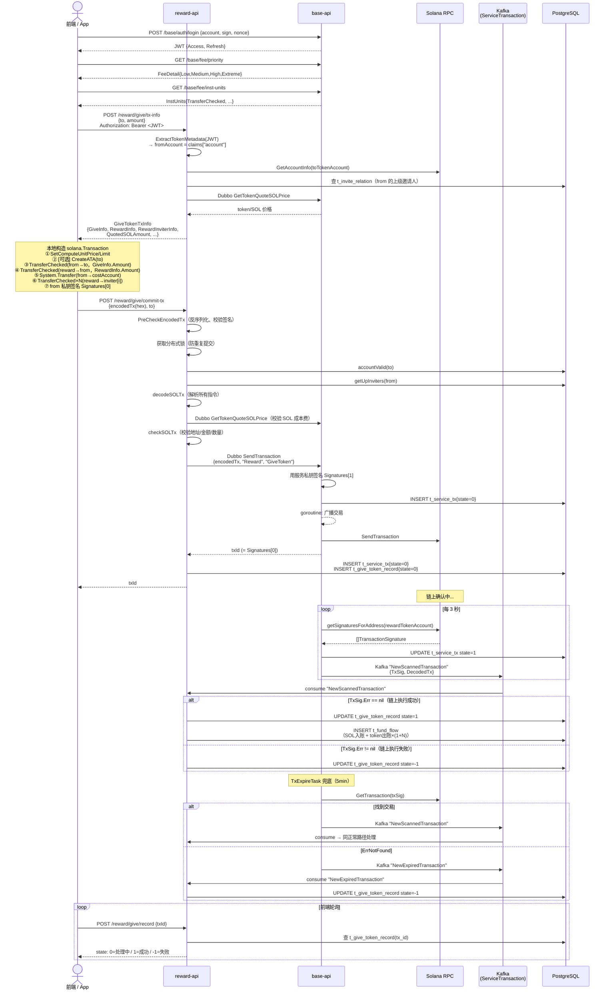

# oshit-go / GiveToken 业务完整参考文档

> 面向 Claude Code 使用，描述 GiveToken 业务的完整流程。
> reward 服务架构见 `docs/reward_service.md`；base 服务见 `docs/base_service.md`；TakeToken 见 `docs/reward_take_token.md`。

---

## 1. 业务概述

GiveToken 是用户（from）主动将 token 转给另一个地址（to），平台根据转账金额奖励该转账人（from）以及 from 的各级上级邀请人 token 的业务。

与 TakeToken 的对比：

| | TakeToken | GiveToken |
|--|--|--|
| token 转账方向 | 平台 → 用户 | 用户 → 另一个地址 |
| 平台奖励对象 | 领取人 + 邀请人 | 转账人（from）+ 邀请人 |
| 需要 JWT | 否 | **是**（从 JWT 读取 fromAccount） |
| to 地址校验 | 无 | 必须是"新地址"（未领取过 token 的地址） |

---

## 2. 前端构造交易阶段

```
① POST /base/auth/login             → 登录获取 JWT（用于 /give/tx-info）
② GET  /base/fee/priority           → 获取 4 档优先费（用 PerComputeUnit.Medium 作为 computeUnitPrice）
③ GET  /base/fee/inst-units         → 获取各指令 CU 消耗量
④ POST /reward/give/tx-info         → 获取打包参数（需带 Authorization: Bearer <JWT>，见 GiveTokenTxInfo）
⑤ 前端本地构造 solana.Transaction（见下节交易指令顺序）
⑥ 前端用自己私钥签名 tx.Signatures[0]
⑦ POST /reward/give/commit-tx       → 提交 hex 编码的交易二进制（不需要 JWT）
```

**computeUnitLimit 计算公式（测试文件）**：
```
transferCheckedCount = 2 + len(RewardInviterInfo)   // 用户转账 + 奖励转账人 + N 个邀请人
computeUnitLimit = (transferCheckedCount * instUnits.TransferChecked + 500) * 1.2
```
> 注：500 为 System Transfer 固定预留，1.2 为 20% buffer。

**JWT 注意**：claims 中 fromAccount 的 key 是 `"account"`（不是 `"nativeAccount"`），handler 取法：
```go
fromAccount := claims.Credentials["account"].(string)
```

---

## 3. GiveTokenTxInfo 详解（`types/types.go`）

`POST /reward/give/tx-info` 的请求与响应：

**请求**：
```go
type GetGiveTokenTxInfoReq struct {
    To     string  `json:"to"`     // 接收 token 的 native account
    Amount float64 `json:"amount"` // 转账数量（UI 单位，如 1000 代表 1000 个 token）
}
```

**响应**：
```go
type GiveTokenTxInfo struct {
    // 地址信息（前端打包交易用）
    RewardAccount string  // 平台奖励发放的 native account（t_give_token_config）
    Mint          string  // token mint address
    CostAccount   string  // 用户付 SOL 成本费的目标地址

    // 费率
    DexFeeRate float64  // 奖励费率（to 有 token account 时）
    MaxDexFee  float64  // 奖励上限（原始单位）
    Decimals   int32    // token 精度

    // 价格与金额
    QuoteSOLPrice   float64  // token/SOL 价格（dubbo 从 base 获取）
    TotalReward     float64  // 平台总奖励量（奖励 from + 所有邀请人，原始单位）
    QuotedSOLAmount float64  // 用户需支付的 SOL lamports
                             // = QuoteSOLPrice × TotalReward / TokenDecimal × LAMPORTS_PER_SOL

    // 奖励明细
    Claims            []model.LevelRatio // 各层邀请人分成比例
    GiveInfo          RewardTokenItem    // from 转给 to 的信息
    RewardInfo        RewardTokenItem    // 平台奖励 from 的信息
    RewardInviterInfo []RewardTokenItem  // 平台奖励各级邀请人的信息
}

type RewardTokenItem struct {
    Index          int    // 0=主体，1=直接邀请人，2=二级邀请人...
    ReceiptAccount string // native account（前端通过 FindAssociatedTokenAddress 推导 token account）
    Amount         uint64 // token 数量（原始单位，含精度）
}
```

**三个 RewardTokenItem 语义**：

| 字段 | ReceiptAccount | Amount | 含义 |
|--|--|--|--|
| `GiveInfo` | to（接收方） | `uint64(amountUI × TokenDecimal)` | from 发给 to 的转账量 |
| `RewardInfo` | from（转账人） | `min(MaxValidReward, amountRaw × Rate)` | 平台奖励 from |
| `RewardInviterInfo[i]` | from 的第 i 级上级 | `RewardInfo.Amount × LevelRatio[i].Ratio` | 平台奖励各级邀请人 |

> `rewardTokenAccount`（平台奖励发放的 token account）不存储，由双方各自推导：
> `solana.FindAssociatedTokenAddress(RewardAccount, Mint)`

---

## 4. 奖励计算逻辑（`logic/give/logic.go:GetTxInfo`）

```
amountRaw = uint64(amountUI × TokenDecimal)     // TokenDecimal = math.Pow(10, decimals)

if to 地址已有 token account:
    rewardAmount = min(MaxValidReward, amountRaw × RewardRate)
else（to 是新地址，ValidRate 更高）:
    rewardAmount = min(MaxValidReward, amountRaw × ValidRate)

各级邀请人奖励[i] = rewardAmount × LevelRatio[i].Ratio
TotalReward = rewardAmount + Σ(各级邀请人奖励)
QuotedSOLAmount = quoteSOLPrice × TotalReward / TokenDecimal × LAMPORTS_PER_SOL
```

---

## 5. to 地址有效性校验（`logic/give/logic.go:accountValid`）

to 地址必须满足以下**全部**条件，否则 `valid=false`：

1. Solana 公钥格式正确
2. `t_take_token_record` 中没有 `receipt_account=to AND state >= 0` 的记录（to 没领取过 TakeToken）
3. `t_give_token_record` 中没有 `receipt_account=to AND state >= 0` 的记录（to 没被转过 GiveToken）
4. to 地址没有 token account（`GetAccountInfoWithOpts` 返回 "not found"）→ `valid=true`，使用 ValidRate

> 若 to 已有 token account（条件4不满足），accountValid 返回 `(false, nil)`，但业务流程**不因此中断**——只是 `valid=false` 时使用 RewardRate 而非 ValidRate 来计算奖励。
> `accountValid` 仅在 `ProcessCommitTx` 中调用，用于决定奖励费率，不作为拦截条件。

---

## 6. 前端构造的 Solana 交易指令顺序

```
① SetComputeUnitPrice(Medium)
② SetComputeUnitLimit(计算值)
③ [可选] CreateAssociatedTokenAccount（to 地址没有 token account 时，由 from 付租金创建）
④ TransferChecked: fromTokenAccount → toTokenAccount
                   amount = GiveInfo.Amount，owner = from
⑤ TransferChecked: rewardTokenAccount → fromTokenAccount
                   amount = RewardInfo.Amount，owner = rewardNativeAccount
⑥ System.Transfer: from → costAccount（SOL 成本费）
                   amount = QuotedSOLAmount（lamports）
⑦ TransferChecked × N: rewardTokenAccount → FindATA(RewardInviterInfo[i].ReceiptAccount)
                        amount = RewardInviterInfo[i].Amount，owner = rewardNativeAccount
...（按 RewardInviterInfo 顺序，最多 levelDist 条）
```

> 交易签名者：index=0 为 from（fee payer），index=1 将由 base 模块补签（rewardNativeAccount 私钥）。

---

## 7. CommitTx 处理流程（`handler/give.go` + `logic/give/logic.go`）

```
POST /reward/give/commit-tx
  Body: { encodedTx: "<hex>", to: "toNativeAccount" }

1. PreCheckEncodedTx(encodedTx)
   → hex decode → 反序列化 solana.Transaction
   → 校验 tx.Signatures[0] 签名有效
   → 提取 From（tx.Message.AccountKeys[0]）

2. 获取分布式锁（key: "give-token:process:commit-tx:{from}"，1h 过期）
   → 防止同一地址并发重复提交

3. accountValid(to)
   → 检查 to 地址是否符合规则（见第5节）

4. getUpInviters(from)
   → 查 t_invite_relation，获取 from 的上级邀请人列表（最多 levelDist 层）

5. decodeSOLTx(tokenMintAccount, toNativeAccount, needCreateTokenAccount=true, tx)
   → 遍历所有指令，按 ProgramID 分类解析：
     - ComputeBudget → 提取 ComputeUnitPrice / ComputeUnitLimit
     - SPLAssociatedTokenAccount → 跳过
     - TokenProgram → TransferChecked 解析，查库获取 native account
     - SystemProgram → Transfer 解析
   → 返回 DecodedSolanaTransaction

6. checkSOLTx(decodedTx, upInvitersInfo, receiptTokenAccount, valid)
   → 规则校验（见第8节）
   → 返回 DecodedServiceTransaction

7. baseClient.SendTransaction(ctx, tx, "Reward", "GiveToken")
   → base 模块签名 tx.Signatures[1]，写 t_service_tx(state=0)，异步广播
   → 返回 txId

8. recordGiveToken(decodedServiceTx)
   DB 事务：
   a. INSERT t_service_tx{service="Reward", subService="GiveToken", txId}
   b. INSERT t_give_token_record{txId, state=0, fromAccount, receiptAccount, amount}

9. 返回 txId 给前端
```

---

## 8. checkSOLTx 校验规则（`logic/give/decode.go`）

```
必须满足（任意不满足则拒绝）：

1. TransferInstructions（System.Transfer）数量 == 1
   - to == CostAccount
   - from == 交易发起人（decodedTx.FromNativeAccount）

2. TransferChecked 数量 == len(upInviters) + 2
   （用户转账 1 条 + 奖励 from 1 条 + 奖励邀请人 N 条）

3. "用户转账"指令（from=fromTokenAccount, to=receiptTokenAccount）：
   - token mint == 配置 mint ✓
   - from == FindATA(txFromNativeAccount, mint) ✓
   - owner == txFromNativeAccount ✓
   - decimals == 配置 ✓
   - amount > 0（amount==0 直接报错）✓

4. "奖励 from"指令（to=fromTokenAccount，from=rewardTokenAccount）：
   - from == FindATA(RewardAccount, mint) ✓
   - mint == 配置 mint ✓
   - to == FindATA(txFromNativeAccount, mint) ✓
   - owner == RewardAccount ✓
   - amount <= min(MaxValidReward, transferTokenAmount × Rate) ✓
   - decimals == 配置 ✓

5. "奖励邀请人"指令（to 在 inviterRecordMap 中）：
   - from == FindATA(RewardAccount, mint) ✓
   - mint == 配置 mint ✓
   - owner == RewardAccount ✓
   - amount == rewardFromAmount × LevelRatio[i].Ratio（精确匹配）✓
   - decimals == 配置 ✓

6. SOL 成本费校验：
   requiredDexFee = TotalReward / TokenDecimal × quoteSOLPrice × LAMPORTS_PER_SOL
   实际支付 >= requiredDexFee × (1 - FeeTolerance.MaxLessRate) ✓
```

---

## 9. Kafka 处理流程（`logic/give/kafka.go`）

### HandleScannedTx

```
收到 NewScannedTx{Service, SubService, TxSig, DecodedTx}

DB 事务：
1. 查 t_give_token_record WHERE tx_id = txId
2. 检查 msg.TxSig.Err：
   ├── != nil（链上执行失败）：
   │    → UPDATE t_give_token_record SET state=-1
   └── == nil（链上执行成功）：
        → UPDATE t_give_token_record SET state=1
        → DecodeServiceTransaction(msg.DecodedTx)
        → recordFundFlow("OShit", "OShit", decodedServiceTx)
             写 t_fund_flow（批量 upsert，唯一键=tx_id+to_account+flow_type）：
             ① SOL 入账（成本费）: is_token=false, direction=FlowInput, flow_type=FlowGiveTokenCost
             ② token 出账（奖励 from）: is_token=true, direction=FlowOutput, flow_type=FlowGiveTokenReceipt
             ③ token 出账（奖励各邀请人，循环）: flow_type=FlowGiveTokenInviter
3. Commit
```

> GiveToken 成功后**不**写 `t_invite_relation`（邀请关系由 TakeToken 在领取时确定）。

### HandleExpiredTx

```
收到 NewExpiredTx{Service, SubService, TxID}

DB 事务：
1. 查 t_give_token_record WHERE tx_id = txId
2. UPDATE t_give_token_record SET state=-1
3. Commit
```

---

## 10. 资金流水（`logic/give/kafka.go:recordFundFlow`）

写入 `t_fund_flow`，每笔成功交易写 3 类条目：

| 编号 | 含义 | from | to | is_token | direction | flow_type |
|--|--|--|--|--|--|--|
| ① | DEX 入账 SOL | from native | costAccount | false | FlowInput | FlowGiveTokenCost |
| ② | 平台奖励 from | rewardAccount | from native | true | FlowOutput | FlowGiveTokenReceipt |
| ③×N | 平台奖励邀请人 | rewardAccount | inviter[i] native | true | FlowOutput | FlowGiveTokenInviter |

使用 `OnConflict(tx_id, to_account, flow_type)` upsert，保证幂等（Kafka 消息重复消费安全）。

---

## 11. 数据库表结构

### t_give_token_config（服务配置，单行）

```sql
CREATE TABLE public.t_give_token_config (
    reward_account   character varying(64) NOT NULL,  -- 平台奖励发放 native account
    cost_account     character varying(64) NOT NULL,  -- SOL 成本费收款 native account
    reward_rate      numeric(78, 0)        NOT NULL,  -- to 有 token account 时的奖励费率
    max_valid_reward numeric(78, 0)        NOT NULL,  -- 奖励上限（原始单位）
    valid_rate       NUMERIC(10, 6)        NOT NULL,  -- to 无 token account 时的奖励费率
    created_at       timestamp without time zone DEFAULT CURRENT_TIMESTAMP,
    updated_at       timestamp without time zone DEFAULT CURRENT_TIMESTAMP
);
```

> 不含 `token_mint_account`、`decimal`、`reward_token_account`，这些从 `t_token_config` 和 ATA 推导。

### t_give_token_record（转账记录）

```sql
CREATE TABLE public.t_give_token_record (
    record_id       public.ulid DEFAULT public.gen_ulid() NOT NULL,
    from_account    character varying(64)  NOT NULL,  -- 发起转账的 native account
    receipt_account character varying(64)  NOT NULL,  -- 接收 token 的 native account（to）
    tx_id           character varying(128) NOT NULL,
    amount          numeric(78, 0)         NOT NULL,  -- 转账量（原始单位）
    state           integer,                          -- 0=pending, 1=success, -1=failed
    created_at      timestamp without time zone DEFAULT CURRENT_TIMESTAMP,
    updated_at      timestamp without time zone DEFAULT CURRENT_TIMESTAMP
);
```

---

## 12. HTTP 接口

| 路由 | 方法 | 是否需要 JWT | 说明 |
|--|--|--|--|
| `/give/tx-info` | POST | **是** | 获取构建交易所需参数 |
| `/give/commit-tx` | POST | 否 | 提交已签名交易 |
| `/give/record` | POST | 否 | 根据 txId 查询记录 |
| `/give/config` | GET | 否 | 获取配置 |

---

## 13. 测试（`test/give_token_test.go`）

```go
// TestGetGiveTokenTxInfo：打印 txInfo 各字段
// TestGiveToken：David 转账给 Robert，完整端到端测试

// createGiveTokenHexEncodedTx 流程：
// 1. loginForToken(Brand, Symbol, from, privKey)    → 获取 JWT
// 2. getGiveTokenTxInfo(jwt, {To, Amount})           → 获取 GiveTokenTxInfo
// 3. getPriorityFee() + getInstUnits()
// 4. 检查 to 地址 token account 是否存在（决定是否加 CreateATA 指令）
// 5. 按指令顺序构造交易
// 6. from 私钥签名 → hex 编码
// 7. commitGiveTokenTx({encodedTx, to})              → 提交
```

---

## 14. 完整系统交互时序

### 14.1 文字描述

```
前端/测试
  │
  ├─①─ POST /base/auth/login（带签名）                → 获取 JWT
  ├─②─ GET  /base/fee/priority
  ├─③─ GET  /base/fee/inst-units
  ├─④─ POST /reward/give/tx-info（带 JWT）            → GiveTokenTxInfo（含 GiveInfo/RewardInfo/QuotedSOLAmount）
  ├─⑤─ [本地] 构造 solana.Transaction，from 私钥签名
  └─⑥─ POST /reward/give/commit-tx
           │
           reward: PreCheckEncodedTx → 分布式锁 → accountValid → getUpInviters
           reward: decodeSOLTx → checkSOLTx
           │
           reward → (Dubbo) base.SendTransaction
                      │ base: 用服务私钥补签 Signatures[1]
                      │ base: 写 t_service_tx(state=0)
                      │ base: goroutine 广播到 Solana RPC
                      │ base: 返回 txId
           reward: 写 t_service_tx + t_give_token_record(state=0)
           └─⑦─ 返回 txId

Solana 链上确认后...

base.TxScanTask（每 3s）
  └─⑧─ 发现 txId → t_service_tx state→1
       Kafka: "NewScannedTransaction"{TxSig, DecodedTx}
                │
reward.KafkaConsumerTask
  └─⑨─ HandleScannedTx
         TxSig.Err==nil：
           t_give_token_record state→1
           recordFundFlow → t_fund_flow（3 类条目）
         TxSig.Err!=nil：
           t_give_token_record state→-1

（兜底路径）base.TxExpireTask（5min 后）
  └─⑩─ 找到 → Kafka "NewScannedTransaction" → 同上
       未找到 → Kafka "NewExpiredTransaction"
                └─ HandleExpiredTx → state→-1

前端轮询
  └─⑪─ POST /reward/give/record { txId }
        → 查 t_give_token_record.state
```

### 14.2 Mermaid 时序图



### 14.3 交易指令结构与校验规则

```mermaid
flowchart LR
    subgraph TX["Solana Transaction 指令顺序"]
        direction TB
        I1["① SetComputeUnitPrice\n(Medium 档)"]
        I2["② SetComputeUnitLimit\n= (N×TC_CU + 500) × 1.2\nN = 2 + len(RewardInviterInfo)"]
        I3["③ CreateATA (可选)\nto 地址无 token account 时\n由 from 付租金创建"]
        I4["④ TransferChecked\nfromTokenAccount → toTokenAccount\namount = GiveInfo.Amount\nowner = from"]
        I5["⑤ TransferChecked\nrewardTokenAccount → fromTokenAccount\namount = RewardInfo.Amount\nowner = rewardNativeAccount"]
        I6["⑥ System.Transfer\nfrom → costAccount\namount = QuotedSOLAmount (lamports)"]
        I7["⑦ TransferChecked × N\nrewardTokenAccount → FindATA(inviter[i])\namount = RewardInviterInfo[i].Amount\nowner = rewardNativeAccount"]
    end

    subgraph CHECK["服务端校验要点"]
        direction TB
        C1["System.Transfer 数量 == 1\nto==CostAccount, from==交易发起人"]
        C2["TransferChecked 数量 == upInviters+2"]
        C3["用户转账指令:\nfrom==fromTokenAccount\nto==receiptTokenAccount\namount > 0"]
        C4["奖励 from 指令:\nfrom==rewardTokenAccount\nto==fromTokenAccount\namount <= min(MaxValidReward, transferAmt×Rate)"]
        C5["奖励邀请人指令:\nfrom==rewardTokenAccount\namount == rewardFromAmount×Ratio[i]（精确）"]
        C6["SOL 成本费:\nactual >= required×(1-MaxLessRate)"]
    end

    TX --> CHECK
```



---

## 15. 注意事项 / 易踩坑点

1. **JWT 必须在 `/give/tx-info` 中携带**：handler 从 `claims.Credentials["account"]` 读取 fromAccount（key 是 `"account"` 不是 `"nativeAccount"`）。`/give/commit-tx` 不需要 JWT。

2. **GiveInfo / RewardInfo / RewardInviterInfo 语义不同**：
   - `GiveInfo.Amount` 用于 `fromTokenAccount → toTokenAccount` 指令（用户转出）
   - `RewardInfo.Amount` 用于 `rewardTokenAccount → fromTokenAccount` 指令（平台奖励）
   - 两者数量来源不同，不可混用

3. **rewardTokenAccount 不在配置表中**：服务端和客户端都通过 `FindAssociatedTokenAddress(RewardAccount, Mint)` 推导，RewardAccount 存在 `t_give_token_config.reward_account`。

4. **amount==0 会被服务端拒绝**：`checkSOLTx` 检查 `transferTokenAmount == 0` 时报错，确保 `GiveInfo.Amount` 非零（需服务端重新编译后生效）。

5. **txId = tx.Signatures[0]**：永远是 from 用户的签名，不是 base 服务的签名。

6. **t_service_tx 在两个地方都会写**：base 的 `TxLogic.SendTransaction` 写一次，reward 的 `recordGiveToken` 也写一次。

7. **GiveToken 成功后不写 t_invite_relation**：邀请关系在 TakeToken 时确定，GiveToken 只记录流水。

8. **Kafka consumer 无 ack 重试**：`kafka-go` 的 `ReadMessage` 自动提交 offset，消息处理失败不重试，业务需保证幂等（fund flow 已用 OnConflict 保证）。
