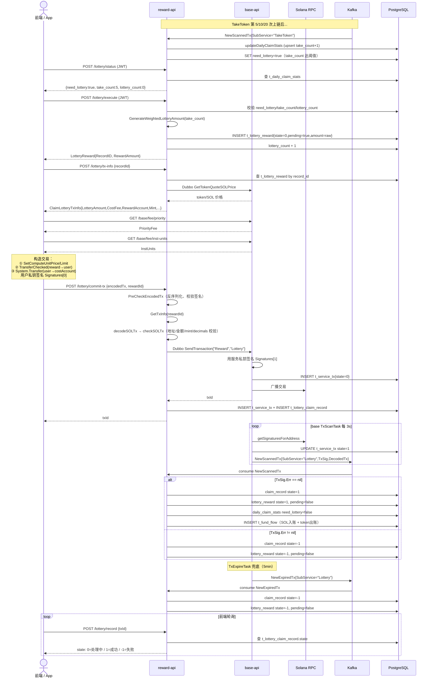

# oshit-go / Lottery 业务完整参考文档

> 面向 Claude Code 使用，描述 Lottery 业务的完整流程。
> reward 服务架构见 `docs/reward_service.md`；TakeToken 业务见 `docs/reward_take_token.md`。

---

## 1. 业务概述

Lottery 是在 TakeToken 基础上新增的抽奖机制。用户每日累计领取 token（TakeToken）达到 **5 / 10 / 20 次**时，系统将 `t_daily_claim_stats.need_lottery` 置为 `true`，阻止用户继续领取，直到用户完成一次抽奖领取（提交链上交易）。

每日最多触发 3 次抽奖（对应 5、10、20 次阈值），奖励金额按次数段随机生成（带权重）。

---

## 2. 触发机制（`logic/take/kafka.go:updateDailyClaimStats`）

TakeToken 的 Kafka 处理成功后，在同一事务内调用 `updateDailyClaimStats`：

```sql
INSERT INTO t_daily_claim_stats (native_account, take_date, take_count, need_lottery, last_take_time)
VALUES (?, ?, 1, false, ?)
ON CONFLICT (native_account, take_date)
DO UPDATE SET
    take_count     = t_daily_claim_stats.take_count + 1,
    last_take_time = ?
RETURNING take_count
```

> **唯一约束**：`t_daily_claim_stats(native_account, take_date)` 必须存在唯一约束，否则 ON CONFLICT 报错：
> ```sql
> ALTER TABLE t_daily_claim_stats
>     ADD CONSTRAINT uq_daily_claim_stats_account_date UNIQUE (native_account, take_date);
> ```

返回的 `take_count` 达到阈值（5 / 10 / 20）时，追加一条 UPDATE 将 `need_lottery=true`：

```go
func isLotteryThreshold(takeCount int32) bool {
    return takeCount == 5 || takeCount == 10 || takeCount == 20
}
```

**TakeToken 的阻断**：`ProcessCommitTx` 调用 `checkNeedLottery`，若 `need_lottery=true` 则直接返回错误，拒绝后续 take 的 commit-tx。

---

## 3. 完整前端交互流程

```
① POST /reward/lottery/status    → 查询今日统计（JWT 认证）
② POST /reward/lottery/execute   → 执行抽奖，创建 t_lottery_reward 记录（JWT 认证）
③ POST /reward/lottery/tx-info   → 用 RecordId 获取打包参数（ClaimLotteryTxInfo）
④ GET  /base/fee/priority        → 获取优先费（Medium 档）
⑤ GET  /base/fee/inst-units      → 获取指令 CU 消耗量
⑥ 前端本地构造 solana.Transaction（见下节交易指令顺序）
⑦ 前端用自己私钥签名 tx.Signatures[0]
⑧ POST /reward/lottery/commit-tx → 提交 hex 编码的交易二进制
⑨ 前端轮询 POST /reward/lottery/record { txId } 确认状态
```

> ①② 需要 JWT（`Authorization: Bearer <token>`），从 JWT claims `"account"` 字段获取 native account。

---

## 4. HTTP 接口详解

### 4.1 GET Status — `POST /reward/lottery/status`

**认证**：JWT

**响应**：`*model.DailyClaimStats`（今日无记录时返回 null）

```go
type DailyClaimStats struct {
    NativeAccount string
    TakeDate      time.Time
    TakeCount     int32   // 今日累计领取次数
    NeedLottery   bool    // 是否需要完成抽奖
    LotteryCount  int32   // 今日已触发抽奖次数（上限 3）
    TotalLottery  float64
    TotalTake     float64
    LastTakeTime  time.Time
}
```

### 4.2 Execute Lottery — `POST /reward/lottery/execute`

**认证**：JWT（服务端从 JWT 提取 native account）

**校验条件**（任意不满足则拒绝）：
1. `need_lottery == true`
2. `take_count ∈ {5, 10, 20}`
3. `lottery_count < 3`
4. 不存在 `pending=false AND state=0` 的未领取 `t_lottery_reward` 记录

**成功**：
- 生成带权重随机奖励金额（字面值 × `TokenDecimal` → raw amount），见第 5 节
- 创建 `t_lottery_reward{state=0, pending=true}`
- `t_daily_claim_stats.lottery_count + 1`（同一事务）

**响应**：`model.LotteryReward`（含 `RecordID`，后续传给 `/lottery/tx-info`）

### 4.3 Get TxInfo — `POST /reward/lottery/tx-info`

**请求**：`{ "recordId": "<t_lottery_reward.record_id>" }`

**查询条件**：`record_id = ? AND pending = true AND state = 0`

**CostFee 计算**（用 TakeToken config 的默认金额，而非本次随机金额）：
```go
configAmount := float64(takeTokenConfig.Amount)
costFee = quoteSOLPrice * configAmount / TokenDecimal * LAMPORTS_PER_SOL
```

**响应**：
```go
type ClaimLotteryTxInfo struct {
    RecordId      string  // t_lottery_reward.record_id
    RewardAccount string  // 发奖励的 native account（非 token account）
    Mint          string  // token mint 地址
    CostAccount   string  // 用户需转 SOL 的目标地址
    Decimals      int32
    LotteryAmount float64 // 本次奖励 raw amount（= 随机字面值 × TokenDecimal）
    CostFee       float64 // 用户需支付的 SOL lamports
}
```

### 4.4 Commit Tx — `POST /reward/lottery/commit-tx`

**请求**：`{ "encodedTx": "<hex>", "rewardId": "<record_id>" }`

**处理流程**见第 6 节。

**响应**：`txId`（= `tx.Signatures[0].String()`）

### 4.5 Unclaimed — `POST /reward/lottery/unclaimed`

**请求**：`{ "nativeAccount": "..." }`

查询 `pending=false AND state=0` 的 `t_lottery_reward` 列表。

### 4.6 Record — `POST /reward/lottery/record`

**请求**：`{ "txId": "..." }`

查询 `t_lottery_claim_record` by `tx_id`。

---

## 5. 奖励金额随机算法（`logic/lottery/amount.go`）

```go
func GenerateWeightedLotteryAmount(count int) (int, error)
```

按今日 `take_count` 选择概率配置，在区间内均匀随机：

| take_count | 区间 | 权重（总 10000） |
|---|---|---|
| 5~9 | 1000~1500 | 9050（90.50%） |
| 5~9 | 2001~3000 | 950（9.50%） |
| 10~19 | 1000~1500 | 8000（80.00%） |
| 10~19 | 2001~3000 | 1905（19.05%） |
| 10~19 | 3001~5000 | 95（0.95%） |
| ≥20 | 1000~1500 | 7500（75.00%） |
| ≥20 | 2000~3000 | 2300（23.00%） |
| ≥20 | 3001~5000 | 185（1.85%） |
| ≥20 | 5001~10000 | 15（0.15%） |

返回字面值（token 显示金额），`ExecuteLottery` 中乘以 `srvCtx.TokenDecimal` 转为 raw amount 存入 DB。

---

## 6. CommitTx 处理流程（`handler/lottery.go` + `logic/lottery/logic.go`）

```
POST /reward/lottery/commit-tx
  Body: { encodedTx: "<hex>", rewardId: "<record_id>" }

1. PreCheckEncodedTx(encodedTx)
   → hex decode → 反序列化 solana.Transaction
   → 校验 tx.Signatures[0] 签名有效
   → 提取 From（tx.Message.AccountKeys[0]）和 txId（Signatures[0].String()）

2. 查 t_lottery_reward
   WHERE record_id=rewardId AND native_account=From AND pending=true AND state=0

3. GetTxInfo(ctx, reward.RecordID)
   → 服务端重新计算 CostFee 和账户信息

4. decodeSOLTx(tx, rewardInfo)
   → 遍历指令：
     - ComputeBudget → 提取 ComputeUnitPrice / ComputeUnitLimit
     - SPLAssociatedTokenAccount → 跳过（可选 CreateATA）
     - TokenProgram → TransferChecked 解析（验证 from/to/mint）
     - SystemProgram → Transfer 解析
     - LightHouseAddress → 跳过
     - 其他 → 报错

5. checkSOLTx(decodedTx, rewardInfo)
   规则校验：
   a. TransferInstructions 数量 == 1（SOL → costAccount）
   b. TransferCheckedInstructions 数量 == 1（reward → user）
   c. SOL Transfer to == CostAccount，from == 用户 native
   d. SOL amount >= CostFee × (1 - MaxLessRate)（容错）
   e. TransferChecked from == rewardTokenAccount（由 RewardAccount native 推导）
   f. TransferChecked to == userTokenAccount（由用户 native 推导）
   g. mint == 配置 mint ✓
   h. amount == LotteryAmount ✓
   i. decimals == 配置 decimals ✓

6. baseClient.SendTransaction(ctx, tx, "Reward", "Lottery")
   → base 签名 tx.Signatures[1]，写 t_service_tx(state=0)，异步广播
   → 返回 txId

7. recordLotteryClaim(dbTx, from, txId, rewardId)
   DB 事务：
   a. INSERT t_service_tx{service="Reward", subService="Lottery", txId}
   b. INSERT t_lottery_claim_record{reward_ids="{rewardId}", txId, state=0}
      注意：reward_ids 为 PostgreSQL text[] 列，插入格式为 "{ulid}"

8. 返回 txId
```

---

## 7. 前端构造的 Solana 交易指令顺序

```
① SetComputeUnitPrice(Medium)
② SetComputeUnitLimit = (instUnits.TransferChecked + 500) × 1.2
③ [可选] CreateAssociatedTokenAccount（用户 PDA 不存在时）
④ TransferChecked: rewardTokenAccount → userTokenAccount
     amount = LotteryAmount（raw），mint，decimals
⑤ System.Transfer: userNativeAccount → costAccount
     lamports = CostFee
```

> `rewardTokenAccount` 由前端通过 `FindAssociatedTokenAddress(RewardAccount, Mint)` 推导（RewardAccount 是 native account）。

---

## 8. Kafka 处理流程（`logic/lottery/kafka.go`）

### HandleScannedTx

```
收到 NewScannedTx{Service="Reward", SubService="Lottery", TxSig, DecodedTx}

DB 事务：
1. 查 t_lottery_claim_record WHERE tx_id = txSig
2. rewardId = strings.Trim(claimRecord.RewardIds, "{}")   ← 去除 PG array 花括号

3. 检查 TxSig.Err：
   ├── != nil（链上执行失败）：
   │    → UPDATE t_lottery_claim_record SET state=-1
   │    → UPDATE t_lottery_reward SET state=-1, pending=false
   └── == nil（链上执行成功）：
        → UPDATE t_lottery_claim_record SET state=1
        → 查 t_lottery_reward by rewardId
        → UPDATE t_lottery_reward SET state=1, pending=false
        → UPDATE t_daily_claim_stats SET need_lottery=false
             WHERE native_account=reward.NativeAccount AND take_date=today
        → recordFundFlow：
             ① SOL 成本入账：is_token=false, direction=FlowInput,
                              service_type=ServiceLottery, flow_type=FlowLotteryCost
             ② token 奖励出账：is_token=true, direction=FlowOutput,
                               service_type=ServiceLottery, flow_type=FlowLotteryReceipt
             （批量 upsert，唯一键=tx_id+to_account+flow_type）

4. Commit
```

### HandleExpiredTx

```
收到 NewExpiredTx{Service="Reward", SubService="Lottery", TxID}

DB 事务：
1. 查 t_lottery_claim_record WHERE tx_id = txId
2. rewardId = strings.Trim(claimRecord.RewardIds, "{}")
3. UPDATE t_lottery_claim_record SET state=-1
4. UPDATE t_lottery_reward SET state=-1, pending=false
5. Commit
```

---

## 9. 数据库表

### t_daily_claim_stats

| 列 | 类型 | 说明 |
|---|---|---|
| record_id | ulid PK | |
| native_account | text | |
| take_date | timestamp | 当日零点（Truncate 24h） |
| take_count | int | 今日累计领取次数 |
| need_lottery | bool | 是否需要完成抽奖 |
| lottery_count | int | 今日已触发抽奖次数 |
| total_lottery | float8 | 今日抽奖总奖励 |
| total_take | float8 | 今日领取总量 |
| last_take_time | timestamp | 最后一次领取时间 |

**唯一约束**：`(native_account, take_date)`

### t_lottery_reward

| 列 | 类型 | 说明 |
|---|---|---|
| record_id | ulid PK | |
| native_account | text | 用户地址 |
| reward_amount | float8 | raw amount（字面值 × TokenDecimal） |
| reward_type | int | 0=默认 |
| state | int | 0=待处理, 1=成功, -1=失败 |
| pending | bool | true=已抽奖未提交链上交易 |
| reward_day | timestamp | 抽奖日期 |

**状态机**：
- 创建时：`state=0, pending=true`
- commit-tx 成功后（Kafka）：`state=1, pending=false`
- 链上失败或超时（Kafka）：`state=-1, pending=false`

### t_lottery_claim_record

| 列 | 类型 | 说明 |
|---|---|---|
| record_id | ulid PK | |
| reward_ids | text[] | 关联的 t_lottery_reward.record_id 数组，存储格式 `{ulid}` |
| tx_id | text | 链上交易签名 |
| state | int | 0=待确认, 1=成功, -1=失败 |

---

## 10. 常量定义（`common/constants/service_const.go`）

```go
ServiceLottery     = 8  // 业务类型
FlowLotteryCost    = 0  // 流水类型：SOL 成本入账
FlowLotteryReceipt = 1  // 流水类型：token 奖励出账
```

---

## 11. 测试（`test/lottery_test.go`）

| 测试用例 | 说明 |
|---|---|
| `TestGetLotteryStatus` | 登录后查今日抽奖状态 |
| `TestExecuteLottery` | 登录后执行抽奖 |
| `TestGetLotteryTxInfo` | 用 RecordID 查交易参数 |
| `TestLottery` | 完整流程：execute → tx-info → build → commit |
| `TestGetUnclaimedLotteryRewards` | 查未领取奖励列表 |
| `TestGetLotteryRecord` | 用 txId 查链上领取记录 |
| `TestTakeAndLottery` | 模拟 20 次 take，在第 5/10/20 次触发并完成抽奖 |

### TestTakeAndLottery 流程

```
登录一次（jwtToken 用于全程状态轮询）
│
├─ Take 1~4（直接提交，不触发阈值）
├─ Take 5 → waitNeedLottery（轮询 GET /lottery/status 直到 need_lottery=true）
├─ Lottery #1：execute → tx-info(RecordID) → build tx → commit-tx
├─ waitLotteryDone（轮询直到 need_lottery=false）
│
├─ Take 6~9
├─ Take 10 → waitNeedLottery
├─ Lottery #2
├─ waitLotteryDone
│
├─ Take 11~19
├─ Take 20 → waitNeedLottery
└─ Lottery #3
```

轮询间隔 3s，超时 3 分钟（链上确认 + Kafka 处理时间）。

---

## 12. 完整系统交互时序



---

## 13. 注意事项 / 易踩坑点

1. **`reward_ids` 是 PostgreSQL `text[]` 列**：插入时需格式化为 `{ulid}`，从 DB 读出时也带花括号，kafka.go 中使用前必须 `strings.Trim(value, "{}")` 剥离。

2. **CostFee 使用 config 固定金额计算**：`/lottery/tx-info` 返回的 `CostFee` 基于 `TakeTokenConfig.Amount`（配置默认值），而非本次随机的 `LotteryAmount`，两者可能不同，前端不可混用。

3. **`RewardAccount` 是 native account，不是 token account**：前端需自行通过 `FindAssociatedTokenAddress(RewardAccount, Mint)` 推导出 `rewardTokenAccount`，作为 TransferChecked 的 source。

4. **`pending` 字段语义**：`pending=true` 表示抽奖奖励已创建等待用户提交链上交易；Kafka 处理后（无论成功失败）置为 `false`。检查"是否有未处理记录"应查 `pending=false AND state=0`（已创建但链上未确认）。

5. **`need_lottery` 的重置时机**：是 Kafka `HandleScannedTx` 成功路径中重置，**不是** `commit-tx` 时。前端提交交易后不能立即认为可以继续 take，需轮询 `need_lottery=false`。

6. **`t_daily_claim_stats` 必须有唯一约束**：`(native_account, take_date)` 的唯一约束是 `ON CONFLICT` upsert 的前提，缺少会报 `42P10 there is no unique or exclusion constraint`。

7. **txId = tx.Signatures[0]**：永远是用户签名，base 服务补签的是 `Signatures[1]`。

8. **Kafka 无重试**：`kafka-go ReadMessage` 自动提交 offset，处理失败不重试。lottery 的状态更新需保证幂等（Kafka 可能重复投递同一消息）。
