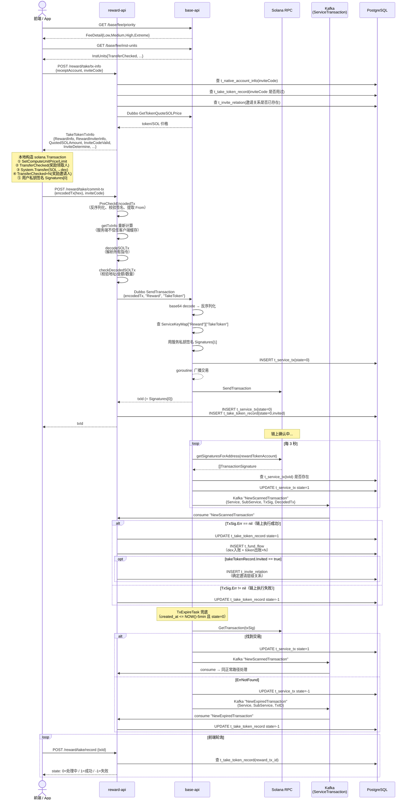
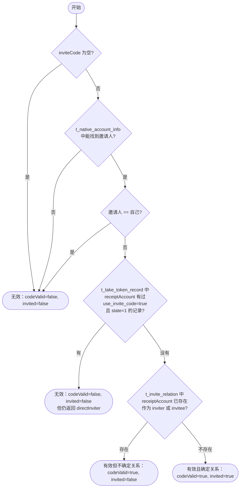

# oshit-go / TakeToken 业务完整参考文档

> 面向 Claude Code 使用，描述 TakeToken 业务的完整流程。
> reward 服务架构见 `docs/reward_service.md`；base 服务见 `docs/base_service.md`。

---

## 1. 业务概述

TakeToken 是 reward 服务目前唯一完整实现的业务。用户（领取人）构造并签名一笔 Solana 交易，将一定量 SOL 转给 dex 账户作为成本费，同时由 reward 服务从奖励账户向领取人发送 token 奖励；若存在邀请关系，还会向各层邀请人按比例分配额外 token。

---

## 2. 前端构造交易阶段

```
① GET /base/fee/priority          → 获取 4 档优先费（用 PerComputeUnit.Medium 作为 computeUnitPrice）
② GET /base/fee/inst-units        → 获取各指令 CU 消耗量
③ POST /reward/take/tx-info       → 获取打包参数（见 TakeTokenTxInfo）
④ 前端本地构造 solana.Transaction（见下节交易指令顺序）
⑤ 前端用自己私钥签名 tx.Signatures[0]
⑥ POST /reward/take/commit-tx    → 提交 hex 编码的交易二进制
```

**computeUnitLimit 计算公式（测试文件）**：
```
transferCheckedCount = 1 + len(RewardInviterInfo)
computeUnitLimit = (transferCheckedCount * instUnits.TransferChecked + 500) * 1.2
```
> 注：500 为 System Transfer 固定预留，1.2 为 20% buffer。

---

## 3. TakeTokenTxInfo 详解（`types/types.go`）

`POST /reward/take/tx-info` 的请求与响应：

**请求**：
```go
type GetTakeTokenTxInfoReq struct {
    ReceiptAccount string  // 领取奖励的 native account
    InviteCode     string  // 可选，邀请码
    Custom         bool    // 自定义金额（暂未使用）
    CustomAmount   float64
}
```

**响应**：
```go
type TakeTokenTxInfo struct {
    // 地址信息（前端打包交易用）
    RewardNativeAccount string   // 发放奖励的 native account（t_take_token_config）
    RewardTokenAccount  string   // 发放奖励的 token account
    TokenMintAccount    string   // token mint
    DexNativeAccount    string   // 用户付成本费的目标地址

    // 费率
    DexFeeRate  float64  // SOL 成本费率
    MaxDexFee   float64  // 最大 SOL 成本费
    Decimals    int32    // token 精度

    // 邀请码状态
    InviteCode      string  // 传入的邀请码
    InviteCodeValid bool    // 邀请码是否有效（影响奖励金额）
    InviteDetermine bool    // 是否本次交易成功后确定邀请关系

    // 价格与金额
    QuoteSOLPrice     float64  // token/SOL 价格（dubbo 从 base 获取）
    TotalRewardAmount float64  // 总奖励 token 数量（含所有邀请人）
    QuotedSOLAmount   float64  // 用户需支付的 SOL lamports
                               // = QuoteSOLPrice × TotalRewardAmount / TokenDecimal × LAMPORTS_PER_SOL

    // 奖励明细
    RewardInfo        RewardTokenItem    // 领取人奖励（index=0）
    RewardInviterInfo []RewardTokenItem  // 各层邀请人奖励（index=1,2,...）
    Claims            []model.LevelRatio // 各层邀请人分成比例
}

type RewardTokenItem struct {
    Index         int    // 0=领取人，1=直接邀请人，2=二级邀请人...
    NativeAccount string
    Amount        uint64 // token 数量（含精度）
    // TokenAccount 由前端通过 solana.FindAssociatedTokenAddress(NativeAccount, mint) 自行推导
}
```

---

## 4. 邀请码有效性判断（`logic/take/logic.go:inviteCodeValid`）

按顺序检查，**任意一条不满足则邀请码无效**：

1. `inviteCode == ""` → 无效
2. 根据邀请码查 `t_native_account_info` 找不到邀请人，或邀请人 == 自己 → 无效
3. `t_take_token_record` 中 `receipt_native_account=receiptAccount AND use_invite_code=true AND state=1` 已有记录 → 邀请码无效（已经用过邀请码领取过）
4. `t_invite_relation` 中 receiptAccount 已存在（无论作为 inviter 还是 invitee） → 邀请码无效（邀请关系已确定）

返回值 `(directInviter, codeValid, invited, err)`：
- `codeValid=true, invited=true` → 邀请码有效且本次将确定邀请关系
- `codeValid=true, invited=false` → 邀请码有效但邀请关系已存在（仍返回直接邀请人）
- `codeValid=false` → 邀请码无效

**影响**：
- `invited=true` → 奖励金额用 `InviteAmount`（更多），否则用 `Amount`
- `InviteDetermine=true` → 交易成功后写 `t_invite_relation`

---

## 5. 奖励邀请人列表构建（`logic/invite.go:BuildSortedInviterItems`）

```
1. GetUpInviterRecords(receiptAccount, levelDist) → 递归 CTE 查 t_invite_relation 向上最多 levelDist 层
2. 如果 directInviter != nil（邀请码有效），将 directInviter 插入列表最前（index=0）
3. 截取 min(len(levelRatio), len(sortedItems)) 条（按 t_level_ratio 配置的层级数截断）
4. 为每个邀请人计算 Amount = rewardAmount × levelRatio[i].Ratio
```

---

## 6. 前端构造的 Solana 交易指令顺序

```
① SetComputeUnitPrice(Medium)
② SetComputeUnitLimit(计算值)
③ [可选] CreateAssociatedTokenAccount（领取人 PDA 不存在时）
④ TransferChecked: rewardTokenAccount → receiptTokenAccount（领取人奖励）
⑤ System.Transfer: receiptNativeAccount → dexNativeAccount（成本费）
⑥ TransferChecked: rewardTokenAccount → FindATA(inviter1.NativeAccount)（邀请人1奖励）
⑦ TransferChecked: rewardTokenAccount → FindATA(inviter2.NativeAccount)（邀请人2奖励）
...（按 RewardInviterInfo 顺序，最多 levelDist 条）
```

> 交易签名者：index=0 为用户（fee payer），index=1 将由 base 模块补签（rewardNativeAccount 私钥）。

---

## 7. CommitTx 处理流程（`handler/take.go` + `logic/take/logic.go`）

```
POST /reward/take/commit-tx
  Body: { encodedTx: "<hex>", inviteCode: "xxx" }

1. PreCheckEncodedTx(encodedTx)
   → hex decode → 反序列化 solana.Transaction
   → 校验 tx.Signatures[0] 签名有效
   → 提取 From（tx.Message.AccountKeys[0]）和 txId（Signatures[0].String()）

2. getTxInfo(from.String(), inviteCode)
   → 服务端重新计算交易参数（不信任客户端缓存）

3. decodeSOLTx(takeTxInfo, tx)
   → 遍历所有指令，按 ProgramID 分类解析：
     - ComputeBudget → 提取 ComputeUnitPrice / ComputeUnitLimit
     - SPLAssociatedTokenAccount → 跳过
     - TokenProgram → TransferChecked 解析，查库获取 native account
     - SystemProgram → Transfer 解析
     - LightHouseAddress → 跳过（安全校验程序）
     - 其他 → 报错（拒绝未知程序）
   → 返回 DecodedSolanaTransaction

4. checkDecodedSOLTx(takeTxInfo, decodedTx)
   规则校验（任意不满足则拒绝）：
   a. TransferInstructions 必须 ==1 条（SOL → dex）
   b. TransferCheckedInstructions 数量 == len(Claims)+1
   c. SOL Transfer 的 to == DexNativeAccount，from == 用户 native
   d. SOL amount >= QuotedSOLAmount × (1 - MaxLessRate)（费用容错）
   e. 主奖励 TransferChecked（to == 用户 token account）：
      - from == RewardTokenAccount ✓
      - mint == TokenMintAccount ✓
      - amount == InviteAmount（有邀请码）或 Amount（无邀请码）✓
      - decimals == 配置 ✓
   f. 各邀请人 TransferChecked：
      - from == RewardTokenAccount ✓
      - mint == TokenMintAccount ✓
      - owner == RewardNativeAccount ✓
      - amount == rewardTxFromAmount × Ratio ✓
      - decimals == 配置 ✓
   → 返回 DecodedServiceTransaction

5. baseClient.SendTransaction(ctx, tx, "Reward", "TakeToken")
   → base 模块签名 tx.Signatures[1]，写 t_service_tx(state=0)，异步广播
   → 返回 txId（= tx.Signatures[0].String()）

6. recordTakeToken(takeTxInfo, decodedServiceTx, invited)
   DB 事务：
   a. INSERT t_service_tx{service="Reward", subService="TakeToken", txId, state=0}
   b. INSERT t_take_token_record{txId, state=0, invited, ...}

7. 返回 txId 给前端
```

---

## 8. Kafka 处理流程（`logic/take/kafka.go`）

### HandleScannedTx

```
收到 NewScannedTx{Service, SubService, TxSig, DecodedTx}

DB 事务：
1. 查 t_take_token_record WHERE reward_tx_id = txId
2. 检查 msg.TxSig.Err：
   ├── != nil（链上执行失败）：
   │    → UPDATE t_take_token_record SET state=-1
   └── == nil（链上执行成功）：
        → UPDATE t_take_token_record SET state=1
        → DecodeServiceTransaction(msg.DecodedTx)
        → recordFundFlow("OShit", "OShit", decodedServiceTx)
             写 t_fund_flow（批量 upsert，唯一键=tx_id+to_account+flow_type）：
             ① SOL 入账（dex fee）: is_token=false, direction=FlowInput, flow_type=FlowTakTokenCost
             ② token 出账（奖励领取人）: is_token=true, direction=FlowOutput, flow_type=FlowTakeTokenReceipt
             ③ token 出账（奖励各邀请人，循环）: flow_type=FlowTakeTokenInviter
        → 如果 takeTokenRecord.Invited==true：
             inviteLogic.GetAccountByInviteCode(inviteCode)
             inviteLogic.RecordDetermineInvitationHierarchy(
               inviterNativeAccount,
               receiptNativeAccount,
               txId, "InviteCode"
             )
             → 写 t_invite_relation（level = inviter.Level+1 或 1）
3. Commit
```

### HandleExpiredTx

```
收到 NewExpiredTx{Service, SubService, TxID}

DB 事务：
1. 查 t_take_token_record WHERE reward_tx_id = txId
2. UPDATE t_take_token_record SET state=-1
3. Commit
```

---

## 9. 邀请关系管理（`logic/invite.go:RewardInviteLogic`）

| 方法 | 说明 |
|---|---|
| `GetAccountByInviteCode(code)` | 查 `t_native_account_info` by invite_code |
| `CheckInviteRecord(account)` | 查 `t_invite_relation`，account 是否作为 invitee 存在 |
| `GetUpInviterRecords(account, depth)` | PostgreSQL `WITH RECURSIVE` 向上递归查（最大 depth=20） |
| `GetDownInviteeRecords(account, depth)` | PostgreSQL `WITH RECURSIVE` 向下递归查 |
| `FindInviteRelationByAccount(account)` | 查是否作为 inviter 或 invitee 存在 |
| `InviteRelationExist(account)` | 同上，用于 RecordDetermineInvitationHierarchy 前置检查 |
| `QueryInviterRecordByNativeAccount(account)` | 查作为 inviter 的记录，用于推算 level |
| `RecordDetermineInvitationHierarchy(...)` | 写 `t_invite_relation`（幂等：invitee 已存在则跳过） |
| `BuildSortedInviterItems(...)` | 构建排序好的邀请人奖励列表（供 getTxInfo 使用） |

**level 推算规则**（`RecordDetermineInvitationHierarchy`）：
- 邀请人在 `t_invite_relation` 中没有记录 → `level = 1`
- 邀请人已有记录 → `level = inviterRecord.Level + 1`

---

## 10. 测试账户（`test/reward_test.go`）

> 环境：Solana devnet

| 角色 | Native Account | 说明 |
|---|---|---|
| Alice | `5D4MWh35wxUcY1hBsm5GwuippPL2UBmfDnfkC8MeqxcN` | 测试用户 |
| Bob | `27htRMGeQ4HV32SPHsJrpndZn1zwmF2kiPqmABcHgehx` | 测试用户 |
| David | `JAZtFeZfLeeVtWS4vrruCpTa5LdASRDJuMe7yLKbkJk` | TestTakeToken 发起人 |
| Robert | `6HLScqNL4EQWLk8DTcB4hXUrHjDkVbeP2a3Sc5VtHozM` | 测试用户 |

```
BaseURL   = http://localhost:1100/base
RewardURL = http://localhost:1200/reward
TokenMint = wtnrTujJqBRUknLRhQQcUSwzAzx8LvcxKXEuBwvFnJM（devnet）
```

### TestTakeToken 完整流程

```go
// 1. createHexEncodedTx：
//    - getTakeTokenTxInfo(David, inviteCode="ogG0W1OK")
//    - getPriorityFee()
//    - getInstUnits()
//    - 构造交易 → David 签名 → hex 编码

// 2. commitTakeTokenTx：
//    POST /reward/take/commit-tx { encodedTx, inviteCode }
//    → 返回 txId（Solscan devnet 链接）
```

---

## 11. 完整系统交互时序

### 11.1 文字描述

```
前端/测试
  │
  ├─①─ GET /base/fee/priority
  ├─②─ GET /base/fee/inst-units
  ├─③─ POST /reward/take/tx-info          → TakeTokenTxInfo（含 QuotedSOLAmount）
  ├─④─ [本地] 构造 solana.Transaction，用户私钥签名
  └─⑤─ POST /reward/take/commit-tx
           │
           reward: PreCheckEncodedTx → getTxInfo → decodeSOLTx → checkDecodedSOLTx
           │
           reward → (Dubbo) base.SendTransaction
                      │ base: 用服务私钥补签 Signatures[1]
                      │ base: 写 t_service_tx(state=0)
                      │ base: goroutine 广播到 Solana RPC
                      │ base: 返回 txId
           reward: 写 t_service_tx + t_take_token_record(state=0)
           └─⑥─ 返回 txId

Solana 链上确认后...

base.TxScanTask（每 3s）
  └─⑦─ getSignaturesForAddress(rewardTokenAccount)
       发现 txId → t_service_tx state→1
       Kafka: "NewScannedTransaction"{TxSig, DecodedTx}
                │
reward.KafkaConsumerTask
  └─⑧─ handleScannedTx → TakeTokenLogic.HandleScannedTx
         TxSig.Err==nil：
           t_take_token_record state→1
           recordFundFlow → t_fund_flow
           Invited==true → t_invite_relation（确定邀请层级）
         TxSig.Err!=nil：
           t_take_token_record state→-1

（兜底路径）base.TxExpireTask（5min 后）
  └─⑨─ GetTransaction(txSig)
       - 找到 → Kafka "NewScannedTransaction" → 同上
       - NotFound → Kafka "NewExpiredTransaction"
                      └─ HandleExpiredTx → state→-1

前端轮询
  └─⑩─ POST /reward/take/record { txId }
        → 查 t_take_token_record.state
```

### 11.2 Mermaid 时序图



### 11.3 邀请码有效性判断流程



### 11.4 交易指令结构与校验规则

```mermaid
flowchart LR
    subgraph TX["Solana Transaction 指令顺序"]
        direction TB
        I1["① SetComputeUnitPrice\n(Medium 档)"]
        I2["② SetComputeUnitLimit\n= (N×TC_CU + 500) × 1.2"]
        I3["③ CreateATA (可选)\n领取人 PDA 不存在时"]
        I4["④ TransferChecked\nrewardTokenAccount → receiptTokenAccount\namount = Amount 或 InviteAmount"]
        I5["⑤ System.Transfer\nreceiptNativeAccount → dexNativeAccount\namount >= QuotedSOLAmount×(1-MaxLessRate)"]
        I6["⑥ TransferChecked×N\nrewardTokenAccount → FindATA(inviter[i].NativeAccount)\namount = rewardAmount × Ratio[i]"]
    end

    subgraph CHECK["服务端校验要点"]
        direction TB
        C1["TransferInstructions 数量 == 1"]
        C2["TransferChecked 数量 == Claims数+1"]
        C3["SOL to == DexNativeAccount"]
        C4["SOL from == 交易发起人"]
        C5["SOL amount >= 最小成本费"]
        C6["奖励 from == RewardTokenAccount"]
        C7["奖励 mint == TokenMintAccount"]
        C8["奖励 to == 用户 ATA"]
        C9["奖励 amount 与规则精确匹配"]
        C10["邀请人 owner == RewardNativeAccount"]
        C11["邀请人 amount == rewardAmount×Ratio"]
    end

    TX --> CHECK
```



---

## 12. 注意事项 / 易踩坑点

1. **inviteCode 有效性是服务端重新校验的**：`ProcessCommitTx` 不信任前端传来的 `inviteCode` 计算结果，会调用 `getTxInfo` 重新计算，包括重新判断邀请码有效性。

2. **txId = tx.Signatures[0]**：永远是用户签名，不是 base 服务的签名。

3. **t_service_tx 在两个地方都会写**：
   - base 的 `TxLogic.SendTransaction` 写一次（为了 TxScanTask 查询）
   - reward 的 `recordTakeToken` 也写一次（reward 侧业务记录，注意唯一键冲突）

4. **SOL 成本费容错**：`minRequiredDexFee = QuotedSOLAmount × (1 - FeeTolerance.MaxLessRate)`，前端允许少付一定比例。

5. **LightHouseAddress 指令会被跳过**：交易中可能包含 LightHouse 安全校验程序的指令，decode 时直接跳过，不会报错。

6. **`createHexEncodedTx` 使用 hex 编码**：测试文件用的是 `hex.EncodeToString`，但 handler 的 `PreCheckEncodedTx` 是 hex decode。生产代码中 `baseClient.SendTransaction` 用的是 base64，两者编码方式不同，注意区分。

7. **Kafka consumer 无 ack 机制**：`kafka-go` 的 `ReadMessage` 是自动提交 offset 的，消息处理失败不会重试（业务需自行保证幂等）。

8. **t_reward_key_config vs t_service_key**：两张表都存私钥，base 用 `t_service_key`（二维索引 service+subService），reward 用 `t_reward_key_config`（一维索引 service），但实际发送交易的私钥在 base 侧。
