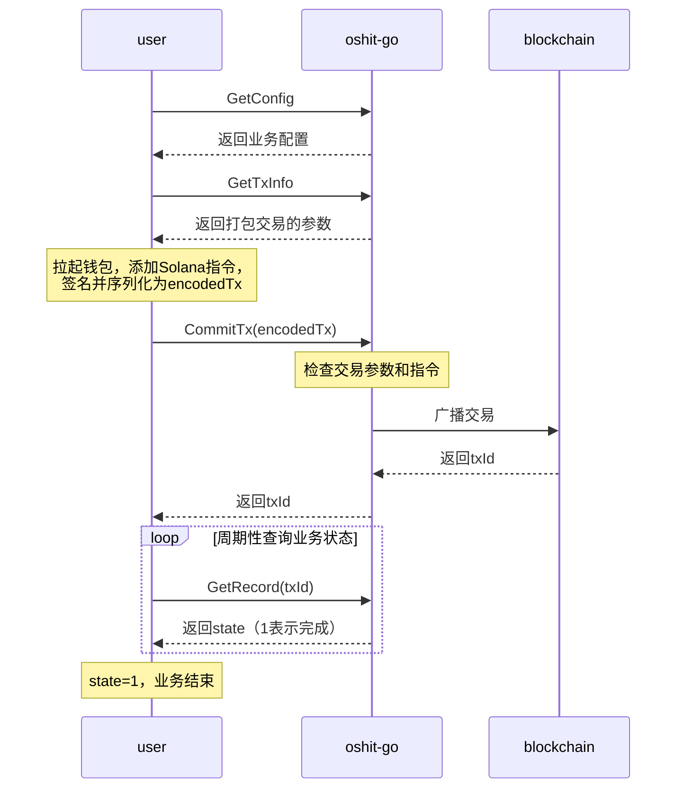

# oshit-go 项目总览

> 面向 Claude Code 使用的项目全局参考文档。详细服务文档请参阅各服务独立文档。请从overview.md开始阅读，overview会概述项目的信息，同时会在 1.1 文档索引章节索引文档，引导大模型详细阅读各个模块的文档。

---

## 1. 项目简介

oshit-go 是基于 Solana 区块链的 Token 奖励平台后端，采用 Go语言编写。前端用户完成特定行为（如领取 Token、赠出 Token）后，通过链上交易获得奖励，并通过邀请链机制将部分奖励分配给各层邀请人。
oshit-go 里面的各个服务之间通过dubbo实现服务间调用，于此同时通过kafka进行消息的生产，派发，和消费。

---

### 1.1 文档索引

| 文件名称              | 文档功能          | 说明                                                            | 
|-------------------|---------------|---------------------------------------------------------------|
| overview.md       | 总体预览文档        | 该文档整体的介绍了整个工程的结构，目的是为了引导claude等大模型来预览工程，并索引到其他文档来详细的了解每个模块的代码 |
| base_service.md   | base服务的文档说明   | 该文档详细的介绍了base服务的功能，流程，以及对其他服务提供的dubbo接口等信息                    |
| reward_service.md | reward服务的文档说明 | 该文档大致介绍了 reward 服务的功能划分，并且索引大模型到其他子业务去阅读更详细的代码                |
| pos_service.md    | pos 服务的文档说明   | 该文档大致介绍了 pos 服务的功能划分，并且索引大模型到其他子业务去阅读更详细的代码                   |
| testnet_deploy.md | 测试网部署说明文档     | 该文档介绍了测试网的部署网络top，以及详细的测试信息                                   |
| security_plan.md  | 安全加固计划        | 密钥管理、Nacos加固、运行时安全、密钥轮换等安全方案与实施进度                              |

## 2. 技术栈

| 层次 | 组件 | 库 |
|---|---|---|
| Web 框架 | HTTP 服务 | `github.com/gofiber/fiber/v2` |
| ORM | 数据库访问 | `gorm.io/gorm` + `gorm.io/driver/postgres` |
| 缓存 | Redis | `github.com/redis/go-redis/v9` |
| 分布式锁 | 基于 Redis | `github.com/go-redsync/redsync/v4` |
| 消息队列 | Kafka | `github.com/segmentio/kafka-go` |
| 服务间 RPC | Dubbo Triple 协议 | `dubbo.apache.org/dubbo-go/v3` |
| 注册中心 | Nacos | `127.0.0.1:8848` |
| 区块链 | Solana SDK | `github.com/gagliardetto/solana-go` |
| 区块链节点 | QuickNode | RPC/WSS |
| 配置加载 | Viper | `github.com/spf13/viper` |
| JSON | json-iterator | `github.com/json-iterator/go`（禁用 6 位小数截断） |
| 数据库 | PostgreSQL | 主键使用 ULID |

---

## 3. 目录结构

```
oshit-go/
├── app/
│   ├── base/api/         # Base 服务（端口 1100 HTTP + 20880 Dubbo）
│   ├── reward/api/       # Reward 服务（端口 1200 HTTP）
|   ├── pos/api/          # Pos 服务（端口 1300 HTTP）
│   └── utils/            # 应用层工具（tx.go, rpc.go）
├── common/
│   ├── constants/        # 业务常量（交易状态、资金流向类型等）
│   ├── pkg/
│   │   ├── dal/          # GORM 自动生成的 model + query
│   │   ├── entity/       # 跨服务共享数据结构（Kafka 消息、解码后交易）
│   │   ├── pb/base/      # Protobuf 生成代码（Dubbo Triple 协议，base 服务 RPC 接口）
│   │   └── response/     # HTTP 响应结构
│   └── utils/            # 通用工具（amount, jwt, jasypt, solana_util）
├── repositories/
│   ├── base_structure.sql          # Base 服务所有表的 DDL
│   └── reward_structure.sql        # Reward 服务所有表的 DDL
└── docs/v1               # 参考文档（本文件所在目录）
└── deploy                # 部署相关脚本和docker file,scripts下的server.sh用作线上启动程序脚本
```

---

## 4. 服务划分

## 4.1 按照目录划分

| 服务 | 目录 | 端口 | 职责 |
|---|---|---|---|
| base-api | `app/base/api` | HTTP 1100 / Dubbo 20880 | 基础能力：链上交易扫描、Kafka 推送、费率/价格/邀请等 HTTP API、Dubbo 对内服务 |
| reward-api | `app/reward/api` | HTTP 1200 | 业务层：TakeToken / GiveToken 等用户通过前端页面做活动获取奖励的业务 |
| pos-api | `app/pos/api` | HTTP 1300 | 业务层：Pos / Stake 等通过持有token或者质押token到指定智能合约获取奖励的业务 |

多个服务共享共同的postgres,redis,kafka,nacos.

## 4.2 按照具体的业务划分

```
├── base
├── reward
    ├── take token
    ├── give token
    ├── lottery
    ├── reward code
    ├── campaign quote
├── pos
    ├── pos reward
    ├── stake token
    ├── stake reward
    ├── stake reward leader
    ├── market buy token
```

---

## 5. 业务常量定义

在 common/constants/service.go 和  common/constants/service_const.go 当中定义了全局使用的一些业务常量，包括:

* service.go

| 常量 | 说明 |
|---|---|
| ServiceReward | 标识 reward 服务整个业务 |
| ServicePos |  标识 pos 服务整个业务 |

| 常量 | 说明 |
|---|---|
| SubServiceTakeToken | 标识 reward 整个服务下的 take token 业务 |
| SubServiceGiveToken | 标识 reward 整个服务下的 give token 业务 |
| SubServiceLottery | 标识 reward 整个服务下的 lottery 业务 |
| SubServiceRewardCode | 标识 reward 整个服务下的 reward code 业务 |
| SubServicePosReward | 标识 pos 整个服务下的 pos reward 业务，该业务用于奖励持币超过一定数量的用户 |
| SubServiceStakeToken | 标识 pos 整个服务下的 stake token 业务，该业务用于记录并确认用户的质押token行为 |
| SubServiceStakeReward | 标识 pos 整个服务下的 stake reward 业务，该业务用于奖励质押token到指定智能合约地址的用户 |
| SubServiceStakeLeaderReward | 标识 pos 整个服务下的 stake reward 业务，该业务用于奖励推荐其他用户质押token到指定智能合约地址的领导 |
| SubServiceMarketBuyToken | 标识 pos 整个服务下的 market buy token 业务，该业务用来记录用户在去中心话交易所购买token的记录 |
| SubServiceCampaignQuote | 标识 reward 整个服务下的 campaign 业务，该业务让用户可以将做活动得到的积分兑换成我们发布的token |

* service_const.go

* * 交易获取常量

| 常量 | 说明 |
|---|---|
| TxFetchInit | 没有开始获取交易 |
| TxFetchFailed | 获取交易失败，无法查到交易，在oshit-go里面会尝试多次查询交易，查询不到会标记交易获取失败 |
| TxFetchSuccess | 获取交易成功 |

交易获取这几个常量只负责标记获取链上交易的状态，不负责标记交易是否被执行成功

* * 交易状态常量

| 常量 | 说明 |
|---|---|
| TxStateFailed | 交易执行失败 |
| TxStateInit | 交易初始化 |
| TxStateSuccess | 交易执行成功 |

交易状态的几个常量，负责标记链上交易是否被执行成功

* * 奖励状态常量

| 常量 | 说明 |
|---|---|
| RewardStateExpired | 奖励超时 |
| RewardStateFailed | 奖励失败 |
| RewardStateInit | 奖励初始化，也就是未被领取 |
| RewardStateClaimed | 奖励已经被领取 |

* * 兑换状态常量

| 常量 | 说明 |
|---|---|
| QuoteStateFailed | 兑换失败 |
| QuoteStateInit | 兑换初始化 |
| QuoteStateSuccess | 兑换成功 |

> 注意：旧版的流水方向常量（FlowInput/FlowOutput）和流水类型常量（FlowCost/FlowReceipt/FlowInviter）已废弃，`t_fund_flow` 表不再使用。

---

## 6. 跨服务数据结构

## 6.1 被解析后的交易

common/pkg/entity/tx.go

* DecodedSolTransferInst

被解析后solana转账指令

| 字段 | 类型 | 说明 | 
| ---- | ------- |----- | 
| FromNativeAccount| solana.PublicKey | 转账发起地址 | 
| ToNativeAccount | solana.PublicKey | 转账收款地址 | 
| Amount | uint64 |转账金额 | 

* DecodedServiceTransferInst

被解析成业务可读的 solana 转账指令，该指令使用的数据类型均为 go 的基础类型

| 字段 | 类型 | 说明 | 
| ---- | ----- | ----- | 
| FromNativeAccount | string | 转账发起地址 | 
| ToNativeAccount | string | 转账收款地址 | 
| Amount | float64 | 转账金额 | 

* DecodedSolTransferCheckedInst

被解析出来的 solana transfer checked 指令

| 字段 | 类型 | 说明 | 
| ---- | ----- | ----- | 
| FromTokenAccount | solana.PublicKey |  转账发起方，solana system account | 
| FromNativeAccount | solana.PublicKey | 转账发起方，token account | 
| ToTokenAccount | solana.PublicKey | 转账接收方，token account | 
| ToNativeAccount | solana.PublicKey | 转账接收方，solana system account | 
| OwnerNativeAccount | solana.PublicKey | transfer checked 指令的owner account | 
| TokenMintAccount | solana.PublicKey | token mint account | 
| Amount | uint64 | 转账金额 | 
| Decimals | uint8 | 转账精度 | 

* DecodedServiceTransferCheckedInst

被解析成业务可读的 solana transfer checked  转账指令，该指令使用的数据类型均为 go 的基础类型

| 字段 | 类型 | 说明 | 
| ---- | ----- | ----- | 
| FromTokenAccount | solana.PublicKey |  转账发起方，solana system account | 
| FromNativeAccount | solana.PublicKey | 转账发起方，token account | 
| ToTokenAccount | solana.PublicKey | 转账接收方，token account | 
| ToNativeAccount | solana.PublicKey | 转账接收方，solana system account | 
| OwnerNativeAccount | solana.PublicKey | transfer checked 指令的owner account | 
| TokenMintAccount | solana.PublicKey | token mint account | 
| Amount | uint64 | 转账金额 | 
| Decimals | uint8 | 转账精度 | 

* DecodedSolanaTransaction

被解析出来的solana交易，字段名都以solana原生的public key,signature数据结构保存

| 字段 | 类型 | 说明 | 
| ---- | ----- | ----- | 
| TxID | solana.Signature | 交易ID | 
| FromNativeAccount | solana.PublicKey | 转账发起方，solana system account  | 
| FromTokenAccount | solana.PublicKey | 转账发起方，token account | 
| FeePayer | solana.PublicKey | 交易手续费支付方 | 
| RefBlockHash | solana.Hash | 交易引用区块哈希 | 
| Accounts | []solana.PublicKey | 交易的accounts | 
| Signatures |  []solana.Signature | 交易的多个签名 | 
| TransferInstructions | []DecodedSolTransferInst | 被解析出来的transfer指令 | 
| TransferCheckedInstructions | []DecodedSolTransferCheckedInst | 被解析出来的transfer checked指令 | 
| ComputeUnitPrice | uint64 | 优先费用 | 
| ComputeUnitLimit | uint64 | 计算的单元 | 
| EstimateFee | uint64 | 交易消耗手续费 | 

* DecodedServiceTransaction

被解析出来的solana交易，字段名都 go 基础类型保存

| 字段 | 类型 | 说明 | 
| ---- | ----- | ----- | 
| TxID | string | 交易ID | 
| RefBlockHash | string | 交易引用区块哈希 | 
| FromNativeAccount | string | 转账发起方，solana system account  | 
| FromTokenAccount | string | 转账发起方，token account | 
| FeePayer | string | 交易手续费支付方 | 
| Accounts | []string | 交易的accounts | 
| Signatures | []string | 交易的多个签名 | 
| ToDexInst |  DecodedServiceTransferInst | 转账给成本费地址的指令 | 
| TransferTokenInst | DecodedServiceTransferCheckedInst | 被解析出来的transfer checked指令 | 
| RewardInst | DecodedServiceTransferCheckedInst | 被解析出来的 奖励发起用户的 transfer checked指令 | 
| RewardInviterInst | []DecodedServiceTransferCheckedInst | 被解析出来的 奖励邀请人的 transfer checked指令 | 
| EstimateFee | float64 | 被解析出来的transfer checked指令 | 


## 6.2 kafka消息

* NewScannedTx

| 字段 | 类型 | 说明 | 
| ---- | ----- | ----- | 
| Service | string | 业务名称 | 
| SubService | string | 子业务名称 | 
| TxSig | rpc.TransactionSignature | 交易Id | 
| DecodedTx | DecodedSolanaTransaction | 被解析后的solana交易 | 

当 base 服务扫描到新的交易之后，会将新交易解码，然后写入到kafka消息队列里面

* NewExpiredTx

| 字段 | 类型 | 说明 | 
| ---- | ----- | ----- | 
| Service | string | 业务名称 | 
| SubService | string | 子业务名称 | 
| TxID |  string | 交易Id |

当 base 服务尝试多次请求查询业务相关的交易id，如果查询不到则将消息写入到kafka消息队列里面

* KafkaNewSnapShotMsg

| 字段 | 类型 | 说明 | 
| ---- | ----- | ----- | 
| MsgType | string | 消息类型 | 
| MsgContent | time.Time | 快照日期 | 

快照消息，主要是 pos 服务的的Pos和Stake业务采用到。

Pos业务会每天在新加坡时间中午12点去对token的持币地址进行快照，将快照信息写入到数据库后，通知对应的模块进行快照信息处理。
Stake业务会在每天新加坡时间的中午12点去对质押到指定智能合约里面的token数量进行快照，将快照信息写入到数据库之后，通知对应的模块进行快照信息的处理。

---


## 7. 典型的业务流程



上面的流程图画出来了1个典型的业务流程，典型的流程如下:

1. 参与方分为3方，用户(user),服务器(oshit-go),区块链(blockchain)
2. user 向 oshit-go 查询业务配置 (GetConfig)
3. oshit-go 向 user 返回业务配置
4. user 向 oshit-go 请求打包交易的参数(GetTxInfo)
5. oshit-go 返回打包交易的参数给到 user
6. user 拉起钱包，根据打包交易的参数向 solana 交易里面增加不同类型的指令，然后签名。
7. user 将签名后的交易序列化成二进制，然后放到参数 encodedTx 里main提交到 oshit-go (CommitTx)
8. oshit-go 检查交易参数和指令没问题后，将交易广播到 blockchain
9. oshit-go 将广播到 blockchain 的 txId 返回给 user
10. user 根据 txId 周期性的去查询业务状态 (GetRecord)，如果获取到 state 为1，则结束业务

## 8. 约束与术语

### 8.1 术语

* solana 地址
  solana 区块链的system account,用户随机生成1个私钥，然后私钥生成公钥，公钥就是solana地址
  
* native account
  跟solana地址一样  

* token account
  pda 账户，根据solana地址和token的地址生成的pda账户

* pda account
  跟solana的pda一样

* 用户
  在系统里面，用户等于solana地址

* 地址
  solana区块链的地址

### 8.2 api和数据表

* 数据表的
    * 数据库表的命名和字段命名尽量保持简洁和简短
    * 字段以小写和下划线命名，不得与postgres数据库关键字冲突

* 金额
    * 数据库内保存的金额都以 numeric(78,0) 保存，保存的是按照token最小单位计算的浮点数，但是不包含小数部分，也就是原始金额 amountRaw
    * api 返回给前端的金额也是原始金额，但是需要前端将金额转换成字面值，也就是 amountUI，然后显示到UI上面
    * 打包交易指令的时候，前端依旧要使用amountRaw，因为solana就是这么规定的

* 费率
    * 费率都采用 numeric(5,2) 保存，费率最小精确到 0.01%，计算费率的时候，需要除以单位 100

## 9.  本地开发

* 本地docker环境

我在本地开发环境使用docker来启动了服务所需要的组建，包括 postgres,redis,kafka,nacos 等，具体服务的端口如下:

```
CONTAINER ID   IMAGE                           COMMAND                   CREATED        STATUS                      PORTS                                                                                                         NAMES
7a393b5c286c   provectuslabs/kafka-ui:latest   "/bin/sh -c 'java --…"   3 weeks ago    Up 3 weeks                  0.0.0.0:9080->8080/tcp                                                                                        kafka-ui
6e167e84ac0b   apache/kafka:latest             "/__cacert_entrypoin…"   3 weeks ago    Up 3 weeks                  0.0.0.0:9092->9092/tcp                                                                                        kafka
99dd2a863bd2   nacos/nacos-server:latest       "sh bin/docker-start…"   2 months ago   Up 2 days                   0.0.0.0:8080->8080/tcp, 0.0.0.0:8848->8848/tcp, 0.0.0.0:9848->9848/tcp                                        nacos-standalone-derby
e09d098ac10b   redis:latest                    "docker-entrypoint.s…"   2 months ago   Up 3 weeks                  0.0.0.0:6379->6379/tcp                                                                                        redis-8.4.0
d53639fbd265   postgres:16.2                   "docker-entrypoint.s…"   7 months ago   Up 3 weeks                  0.0.0.0:5432->5432/tcp                                                                                        postgres16.2

```

如果其他开发者接手该项目，CONTAINER ID 会有所变化，平时进行开发任务，你可以通过docker exec 进入具体的 docker 容器来执行命令

* gorm 生成 model和query

你可以去 cmd 目录下执行

```
go run gen.go
```

该命令会生成 gorm的model和query到 common/pkg/dal 目录下

## 10. TTL 数据清理

base 服务包含一个 `TTLCleanupTask`（`app/base/api/internal/task/ttl_cleanup.go`），每天 SGT 04:00 执行，统一清理所有过期业务数据。

清理方式：批量 DELETE + VACUUM FULL 回收磁盘空间。

| 表 | TTL | 备注 |
|---|---|---|
| `t_fee_statistics` | 2天 | |
| `t_service_tx` | 7天 | |
| `t_take_token_record` | 1月 | |
| `t_give_token_record` | 1月 | |
| `t_lottery_claim` | 1月 | |
| `t_daily_claim_stats` | 1月 | |
| `t_lottery_reward` | 1月 | |
| `t_campaign_quote_record` | 1月 | |
| `t_reward_code` | 1月 | 只清理 reward_state=-2 的已超时奖励码 |
| `t_pos_snap_shot` | 3月 | |
| `t_pos_reward` | 3月 | |
| `t_pos_reward_claim` | 3月 | |
| `t_stake_snap_shot` | 3月 | |
| `t_stake_reward_claim` | 3月 | |
| `t_stake_buy_token` | 3月 | |
| `t_stake_reward` | 3月 | 保留 reward_type=0 且 reward_state=0 的未领取固定利息 |

已废弃的表：
- `t_qn_fee` — QuickNode 手续费统计表，`estimateWeightAvgFee` 任务已删除
- `t_fund_flow` — 资金流水表，各业务模块已移除流水记录逻辑

## 11. 其他(待补充)


