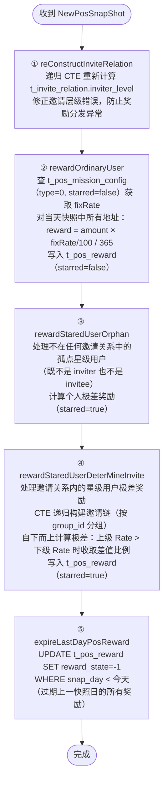
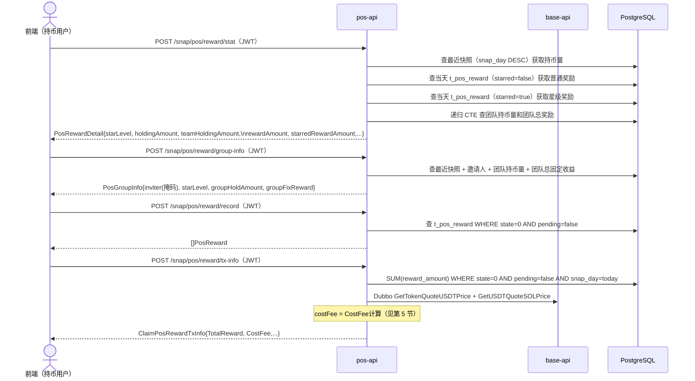
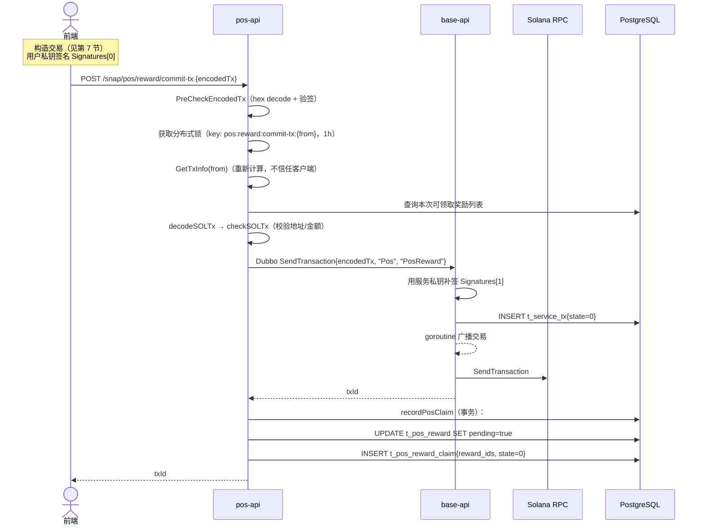
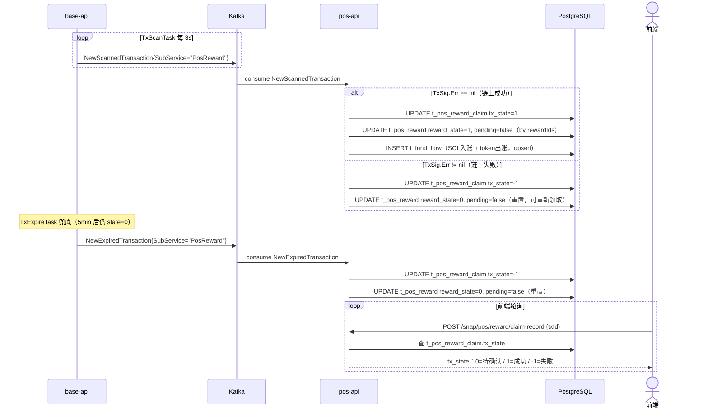
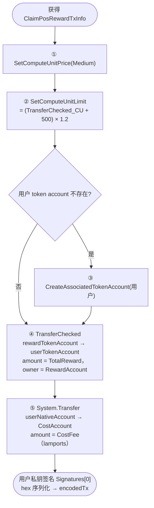
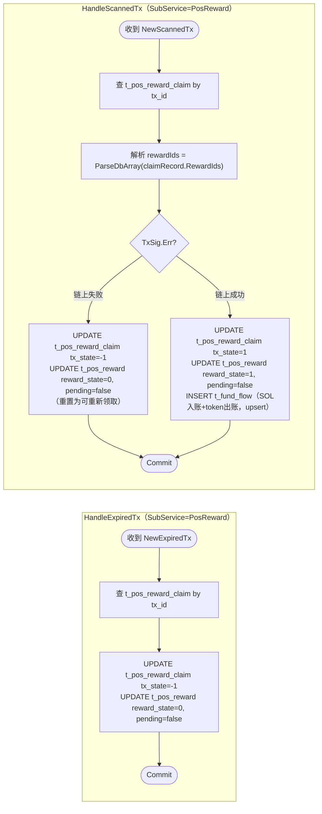

# 1. 业务概述

Pos Reward 是快照（Pos Snapshot）完成后，根据持币量、邀请关系和星级规则，向多类用户生成奖励记录，用户随后主动打包交易领取。

**触发链路**：
```
PosSnapShotTask 写入 t_pos_snap_shot
  → Kafka NewPosSnapShot
    → PosSnapShotLogic.ProcessSnapShot
      → 写入 t_pos_reward（普通 + 星级极差）
        → 用户调用 HTTP API 领取
```

> **与 StakeReward 的核心差异**：
> - 奖励基于**持币量**（token balance），不依赖质押合约
> - CostFee 动态计算：基于 token/USDT 价格，限制在 $0.01 ~ $1.00 USDT 之间
> - GetTxInfo 只汇总**当天**的奖励，历史当天奖励过期后不可领取
> - 额外提供 `group-info` 和 `stat` 接口用于展示团队数据

---

## 2. 奖励类型

| reward_type | 常量 | starred | 说明 |
|---|---|---|---|
| 0 | PosFixedIncome | false | 普通持币固定收益 `持币量 × rate/100 / 365` |
| 0 | PosFixedIncome | true | 星级极差奖励（OrphanStar 或 GroupStar）|

> `starred` 字段区分同一 `reward_type` 下的普通奖励和星级奖励，两者在唯一约束 `(native_account, snap_day, reward_type, starred)` 中共存。

**过期机制**：每次快照后，上一快照日（`snap_day < 今天`）的**所有** `t_pos_reward` 记录置为 `RewardStateExpired(-1)`。

---

## 3. 数据库表

### 配置表

* t_pos_reward_config

```sql
-- POS 奖励发放配置
DROP TABLE IF EXISTS public.t_pos_reward_config;
CREATE TABLE public.t_pos_reward_config
(
    record_id          ulid           NOT NULL DEFAULT gen_ulid(),
    reward_account     VARCHAR(64)    NOT NULL,  -- 发放奖励的 native account
    cost_account       VARCHAR(64)    NOT NULL,  -- 接收 SOL 成本费的 native account
    cost_fee_rate      NUMERIC(78, 0) NOT NULL,  -- 成本费率
    max_cost_fee       NUMERIC(78, 0) NOT NULL,  -- 最大成本费（raw）
    quote_token_amount NUMERIC(78, 0) NOT NULL,  -- CostFee 折算基准 token 数量（raw）
    created_at         TIMESTAMP WITHOUT TIME ZONE DEFAULT CURRENT_TIMESTAMP,
    updated_at         TIMESTAMP WITHOUT TIME ZONE DEFAULT CURRENT_TIMESTAMP,
    PRIMARY KEY (record_id)
);
```

* t_pos_star_level_rule

```sql
-- 星级评定规则（个人持币 + 团队持币双重判断）
DROP TABLE IF EXISTS public.t_pos_star_level_rule;
CREATE TABLE public.t_pos_star_level_rule
(
    record_id    ulid           NOT NULL DEFAULT gen_ulid(),
    amount       NUMERIC(78, 2) NOT NULL, -- 个人持币量门槛（raw）
    group_amount NUMERIC(78, 2) NOT NULL, -- 团队持币量门槛（raw）
    star_level   INT            NOT NULL, -- 星级（1~5）
    rate         NUMERIC(5, 2)  NOT NULL, -- 极差奖励费率（%）
    created_at   TIMESTAMP WITHOUT TIME ZONE DEFAULT CURRENT_TIMESTAMP,
    updated_at   TIMESTAMP WITHOUT TIME ZONE DEFAULT CURRENT_TIMESTAMP,
    PRIMARY KEY (record_id)
);
```

* t_pos_star_whitelist

```sql
-- 星级白名单（运营手动配置，优先级高于规则）
DROP TABLE IF EXISTS public.t_pos_star_whitelist;
CREATE TABLE public.t_pos_star_whitelist
(
    record_id      ulid        NOT NULL DEFAULT gen_ulid(),
    native_account VARCHAR(64) NOT NULL,
    star_level     INT         NOT NULL, -- 直接指定星级
    rate           NUMERIC(5, 2),        -- 直接指定极差费率
    created_at     TIMESTAMP WITHOUT TIME ZONE DEFAULT CURRENT_TIMESTAMP,
    updated_at     TIMESTAMP WITHOUT TIME ZONE DEFAULT CURRENT_TIMESTAMP,
    PRIMARY KEY (record_id)
);
CREATE UNIQUE INDEX ON public.t_pos_star_whitelist (native_account);
```

* t_pos_mission_config

```sql
-- 任务奖励费率配置（按 reward_type 和 starred 区分）
DROP TABLE IF EXISTS public.t_pos_mission_config;
CREATE TABLE public.t_pos_mission_config
(
    record_id   ulid NOT NULL DEFAULT gen_ulid(),
    reward_type INT  NOT NULL, -- 0=固定收益 1=关注Twitter 2=转推 3=点赞/回复
    starred     BOOL NOT NULL, -- true=星级用户配置 false=普通用户配置
    rate        NUMERIC(5, 2), -- 奖励费率（%）
    created_at  TIMESTAMP WITHOUT TIME ZONE DEFAULT CURRENT_TIMESTAMP,
    updated_at  TIMESTAMP WITHOUT TIME ZONE DEFAULT CURRENT_TIMESTAMP,
    PRIMARY KEY (record_id)
);
```

### 业务表

* t_pos_reward

```sql
-- POS 奖励明细表
DROP TABLE IF EXISTS public.t_pos_reward;
CREATE TABLE public.t_pos_reward
(
    record_id      ulid        NOT NULL DEFAULT gen_ulid(),
    group_id       VARCHAR(64) NOT NULL,         -- 极差计算时的团队根地址
    native_account VARCHAR(64) NOT NULL,         -- 奖励接收地址
    star_level     INT                  DEFAULT 0,  -- 星级（0=无星）
    base           NUMERIC(78, 0),               -- 计算奖励的基准值（raw）
    rate           NUMERIC(5, 2),                -- 奖励费率（%）
    reward_amount  NUMERIC(78, 0),               -- 奖励金额（raw）
    reward_type    INT,                          -- 奖励类型（见第 2 节）
    reward_state   INT                  DEFAULT 0,  -- -1=过期 0=待领取 1=已领取
    starred        BOOL        NOT NULL,         -- 是否为星级奖励
    pending        BOOL                 DEFAULT false, -- true=已提交待链上确认
    snap_day       DATE        NOT NULL,         -- 对应快照日期
    created_at     TIMESTAMP WITHOUT TIME ZONE DEFAULT CURRENT_TIMESTAMP,
    updated_at     TIMESTAMP WITHOUT TIME ZONE DEFAULT CURRENT_TIMESTAMP,
    PRIMARY KEY (record_id)
);
CREATE UNIQUE INDEX ON public.t_pos_reward (native_account, snap_day, reward_type, starred);
```

* t_pos_reward_claim

```sql
-- POS 奖励领取记录
DROP TABLE IF EXISTS public.t_pos_reward_claim;
CREATE TABLE public.t_pos_reward_claim
(
    record_id  ulid   NOT NULL DEFAULT gen_ulid(),
    reward_ids ulid[] NOT NULL,   -- 本次领取的 t_pos_reward.record_id 列表
    tx_id      VARCHAR(128),      -- 链上交易 id
    tx_state   INT    DEFAULT 0,  -- 0=待确认 1=成功 -1=失败
    created_at TIMESTAMP WITHOUT TIME ZONE DEFAULT CURRENT_TIMESTAMP,
    updated_at TIMESTAMP WITHOUT TIME ZONE DEFAULT CURRENT_TIMESTAMP,
    PRIMARY KEY (record_id)
);
```

**t_pos_reward 状态机**：

```
快照后写入     → pending=false, reward_state=0（待领取）
CommitTx 提交  → pending=true,  reward_state=0
Kafka 链上成功  → pending=false, reward_state=1（已领取）
Kafka 链上失败  → pending=false, reward_state=0（重置，可重新领取）
Kafka 超时      → pending=false, reward_state=0（重置，可重新领取）
新快照后过期    → reward_state=-1（当天之前的全部过期）
```

---

## 4. 快照后奖励生成（ProcessSnapShot）

收到 `NewPosSnapShot` Kafka 消息后，依次执行 5 步：



**星级评定规则（GetPosStarLevelFromConfig）**：

```mermaid
flowchart TD
    A([评定地址 X 的星级]) --> B{在白名单中?}
    B -- 是 --> C([返回白名单指定的 StarLevel 和 Rate])
    B -- 否 --> D["按个人持币量匹配 t_pos_star_level_rule.amount\n得到 holdLevel"]
    D --> E{holdLevel == 0?}
    E -- 是 --> F([返回星级 0])
    E -- 否 --> G{holdLevel < 5?}
    G -- 是 --> H["团队持币量 = 下级持币量汇总 + 自身持币量\n按 group_amount 匹配 groupLevel"]
    G -- 否（5星）--> I{下级持币量 >= 5星 group_amount?}
    I -- 是 --> J([返回 5 星])
    I -- 否 --> K["团队 = 下级 + 自身，最高返回 4 星"]
    H --> L([返回 min(holdLevel, groupLevel) 和 Rate])
    K --> L
```

---

## 5. CostFee 计算（pos 独有）

与 StakeReward（使用固定 `QuoteTokenAmount` 计算）不同，Pos 的 CostFee 动态基于 token/USDT 价格计算，并设置 USDT 上下界：

```
defaultUSDTFee = totalRewardAmount / 1000 × tokenQuoteUSDTPrice × 0.2

若 defaultUSDTFee < $0.01：使用 $0.01
若 defaultUSDTFee > $1.00：使用 $1.00
否则：使用 defaultUSDTFee

costFee(lamports) = clampedUSDTFee × usdtQuoteSOLPrice × LAMPORTS_PER_SOL
```

> **注意**：GetTxInfo 使用 `Dubbo GetTokenQuoteUSDTPrice` 和 `GetUSDTQuoteSOLPrice` 两个接口，而非 GetTokenQuoteSOLPrice。

---

## 6. 领取流程

### 6.1 阶段一：查询奖励信息



### 6.2 阶段二：提交领取交易（CommitTx）



### 6.3 阶段三：链上确认与 Kafka 处理



---

## 7. 前端构造交易指令



---

## 8. Kafka 处理逻辑（`logic/pos/reward_kafka.go`）



---

## 9. HTTP API（`handler/pos.go`）

所有路由挂载在 `/snap/pos` 前缀下。

### POST `/snap/pos/reward/config`

获取 pos 奖励发放配置。

- 响应：`model.PosRewardConfig`（reward_account / cost_account / cost_fee_rate / max_cost_fee / quote_token_amount）

---

### POST `/snap/pos/reward/stat` 🔒 需要 JWT

查询当前地址的 pos 奖励统计详情。

- 响应：`PosRewardDetail`

| 字段 | 类型 | 说明 |
|---|---|---|
| `starLevel` | int32 | 当前星级（0=无星） |
| `holdingAmount` | float64 | 个人持币量（最近快照） |
| `teamHoldingAmount` | float64 | 团队持币量（不含自己） |
| `rewardAmount` | float64 | 普通固定收益奖励 |
| `starredRewardAmount` | float64 | 星级极差奖励总额 |
| `starredRewardBase` | float64 | 星级奖励中属于个人的部分 |
| `starredRewardFromTeam` | float64 | 星级奖励中由团队带来的部分 |
| `totalRewardAmount` | float64 | 可领取总奖励 |
| `rewardState` | int | `-1`=过期 / `0`=待领取 / `1`=已领取 |
| `pending` | bool | 是否正在处理中 |

---

### POST `/snap/pos/reward/group-info` 🔒 需要 JWT

查询团队信息概览（邀请人、星级、团队持币量、团队总固定收益）。

- 响应：`PosGroupInfo`

| 字段 | 类型 | 说明 |
|---|---|---|
| `inviter` | string | 直接邀请人地址（中间位掩码显示，如 `ABcde*****fGhij`） |
| `starLevel` | int32 | 当前星级 |
| `groupHoldAmount` | float64 | 团队持币量（含自身） |
| `groupFixReward` | float64 | 团队总固定收益 |

---

### POST `/snap/pos/reward/record` 🔒 需要 JWT

查询当前地址的待领取奖励明细列表。

- 响应：`[]model.PosReward`（reward_state=0 AND pending=false）

---

### POST `/snap/pos/reward/tx-info` 🔒 需要 JWT

获取打包领取交易所需参数（**仅汇总当天快照的奖励**）。

- 响应：`ClaimPosRewardTxInfo`

| 字段 | 类型 | 说明 |
|---|---|---|
| `rewardAccount` | string | 发放奖励的 native account |
| `mint` | string | token mint 地址 |
| `decimals` | int32 | token 精度 |
| `totalReward` | float64 | 当天可领取奖励总额（raw） |
| `costAccount` | string | 接收 SOL 成本费的地址 |
| `costFee` | float64 | 需支付的 SOL 成本费（lamports，动态计算，见第 5 节） |

---

### POST `/snap/pos/reward/commit-tx`

提交签名后的领取交易。

- 请求体：`{ "encodedTx": "..." }`
- 响应：`txId`（string）

- 失败场景：

| 场景 | 说明 |
|---|---|
| 无可领取奖励 | TotalReward == 0 |
| 并发提交 | 分布式锁保护（key 为用户地址） |
| 金额不匹配 | TransferChecked amount != TotalReward |
| 成本费不足 | SOL amount < CostFee × (1 - MaxLessRate) |

---

### POST `/snap/pos/reward/claim-record`

根据交易 ID 查询领取记录，用于前端轮询状态。

- 请求体：`{ "txId": "..." }`
- 响应：`model.PosRewardClaim`（reward_ids / tx_id / tx_state）
