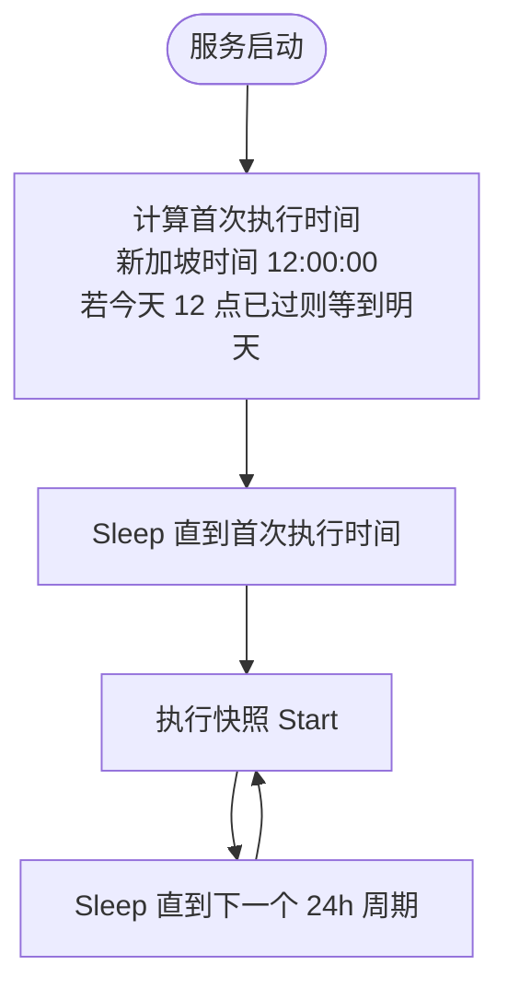
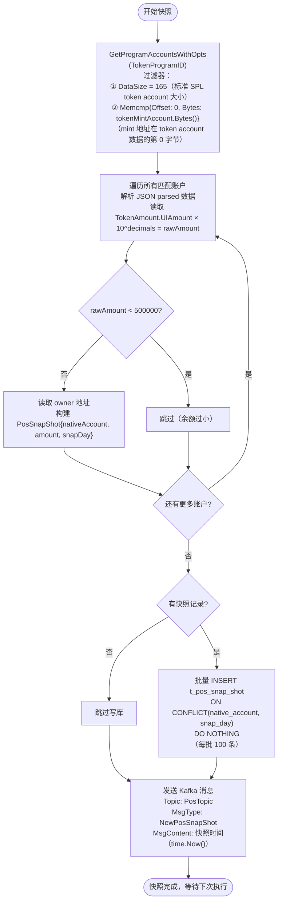

# 1. 业务概述

Pos Snapshot 是 pos 服务的定时快照任务，每天**新加坡时间中午 12 点**自动执行一次。

**核心职责**：
1. 通过 Solana RPC 查询 Token Program 下所有持有指定 token 的账户（token account）
2. 过滤持币量低于最低阈值（rawAmount < 500000）的账户
3. 将符合条件的持币记录写入 `t_pos_snap_shot`
4. 写入完成后发送 Kafka 消息 `NewPosSnapShot` 到 `PosTopic`，触发后续奖励计算

> **与 StakeSnapshot 的核心差异**：
> - Stake 查询**智能合约 PDA 账户**（程序状态账户）；Pos 查询**SPL token account**（持币账户）
> - Pos 使用 `DataSize + Memcmp` 过滤器精确定位持有某 mint 的账户
> - Pos 每条快照只有持币总量（无 stakeType 区分）
> - Pos 写入时 `ON CONFLICT DO NOTHING`（stake 为 DO UPDATE）

---

## 2. 数据库表

* t_pos_snap_shot

```sql
-- POS 每日持币快照表
DROP TABLE IF EXISTS public.t_pos_snap_shot;
CREATE TABLE public.t_pos_snap_shot
(
    record_id      ulid        NOT NULL DEFAULT gen_ulid(),
    native_account VARCHAR(64) NOT NULL,               -- 持币地址（token account 的 owner）
    amount         NUMERIC(78, 0),                     -- 持币总量（raw）
    star_level     INT                  DEFAULT 0,     -- 持币星级（快照后由奖励计算写入）
    rate           NUMERIC(5, 2),                      -- 极差费率（快照后由奖励计算写入）
    range_base     NUMERIC(5, 2),                      -- 极差基数（快照后由奖励计算写入）
    snap_day       DATE        NOT NULL,               -- 快照时间（time.Now() 精确到秒）
    created_at     TIMESTAMP WITHOUT TIME ZONE DEFAULT CURRENT_TIMESTAMP,
    updated_at     TIMESTAMP WITHOUT TIME ZONE DEFAULT CURRENT_TIMESTAMP,
    PRIMARY KEY (record_id)
);
CREATE UNIQUE INDEX ON public.t_pos_snap_shot (native_account, snap_day);
```

> 唯一约束 `(native_account, snap_day)` 配合 `ON CONFLICT DO NOTHING`：同一天重复快照时跳过已有记录，不覆盖。

---

## 3. 快照任务（`task/pos_snapshot.go`）

### 3.1 触发机制（与 StakeSnapshot 相同）



### 3.2 快照执行流程



---

## 4. RPC 查询说明

通过两个过滤器精确获取持有目标 token 的所有账户：

| 过滤器 | 参数 | 说明 |
|---|---|---|
| DataSize | 165 | SPL Token Account 的固定大小（165 bytes） |
| Memcmp | Offset=0, Bytes=tokenMint | mint 字段在 token account 数据的起始偏移为 0，占 32 bytes |

```
SPL Token Account 数据布局（165 bytes）：
offset  0 ( 32 bytes): mint
offset 32 ( 32 bytes): owner
offset 64 (  8 bytes): amount
offset 72 (  4 bytes): delegate_option
...
```

返回的账户数据以 `EncodingJSONParsed` 格式解析，从 `parsedData.Parsed.TokenAccountInfo` 读取：
- `Owner`：持币地址（native account）
- `TokenAmount.UIAmount`：UI 显示金额，乘以 `10^decimals` 转为 raw amount

---

## 5. Kafka 消息

| 属性 | 值 |
|---|---|
| Topic | `PosTopic` |
| Key | `NewPosSnapShot` |
| MsgType | `NewPosSnapShot` |
| MsgContent | 快照时间（`time.Now()`，精确到秒） |

**消费端**：`SnapShotConsumerTask` 从 `PosTopic` 读取，通过 `SnapShotHandlers["Pos"]` 路由到 `PosSnapShotLogic.ProcessSnapShot`，触发奖励计算（详见 `pos_pos_reward.md`）。

---

## 6. 手动触发（HTTP API）

### POST `/snap/pos/shot/take`

手动触发快照（调用 `StartTaskManually`，与自动流程完全一致，执行后直接返回不等待下次）。

- 请求：无 body
- 响应：`200 OK`

### POST `/snap/pos/shot/reset`

清空快照及奖励数据（用于测试环境重置）：

```sql
DELETE FROM t_pos_snap_shot;
DELETE FROM t_pos_reward;
DELETE FROM t_pos_reward_claim;
```

- 请求：无 body
- 响应：`200 OK`

---

## 7. 注意事项

| 项目 | 说明 |
|---|---|
| 最低持币阈值 | `rawAmount < 500000` 的账户跳过，避免微量持币账户产生噪音 |
| 金额单位 | `UIAmount × 10^decimals` = raw amount，直接存入 DB |
| 冲突处理 | `ON CONFLICT DO NOTHING`，重复快照不覆盖历史数据 |
| `snap_day` 精度 | `time.Now()`（精确到秒），而非截断到日期，同一天内多次快照会因唯一约束跳过 |
| Kafka 失败 | 失败时 `break` 退出任务循环，需运维手动触发恢复 |
| 快照频率 | 无分布式锁，多实例部署会重复快照，建议单实例 |
