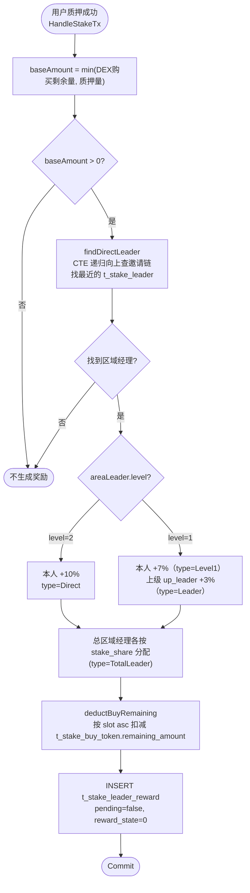
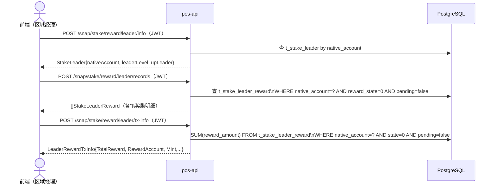
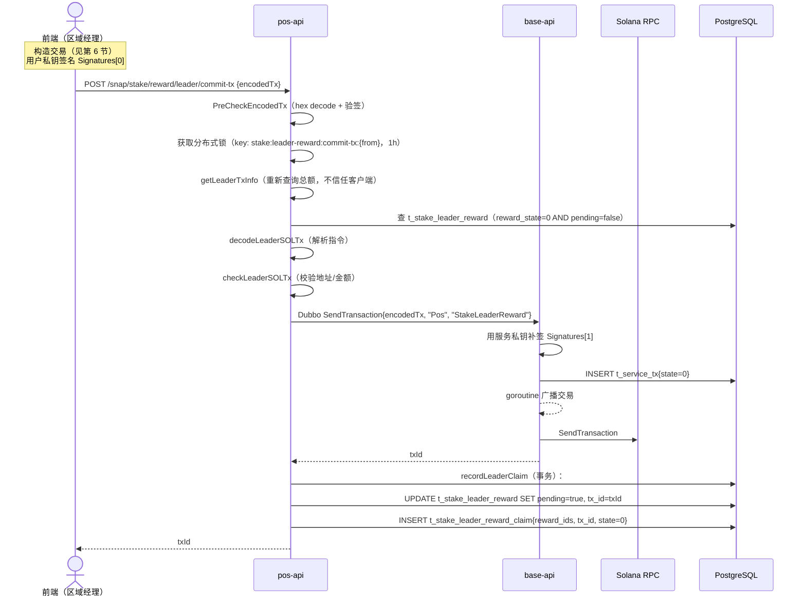
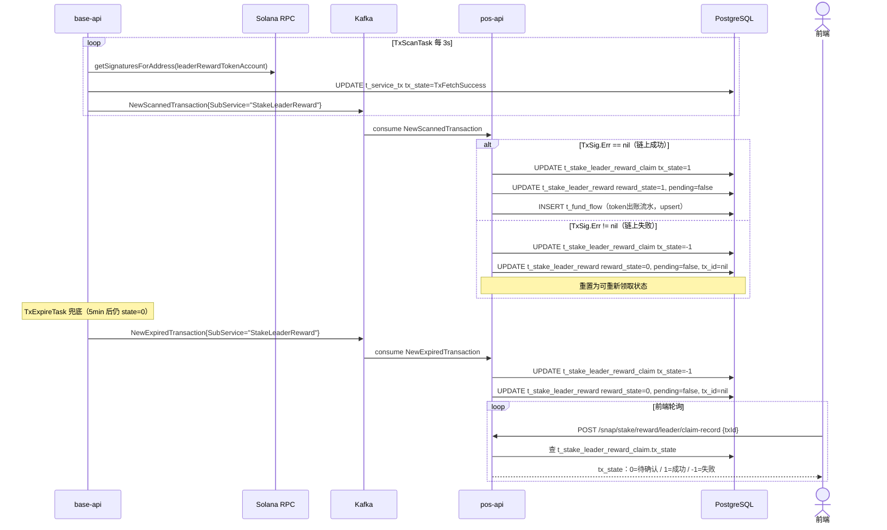
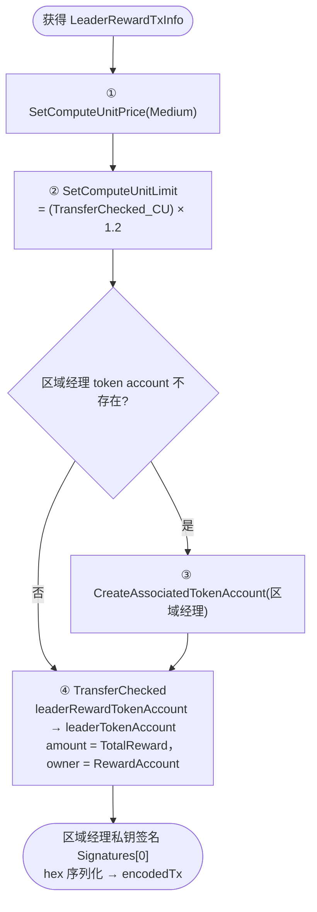
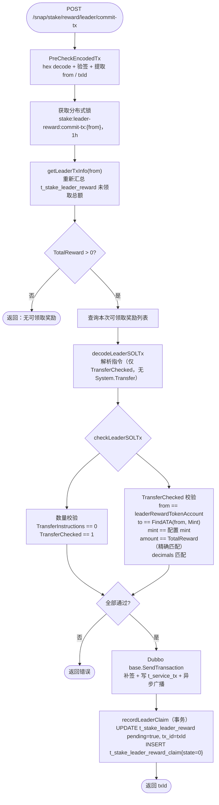
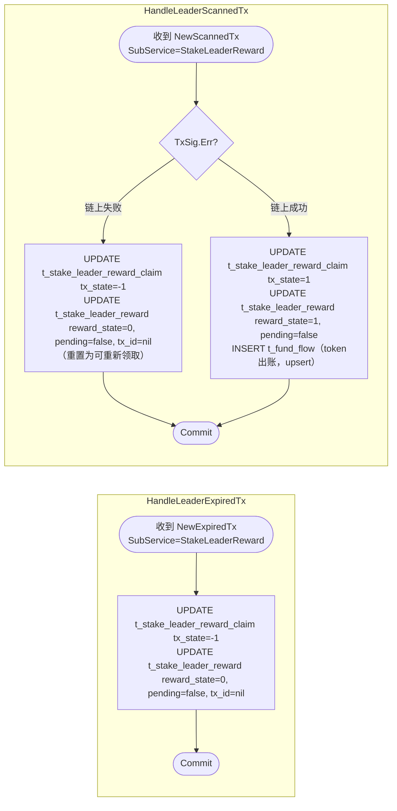

# 1. 业务概述

StakeLeaderReward 是 StakeToken 的附属奖励机制。当用户从 DEX 购买 token（`t_stake_buy_token`）后进行质押（stake）时，系统按比例向其邀请链上的区域经理（Area Leader）生成奖励记录。区域经理随后可自行打包交易领取累积奖励。

**整体流程**：
1. DEX 购买记录由 `HandleMarketBuyTx` 写入 `t_stake_buy_token`
2. 用户质押时（`HandleStakeTx`）计算区域经理奖励，写入 `t_stake_leader_reward`
3. 区域经理通过接口查询待领取奖励 → 构造交易 → CommitTx → 链上确认

> **与普通 StakeReward 的核心差异**：
> - 奖励**由质押行为触发**，而非快照触发
> - 领取时**无 SOL 成本费**，交易仅包含 1 条 TransferChecked（无 System.Transfer）
> - 奖励额度基于 `min(DEX购买剩余量, 质押量)`，按区域经理等级分配不同比例

---

## 2. 数据库表

* t_stake_buy_token（见 `pos_stake_token.md §2`，此处不重复）

* t_stake_leader_reward_config

```sql
-- 区域经理奖励发放配置
drop table if exists public.t_stake_leader_reward_config;
create table public.t_stake_leader_reward_config
(
    record_id      ulid not null               default gen_ulid(),
    reward_account varchar(64),                                               -- 发放奖励的 native account
    created_at     timestamp without time zone default current_timestamp,
    updated_at     timestamp without time zone default current_timestamp,
    primary key (record_id)
);
```

* t_stake_leader

```sql
-- 区域经理表（由运营配置）
drop table if exists public.t_stake_leader;
create table public.t_stake_leader
(
    record_id      ulid     not null           default gen_ulid(),
    native_account varchar(64),                                               -- 区域经理地址
    leader_level   smallint not null,                                        -- 等级：1=普通区域经理 2=无上级的高级区域经理
    up_leader      varchar(64),                                               -- 上级 leader 地址（level=1 时有值）
    created_at     timestamp without time zone default current_timestamp,
    updated_at     timestamp without time zone default current_timestamp,
    primary key (record_id)
);
```

* t_stake_total_leader

```sql
-- 总区域经理表（平台级别，按比例分配奖励）
drop table if exists public.t_stake_total_leader;
create table public.t_stake_total_leader
(
    record_id      ulid not null               default gen_ulid(),
    native_account varchar(64),                                               -- 总区域经理地址
    stake_share    numeric(5, 2),                                            -- 奖励分成比例（小数，如 0.07 = 7%）
    created_at     timestamp without time zone default current_timestamp,
    updated_at     timestamp without time zone default current_timestamp,
    primary key (record_id)
);
```

* t_stake_leader_reward

```sql
-- 区域经理奖励明细表（质押时生成）
drop table if exists public.t_stake_leader_reward;
create table public.t_stake_leader_reward
(
    record_id      ulid        not null default gen_ulid(),
    native_account varchar(64) not null,                       -- 区域经理地址
    staker         varchar(64) not null,                       -- 触发奖励的质押者地址
    reward_type    int         not null,                       -- 奖励类型（见下方说明）
    base_amount    numeric(78, 0),                             -- 基础金额 = min(DEX购买剩余量, 质押量)
    stake_share    numeric(5, 2),                              -- 奖励费率（%）
    reward_amount  numeric(78, 0),                            -- 奖励金额（raw）= base_amount × stake_share/100
    reward_state   int         not null default 0,             -- 0=待领取 1=已领取 -1=过期
    pending        bool        not null default false,         -- true=已提交交易待链上确认
    tx_id          varchar(128),                               -- 领取交易 id（pending 时写入）
    created_at     timestamp without time zone default current_timestamp,
    updated_at     timestamp without time zone default current_timestamp,
    primary key (record_id)
);
create index on public.t_stake_leader_reward (native_account, reward_state, pending);
```

**reward_type 枚举**：

| reward_type | 说明 | 比例 |
|---|---|---|
| 0（Direct） | level=2 区域经理直接获得 | 10% |
| 1（Level1） | level=1 区域经理获得 | 7% |
| 2（Leader） | level=1 的上级 Leader 获得 | 3% |
| 3（TotalLeader） | 总区域经理按各自 stake_share 获得 | 各自配置 |

* t_stake_leader_reward_claim

```sql
-- 区域经理奖励领取记录
drop table if exists public.t_stake_leader_reward_claim;
create table public.t_stake_leader_reward_claim
(
    record_id      ulid        not null default gen_ulid(),
    native_account varchar(64) not null,                   -- 领取者（区域经理）地址
    reward_ids     ulid[]      not null,                   -- 本次领取的 t_stake_leader_reward.record_id 列表
    tx_id          varchar(128),                           -- 链上交易 id
    tx_state       int                  default 0,         -- 0=待确认 1=成功 -1=失败
    created_at     timestamp without time zone default current_timestamp,
    updated_at     timestamp without time zone default current_timestamp,
    primary key (record_id)
);
create index on public.t_stake_leader_reward_claim (tx_id);
create index on public.t_stake_leader_reward_claim (native_account, tx_state);
```

**t_stake_leader_reward 状态机**：

```
质押触发写入    → pending=false, reward_state=0（待领取）
CommitTx 提交  → pending=true,  reward_state=0，tx_id 写入
Kafka 链上成功  → pending=false, reward_state=1（RewardStateClaimed）
Kafka 链上失败  → pending=false, reward_state=0（重置，可重新领取）
Kafka 超时      → pending=false, reward_state=0（重置，可重新领取）
```

---

## 3. 数据结构

```go
// GetTxInfo 响应，前端据此打包领取交易
type LeaderRewardTxInfo struct {
    RewardAccount string  `json:"rewardAccount"` // 发放奖励的 native account
    Mint          string  `json:"mint"`          // token mint 地址
    Decimals      int32   `json:"decimals"`      // token 精度
    TotalReward   float64 `json:"totalReward"`   // 当前可领取奖励总额（raw）
}
```

---

## 4. 奖励生成机制

奖励由 `HandleStakeTx`（Kafka 消费 stake 交易）触发，详见 `pos_stake_token.md §6`。



---

## 5. 业务流程

### 5.1 阶段一：查询奖励信息



### 5.2 阶段二：提交领取交易（CommitTx）



### 5.3 阶段三：链上确认与 Kafka 处理



---

## 6. 前端构造交易指令



> **注意**：领取区域经理奖励**无 SOL 成本费**，交易中**不含** System.Transfer 指令。

---

## 7. CommitTx 服务端处理



---

## 8. Kafka 处理逻辑（`logic/stake/reward_kafka.go`）



---

## 9. HTTP API（`handler/stake.go`）

所有路由挂载在 `/snap/stake/reward/leader` 前缀下，除 `claim-record` 外均需 JWT。

### POST `/snap/stake/reward/leader/info` 🔒 需要 JWT

查询当前登录地址的区域经理信息。

- 响应：`model.StakeLeader`

| 字段 | 类型 | 说明 |
|---|---|---|
| `nativeAccount` | string | 区域经理地址 |
| `leaderLevel` | int16 | 等级：`1`=有上级 / `2`=无上级 |
| `upLeader` | string | 上级 leader 地址（level=1 时有值） |

---

### POST `/snap/stake/reward/leader/records` 🔒 需要 JWT

查询当前登录地址的待领取区域经理奖励明细列表。

- 响应：`[]model.StakeLeaderReward`

| 字段 | 类型 | 说明 |
|---|---|---|
| `nativeAccount` | string | 区域经理地址 |
| `staker` | string | 触发奖励的质押者地址 |
| `rewardType` | int | 奖励类型（0/1/2/3） |
| `baseAmount` | numeric | 基础金额（raw） |
| `stakeShare` | numeric | 奖励费率（%） |
| `rewardAmount` | numeric | 奖励金额（raw） |
| `rewardState` | int | `0`=待领取 / `1`=已领取 |

---

### POST `/snap/stake/reward/leader/tx-info` 🔒 需要 JWT

获取打包领取交易所需参数。

- 响应：`LeaderRewardTxInfo`

| 字段 | 类型 | 说明 |
|---|---|---|
| `rewardAccount` | string | 发放奖励的 native account |
| `mint` | string | token mint 地址 |
| `decimals` | int32 | token 精度 |
| `totalReward` | float64 | 当前可领取奖励总额（raw） |

---

### POST `/snap/stake/reward/leader/commit-tx`

提交签名后的领取交易。

- 请求体：

| 字段 | 类型 | 必填 | 说明 |
|---|---|---|---|
| `encodedTx` | string | 是 | hex 编码的已签名 Solana 交易 |

- 响应：`txId`（string）

- 失败场景：

| 场景 | 说明 |
|---|---|
| 无可领取奖励 | `TotalReward <= 0` |
| 并发提交 | 分布式锁保护，同一地址同时只处理一笔 |
| 交易金额不匹配 | amount != TotalReward（精确匹配） |
| 交易含 SOL 转账 | 不应包含 System.Transfer |

---

### POST `/snap/stake/reward/leader/claim-record`

根据交易 ID 查询领取记录，用于前端轮询状态。

- 请求体：`{ "txId": "..." }`
- 响应：`model.StakeLeaderRewardClaim`

| 字段 | 类型 | 说明 |
|---|---|---|
| `nativeAccount` | string | 领取者地址 |
| `rewardIds` | ulid[] | 本次领取的奖励 ID 列表 |
| `txId` | string | 链上交易 ID |
| `txState` | int | `0`=待确认 / `1`=成功 / `-1`=失败 |
