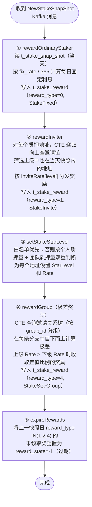
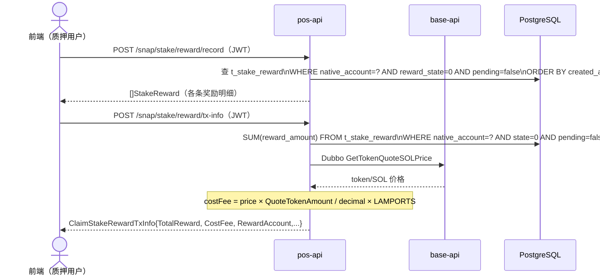
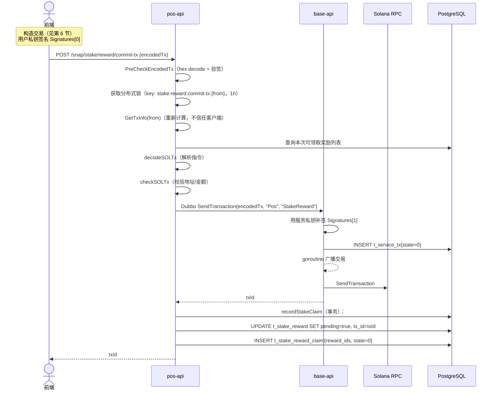
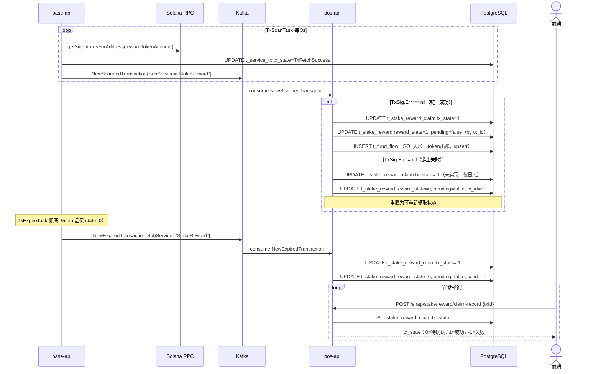
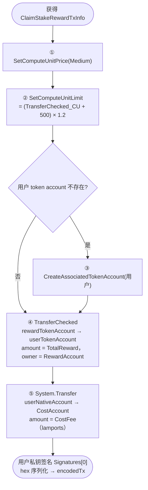
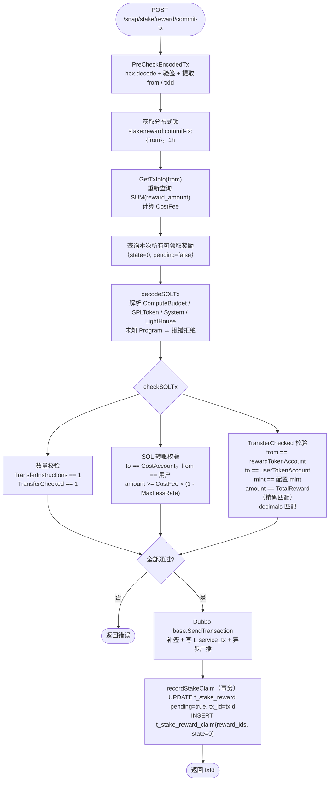
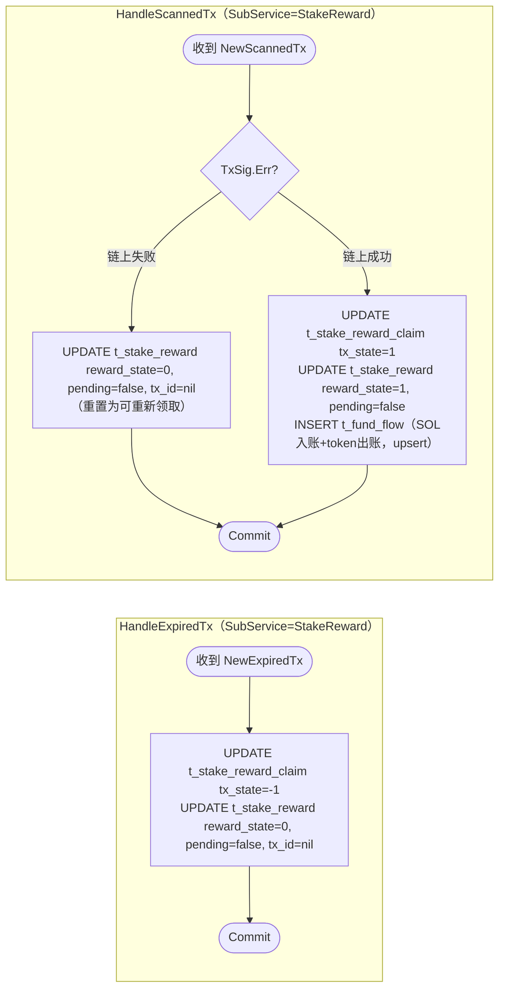

# 1. 业务概述

Stake Reward 是快照（Snapshot）完成后，根据质押数据、邀请关系和星级规则，向多类用户生成奖励记录，用户随后主动打包交易领取。

**触发链路**：
```
StakeSnapshotTask 写入 t_stake_snap_shot
  → Kafka NewStakeSnapShot
    → StakeSnapShotLogic.ProcessSnapShot
      → 写入 t_stake_reward（多种奖励类型）
        → 用户调用 HTTP API 领取
```

> **与 TakeToken / GiveToken 的核心差异**：
> - 奖励**被动生成**（由快照触发），不是用户主动发起
> - 领取时需支付 **SOL 成本费**（与 TakeToken 类似）
> - 一次 CommitTx 批量领取该地址**所有**待领取奖励（一笔交易对应多条 `t_stake_reward`）
> - 失败/超时时奖励**重置为可重新领取**（而非永久失败）

---

## 2. 奖励类型

快照处理（`ProcessSnapShot`）会为每个地址生成多种类型的奖励，写入 `t_stake_reward`：

| reward_type | 常量 | 说明 | 计算基准 |
|---|---|---|---|
| 0 | StakeFixed | 每日固定利息 | `质押量 × FixRate / 100 / 365` |
| 1 | StakeInvite | 邀请奖励 | `被邀请人固定利息 × InviteRate[level] / 100` |
| 2 | StakeStarIndividual | 星级个人奖励 | 待实现 |
| 3 | StakeStar | 星级奖励 | 待实现 |
| 4 | StakeStarGroup | 团队极差奖励 | `SnapBase × StarRate / 100 / 365`（极差计算） |

**过期机制**：每次快照后，上一快照日的 StakeInvite / StakeStarIndividual / StakeStarGroup 类型奖励若未领取，自动置为 `RewardStateExpired(-1)`。

---

## 3. 数据库表

### 配置表

* t_stake_fix_rate_config

```sql
-- 每日固定利息配置（按质押类型区分）
DROP TABLE IF EXISTS public.t_stake_fix_rate_config;
CREATE TABLE public.t_stake_fix_rate_config
(
    record_id       ulid NOT NULL DEFAULT gen_ulid(),
    min_amount      NUMERIC(78, 0),                  -- 最低质押金额
    stake_type      INT  NOT NULL,                   -- 质押类型 0=180天 1=360天
    fix_rate        NUMERIC(5, 2),                   -- 每日固定利息费率（%）
    individual_rate NUMERIC(5, 2),                   -- 星级个人奖励费率（%）
    created_at      TIMESTAMP WITHOUT TIME ZONE DEFAULT CURRENT_TIMESTAMP,
    updated_at      TIMESTAMP WITHOUT TIME ZONE DEFAULT CURRENT_TIMESTAMP,
    PRIMARY KEY (record_id)
);
```

* t_stake_invite_dist / t_stake_invite_rate

```sql
-- 邀请奖励层级配置
DROP TABLE IF EXISTS public.t_stake_invite_dist;
CREATE TABLE public.t_stake_invite_dist (dist_level INTEGER NOT NULL); -- 向上追溯的最大层级

-- 各层级邀请奖励费率
DROP TABLE IF EXISTS public.t_stake_invite_rate;
CREATE TABLE public.t_stake_invite_rate
(
    dist_level INTEGER       NOT NULL,  -- 层级（1=直接邀请人，2=间接邀请人...）
    rate       NUMERIC(5, 2) NOT NULL,  -- 从被邀请人固定利息中抽取的比例（%）
    PRIMARY KEY (dist_level)
);
```

* t_stake_star_level_rule / t_stake_star_whitelist

```sql
-- 星级评定规则（按个人质押量 + 团队质押量双重判断）
DROP TABLE IF EXISTS public.t_stake_star_level_rule;
CREATE TABLE public.t_stake_star_level_rule
(
    record_id    ulid           NOT NULL DEFAULT gen_ulid(),
    amount       NUMERIC(78, 2) NOT NULL, -- 个人质押量门槛
    group_amount NUMERIC(78, 2) NOT NULL, -- 团队质押量门槛
    star_level   INT            NOT NULL, -- 星级（1~5）
    rate         NUMERIC(5, 2)  NOT NULL, -- 极差奖励费率（%）
    created_at   TIMESTAMP WITHOUT TIME ZONE DEFAULT CURRENT_TIMESTAMP,
    updated_at   TIMESTAMP WITHOUT TIME ZONE DEFAULT CURRENT_TIMESTAMP,
    PRIMARY KEY (record_id)
);

-- 星级白名单（运营手动配置，优先级高于规则判断）
DROP TABLE IF EXISTS public.t_stake_star_whitelist;
CREATE TABLE public.t_stake_star_whitelist
(
    record_id      ulid        NOT NULL DEFAULT gen_ulid(),
    native_account VARCHAR(64) NOT NULL,
    star_level     INT         NOT NULL, -- 直接指定的星级
    rate           NUMERIC(5, 2),        -- 直接指定的极差费率
    created_at     TIMESTAMP WITHOUT TIME ZONE DEFAULT CURRENT_TIMESTAMP,
    updated_at     TIMESTAMP WITHOUT TIME ZONE DEFAULT CURRENT_TIMESTAMP,
    PRIMARY KEY (record_id)
);
CREATE UNIQUE INDEX ON public.t_stake_star_whitelist (native_account);
```

### 业务表

* t_stake_reward_config

```sql
-- 奖励发放配置（reward_account / cost_account 等）
drop table if exists public.t_stake_reward_config;
create table public.t_stake_reward_config
(
    record_id          ulid           not null default gen_ulid(),
    program_id         varchar(64)    not null,  -- 智能合约 PDA 地址
    reward_account     varchar(64)    not null,  -- 发放奖励的 native account
    cost_account       varchar(64)    not null,  -- 接收 SOL 成本费的 native account
    quote_token_amount numeric(78, 0) not null,  -- CostFee 计算基准 token 数量（raw）
    cost_fee_rate      int            not null,  -- 成本费率
    created_at         timestamp without time zone default current_timestamp,
    updated_at         timestamp without time zone default current_timestamp,
    primary key (record_id)
);
```

* t_stake_reward

```sql
-- 奖励明细表（快照后写入，用户领取前均在此表）
DROP TABLE IF EXISTS public.t_stake_reward;
CREATE TABLE public.t_stake_reward
(
    record_id      ulid        NOT NULL DEFAULT gen_ulid(),
    group_id       varchar(64) NOT NULL,        -- 邀请链的根地址（极差奖励分组用）
    native_account varchar(64) NOT NULL,        -- 奖励接收地址
    star_level     int                  DEFAULT 0,  -- 星级（0=无星）
    base           numeric(78, 0),              -- 奖励计算基准值（raw）
    rate           numeric(5, 2),               -- 奖励费率（%）
    reward_amount  numeric(78, 0),              -- 奖励金额（raw）
    stake_type     int NOT NULL,                -- 质押类型 0=180天 1=360天
    reward_type    int NOT NULL,                -- 奖励类型（见第2节）
    reward_state   int          DEFAULT 0,      -- -1=过期 0=待领取 1=已领取
    starred        bool NOT NULL,               -- 是否为星级用户奖励
    tx_id          varchar(128),                -- 领取交易 id（pending 时写入）
    pending        bool         DEFAULT false,  -- true=已提交交易待链上确认
    snap_day       date NOT NULL,               -- 对应快照日期
    created_at     timestamp without time zone DEFAULT current_timestamp,
    updated_at     timestamp without time zone DEFAULT current_timestamp,
    primary key (record_id)
);
create unique index on public.t_stake_reward (native_account, snap_day, reward_type, starred);
```

* t_stake_reward_claim

```sql
-- 奖励领取记录（CommitTx 时写入）
drop table if exists public.t_stake_reward_claim;
create table public.t_stake_reward_claim
(
    record_id  ulid   not null default gen_ulid(),
    reward_ids ulid[] not null,   -- 本次领取的 t_stake_reward.record_id 列表
    tx_id      varchar(128),      -- 链上交易 id
    tx_state   int    default 0,  -- 0=待确认 1=成功 -1=失败
    created_at timestamp without time zone default current_timestamp,
    updated_at timestamp without time zone default current_timestamp,
    primary key (record_id)
);
```

**t_stake_reward 状态机**：

```
快照后写入     → pending=false, reward_state=0（待领取）
CommitTx 提交  → pending=true,  reward_state=0，tx_id 写入
Kafka 链上成功  → pending=false, reward_state=1（已领取）
Kafka 链上失败  → pending=false, reward_state=0，tx_id=nil（重置，可重新领取）
Kafka 超时      → pending=false, reward_state=0，tx_id=nil（重置，可重新领取）
过期（新快照后） → reward_state=-1（RewardStateExpired）
```

---

## 4. 快照后奖励生成（ProcessSnapShot）

`KafkaNewSnapShotMsg{MsgType="NewStakeSnapShot"}` 触发 `StakeSnapShotLogic.ProcessSnapShot`，依次执行：



**星级评定规则（GetStakeStarLevelFromConfig）**：

```mermaid
flowchart TD
    A([评定地址 X 的星级]) --> B{在白名单中?}
    B -- 是 --> C([返回白名单配置的 StarLevel 和 Rate])
    B -- 否 --> D["按个人质押量匹配 t_stake_star_level_rule.amount\n得到 stakeLevel"]
    D --> E{stakeLevel == 0?}
    E -- 是 --> F([返回星级 0])
    E -- 否 --> G{stakeLevel < 5?}
    G -- 是 --> H["团队质押量 = 下级质押量汇总 + 自身质押量\n按 group_amount 匹配 groupLevel"]
    G -- 否（5星）--> I{下级质押量 >= 5星 group_amount?}
    I -- 是 --> J([返回 5 星])
    I -- 否 --> K["团队 = 下级 + 自身，最高返回 4 星"]
    H --> L([返回 min(stakeLevel, groupLevel) 和对应 Rate])
    K --> L
```

---

## 5. 领取流程

### 5.1 阶段一：查询奖励信息



### 5.2 阶段二：提交领取交易（CommitTx）



### 5.3 阶段三：链上确认与 Kafka 处理



---

## 6. 前端构造交易指令



---

## 7. CommitTx 服务端处理



---

## 8. Kafka 处理逻辑（`logic/stake/reward_kafka.go`）



**资金流水（HandleScannedTx 成功路径）**：

| 流水 | 方向 | flow_type | 说明 |
|---|---|---|---|
| SOL 入账 | FlowInput | FlowCost | 用户 → costAccount 的 SOL 成本费 |
| token 出账 | FlowOutput | FlowReceipt | rewardAccount → 用户 的 token 奖励 |

---

## 9. HTTP API（`handler/stake.go`）

所有路由挂载在 `/snap/stake/reward` 前缀下。

### POST `/snap/stake/reward/config`

获取 stake 奖励发放配置。

- 响应：`model.StakeRewardConfig`

| 字段 | 类型 | 说明 |
|---|---|---|
| `programId` | string | 智能合约 PDA 地址 |
| `rewardAccount` | string | 发放奖励的 native account |
| `costAccount` | string | 接收 SOL 成本费的地址 |
| `quoteTokenAmount` | numeric | CostFee 计算基准 token 数量（raw） |
| `costFeeRate` | int | 成本费率 |

---

### POST `/snap/stake/reward/star-level`

查询当前地址的质押星级。

- 响应：暂未实现（返回 null）

---

### POST `/snap/stake/reward/stat`

查询质押奖励统计信息。

- 响应：暂未实现（返回 null）

---

### POST `/snap/stake/reward/record` 🔒 需要 JWT

查询当前登录地址的待领取奖励明细列表。

- 响应：`[]model.StakeReward`（按创建时间倒序）

| 字段 | 类型 | 说明 |
|---|---|---|
| `nativeAccount` | string | 奖励接收地址 |
| `rewardAmount` | numeric | 奖励金额（raw） |
| `rewardType` | int | 奖励类型（见第 2 节） |
| `rewardState` | int | `0`=待领取 / `1`=已领取 / `-1`=已过期 |
| `starLevel` | int | 星级（0=无星） |
| `snapDay` | date | 对应快照日期 |
| `base` | numeric | 计算基准值 |
| `rate` | numeric | 奖励费率（%） |

---

### POST `/snap/stake/reward/tx-info` 🔒 需要 JWT

获取打包领取交易所需参数。

- 响应：`ClaimStakeRewardTxInfo`

| 字段 | 类型 | 说明 |
|---|---|---|
| `rewardAccount` | string | 发放奖励的 native account |
| `mint` | string | token mint 地址 |
| `decimals` | int32 | token 精度 |
| `totalReward` | float64 | 当前可领取奖励总额（raw） |
| `quoteAmount` | float64 | totalReward 对应的 SOL 报价（lamports，仅供展示） |
| `costAccount` | string | 接收 SOL 成本费的地址 |
| `costFeeRate` | int32 | 成本费率 |
| `costFee` | float64 | 需支付的 SOL 成本费（lamports，基于 QuoteTokenAmount 固定计算） |

---

### POST `/snap/stake/reward/commit-tx`

提交签名后的领取交易。

- 请求体：`{ "encodedTx": "..." }`
- 响应：`txId`（string）

- 失败场景：

| 场景 | 说明 |
|---|---|
| 无可领取奖励 | TotalReward == 0 |
| 并发提交 | 分布式锁保护（key 为用户地址） |
| 金额不匹配 | TransferChecked amount != TotalReward（精确匹配） |
| 成本费不足 | SOL amount < CostFee × (1 - MaxLessRate) |

---

### POST `/snap/stake/reward/claim-record`

根据交易 ID 查询领取记录，用于前端轮询状态。

- 请求体：`{ "txId": "..." }`
- 响应：`model.StakeRewardClaim`

| 字段 | 类型 | 说明 |
|---|---|---|
| `rewardIds` | ulid[] | 本次领取的 t_stake_reward.record_id 列表 |
| `txId` | string | 链上交易 ID |
| `txState` | int | `0`=待确认 / `1`=成功 / `-1`=失败 |
