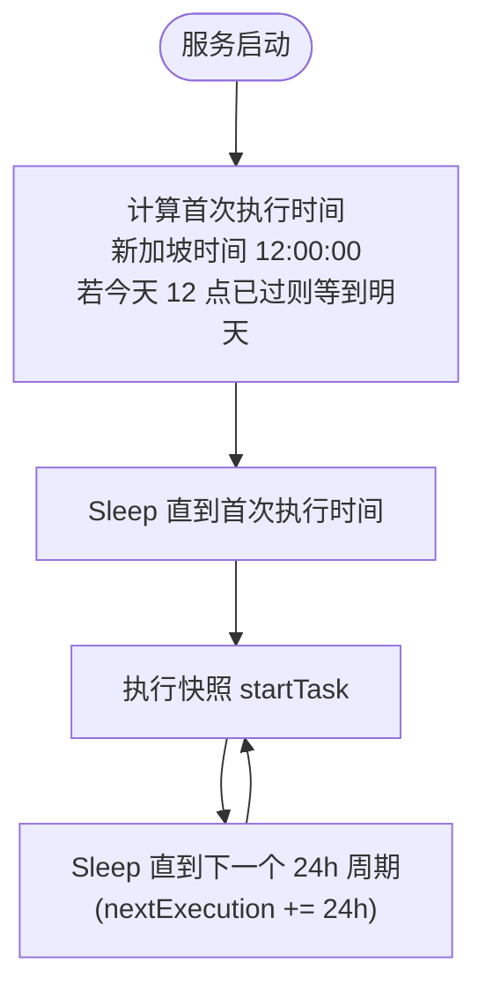
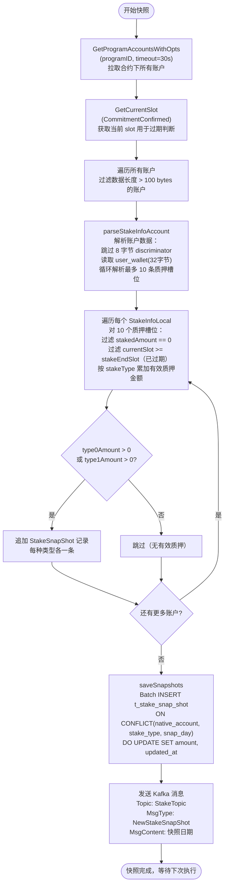
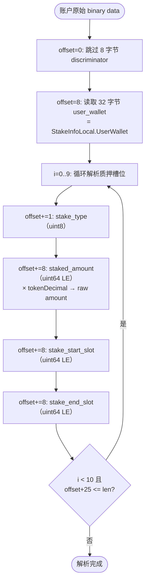

# 1. 业务概述

Stake Snapshot 是 pos 服务的定时快照任务，每天**新加坡时间中午 12 点**自动执行一次。

**核心职责**：
1. 通过 Solana RPC 拉取智能合约程序（`programID`）下的**所有 StakeInfo 账户**
2. 解析每个账户的质押记录（最多 10 条），过滤掉已过期（slot 超过 stakeEndSlot）的记录
3. 按质押类型（type=0 / type=1）分别汇总未过期质押金额，写入 `t_stake_snap_shot`
4. 写入完成后发送 Kafka 消息 `NewStakeSnapShot` 到 `StakeTopic`，由快照消费任务触发后续奖励计算

> 快照任务专注于**数据采集**，奖励计算逻辑由 Kafka 消费后的 `ProcessSnapShot` 完成（见 `pos_stake_reward.md`）。

---

## 2. 数据库表

* t_stake_snap_shot

```sql
-- stake 每日快照表
drop table if exists public.t_stake_snap_shot;
create table public.t_stake_snap_shot
(
    record_id      ulid        not null default gen_ulid(),
    native_account varchar(64) not null,                                  -- 质押用户地址
    amount         numeric(78, 0),                                        -- 该质押类型的未过期质押总额（raw）
    stake_type     int         not null,                                  -- 质押类型：0=180天 1=360天
    snap_day       date        not null,                                  -- 快照日期（UTC 当天零点）
    created_at     timestamp without time zone default current_timestamp,
    updated_at     timestamp without time zone default current_timestamp,
    primary key (record_id)
);
create index on public.t_stake_snap_shot (native_account);
create unique index on public.t_stake_snap_shot (native_account, stake_type, snap_day);
```

> 唯一约束 `(native_account, stake_type, snap_day)` 保证每人每种类型每天只有一条快照记录；写入时使用 `ON CONFLICT DO UPDATE SET amount` 实现幂等。

---

## 3. 快照任务（`task/stake_snapshot.go`）

### 3.1 数据结构

```go
// StakeInfoLocal 对应链上一个 StakeInfo 账户的本地解析结果
type StakeInfoLocal struct {
    UserWallet solana.PublicKey                 // 质押者地址（账户数据 offset=8 起 32 字节）
    Stakes     [MaxStakeRecordNum]StakeRecordLocal // 质押槽位，最多 10 条
}

// StakeRecordLocal 对应链上一条质押槽位记录
type StakeRecordLocal struct {
    StakeType      uint8  // 质押类型（0=180天 1=360天）
    StakedAmount   uint64 // 质押金额（raw，已乘以 tokenDecimal）
    StakeStartSlot uint64 // 质押开始 slot
    StakeEndSlot   uint64 // 质押到期 slot
}
```

**链上 StakeInfo 账户数据布局**：

| 字段 | 偏移 | 大小 | 说明 |
|---|---|---|---|
| discriminator | 0 | 8 bytes | Anchor 账户判别器，跳过 |
| user_wallet | 8 | 32 bytes | 质押者 native account |
| stakes[0..9] | 40 | 10 × 25 bytes | 质押槽位数组（每条 25 bytes） |

**每条质押槽位（25 bytes）**：

| 字段 | 大小 | 编码 |
|---|---|---|
| stake_type | 1 byte | uint8 |
| staked_amount | 8 bytes | uint64 LE，读取后 × tokenDecimal |
| stake_start_slot | 8 bytes | uint64 LE |
| stake_end_slot | 8 bytes | uint64 LE |

### 3.2 任务触发机制



### 3.3 快照执行流程



---

## 4. StakeInfo 账户解析详情

链上每个 StakeInfo 账户对应一个质押用户，通过 `GetProgramAccounts` 批量拉取：



**过期判断逻辑**：

```
if currentSlot == 0 OR currentSlot < record.StakeEndSlot:
    → 未过期，纳入统计
else:
    → 已过期，跳过
```

> `currentSlot == 0` 时（RPC 查询失败）视为所有记录未过期，保守处理。

---

## 5. 写入数据库

`saveSnapshots` 使用批量 upsert，每批 100 条：

```sql
INSERT INTO t_stake_snap_shot (native_account, amount, stake_type, snap_day, ...)
VALUES (...)
ON CONFLICT (native_account, stake_type, snap_day)
DO UPDATE SET amount = excluded.amount, updated_at = excluded.updated_at;
```

每位用户最多生成 **2 条**快照记录（type=0 和 type=1 各一条），amount 为该类型下所有未过期质押槽位的汇总。

---

## 6. Kafka 消息

快照写入完成后发送：

| 属性 | 值 |
|---|---|
| Topic | `StakeTopic` |
| Key | `NewStakeSnapShot` |
| MsgType | `NewStakeSnapShot` |
| MsgContent | 快照日期（`time.Time`，自动触发时为 `time.Now()`） |

**消费端**：`SnapShotConsumerTask` 从 `StakeTopic` 读取，通过 `SnapShotHandlers["Pos"]` 路由到 `StakeSnapShotLogic.HandeSnapShot`，触发奖励计算（详见 `pos_stake_reward.md`）。

---

## 7. 手动触发（HTTP API）

提供两个运维接口，不需要 JWT：

### POST `/snap/stake/shot/take`

手动触发快照（调用 `StartTaskManually`，流程与自动触发完全一致）。

- 请求：无 body
- 响应：`200 OK`

### POST `/snap/stake/shot/reset`

清空快照及奖励数据（用于测试环境重置）：

```sql
DELETE FROM t_stake_snap_shot;
DELETE FROM t_stake_reward;
DELETE FROM t_stake_reward_claim;
```

- 请求：无 body
- 响应：`200 OK`

---

## 8. 注意事项

| 项目 | 说明 |
|---|---|
| 账户过滤阈值 | 只处理数据长度 > 100 bytes 的账户，跳过配置账户等非 StakeInfo 账户 |
| 金额单位 | `staked_amount` 从链上读出后乘以 `tokenDecimal`，存入 `t_stake_snap_shot.amount` 为 raw amount |
| 幂等性 | ON CONFLICT DO UPDATE，重复执行快照只会覆盖 amount，不会产生重复记录 |
| 时区 | 触发时间为**新加坡时间（UTC+8）**中午 12 点；写入 DB 的 `snap_day` 以 **UTC 当天零点**为准 |
| Kafka 失败处理 | 当前实现 Kafka 发送失败时 `break` 退出循环，**不会**等到下次执行；需运维介入手动触发 |
| 任务类型 | 无分布式锁，多实例部署时会重复执行快照，建议单实例部署或加锁 |
