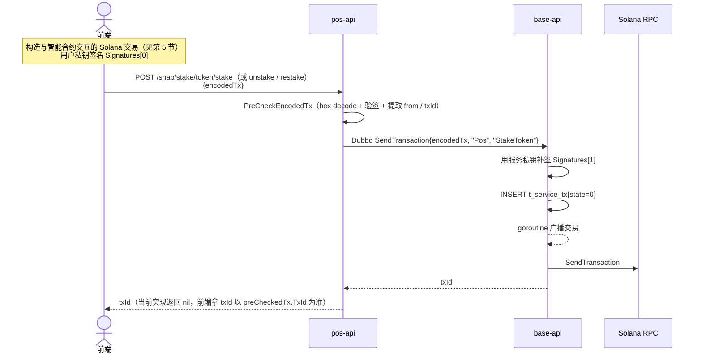
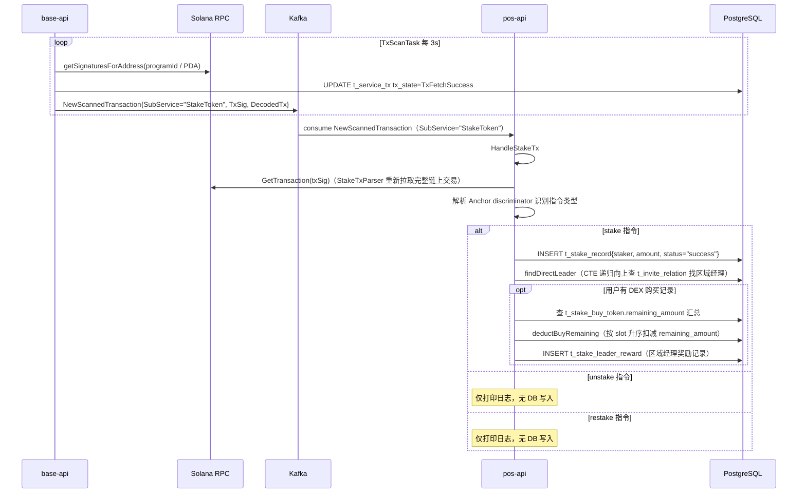
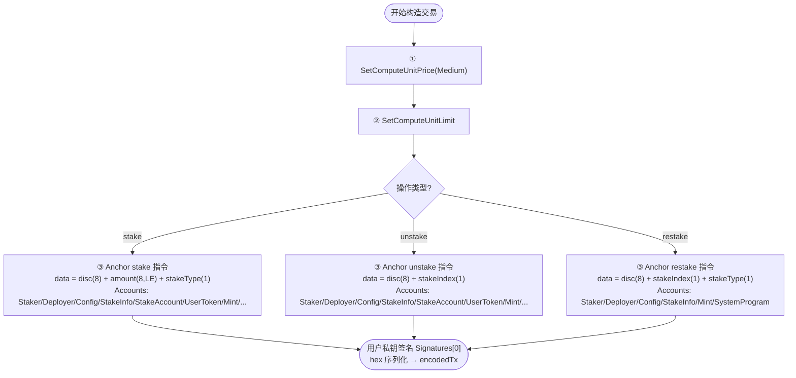
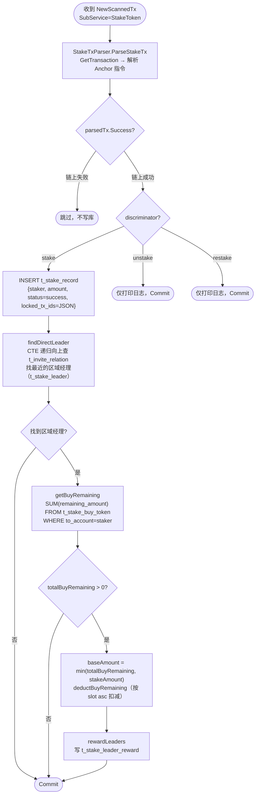
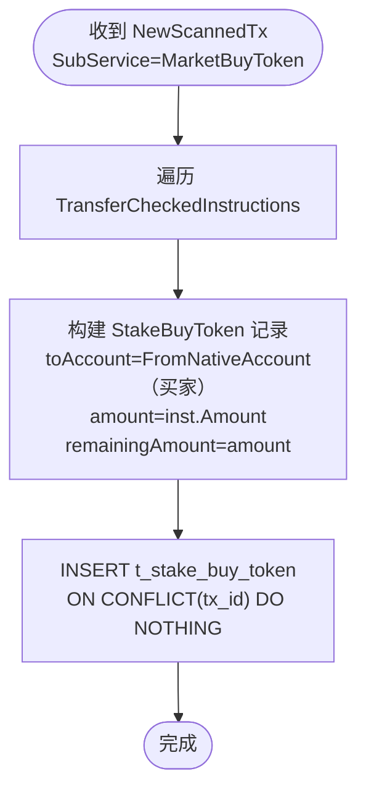

# 1. 业务概述

StakeToken 业务让用户将 token 质押到指定 Solana 智能合约（Anchor 程序），支持三种操作：

| 操作 | 说明 |
|---|---|
| **stake** | 质押 token，锁仓 180 天（type=0）或 360 天（type=1） |
| **unstake** | 解除质押，将 token 从智能合约取回（须超过锁仓期） |
| **restake** | 不取回，直接续期重新质押 |

> **与 reward 服务的核心差异**：
> - 前端直接与 Solana 智能合约交互，后端**不校验指令内容**，仅做预检查（验签）后直接广播
> - Kafka 消费后才做业务处理（写 `t_stake_record`、计算区域经理奖励）
> - 质押时若用户有 DEX 购买记录（`t_stake_buy_token`），会触发**区域经理奖励**写入

---

## 2. 数据库表

* t_stake_reward_config

```sql
-- 质押奖励发放配置表
drop table if exists public.t_stake_reward_config;
create table public.t_stake_reward_config
(
    record_id          ulid           not null default gen_ulid(),
    program_id         varchar(64)    not null,                               -- 智能合约程序地址（PDA 账户）
    reward_account     varchar(64)    not null,                               -- 奖励 token 的 native account
    cost_account       varchar(64)    not null,                               -- 收取成本费的 native account
    quote_token_amount numeric(78, 0) not null,                               -- 折算 token 的基准金额
    cost_fee_rate      int            not null,                               -- 领取奖励时的成本费费率
    created_at         timestamp without time zone default current_timestamp,
    updated_at         timestamp without time zone default current_timestamp,
    primary key (record_id)
);
```

* t_stake_record

```sql
-- 质押记录表（stake 成功后写入）
drop table if exists public.t_stake_record;
create table public.t_stake_record
(
    record_id     ulid           not null default gen_ulid(),
    staker        varchar(64),                                                -- 质押用户地址
    stake_amount  numeric(78, 0),                                            -- 质押金额（raw）
    status        varchar(16),                                               -- 质押状态（"success"）
    stake_tx_hash varchar(128),                                              -- 质押交易 id
    used_tx_ids   text,                                                      -- 已使用的购买交易 id 列表（JSON）
    locked_tx_ids text,                                                      -- 完整的 ParsedStakeTx JSON
    created_at    timestamp without time zone default current_timestamp,
    updated_at    timestamp without time zone default current_timestamp,
    primary key (record_id)
);
```

* t_stake_buy_token

```sql
-- DEX 购买 token 记录表（由 MarketBuyToken Kafka 消息写入）
drop table if exists public.t_stake_buy_token;
create table public.t_stake_buy_token
(
    tx_id            varchar(128)   not null,              -- 购买交易 id（唯一）
    slot             numeric(78, 0) not null,              -- 交易所在 slot
    from_account     varchar(64)    not null,              -- 卖出 token 的地址（Raydium Pool）
    to_account       varchar(64)    not null,              -- 买入 token 的地址（用户）
    amount           numeric(78, 0) not null,              -- 买入 token 金额（raw）
    locked           bool           not null default false,-- 是否已被锁定
    locked_by        varchar(128),                         -- 锁定该金额的交易 id
    locked_at        timestamptz(6),                       -- 锁定时间
    staked_amount    numeric(78, 0) not null default 0,    -- 已质押金额
    remaining_amount numeric(78, 0) not null default 0,   -- 剩余可用金额
    expired          bool           not null default false,
    created_at       timestamp without time zone default current_timestamp,
    expired_at       timestamp without time zone default current_timestamp
);
create unique index uq_stake_buy_token_tx_id on public.t_stake_buy_token (tx_id);
```

---

## 3. 数据结构

```go
// stake / unstake / restake 三个接口共用同一请求结构
type EncodedTxReq struct {
    EncodedTx string `json:"encodedTx"` // hex 编码的已签名 Solana 交易二进制
}
```

```go
// ParsedStakeTx 链上交易解析结果（Kafka 处理时使用）
type ParsedStakeTx struct {
    TransactionSignature solana.Signature
    InstructionData      StakeInstructionData
    Accounts             StakeAccounts
    Signatures           []solana.Signature
    Success              bool
    RawData              []byte
}

type StakeInstructionData struct {
    Discriminator []byte // SHA256("global:<name>") 前 8 字节
    Amount        uint64 // 仅 stake 携带（raw，需 × tokenDec 换算）
    StakeType     uint8  // 仅 stake 携带：0=180天 1=360天
}

type StakeAccounts struct {
    Staker           solana.PublicKey
    Deployer         solana.PublicKey
    ConfigAccount    solana.PublicKey
    StakeInfoAccount solana.PublicKey
    StakeAccount     solana.PublicKey // stake/unstake 有
    UserTokenAccount solana.PublicKey // stake/unstake 有
    MintAccount      solana.PublicKey
    ProgramID        solana.PublicKey
}
```

---

## 4. 业务流程

### 4.1 Stake / Unstake / Restake 提交流程



### 4.2 链上确认与 Kafka 处理



---

## 5. 前端构造交易指令

stake、unstake、restake 均为 Anchor 程序调用，**不是** SPL Token Transfer。交易结构如下：



> **Anchor Discriminator 计算**：`SHA256("global:<instructionName>")` 取前 8 字节。
> 例：`AnchorDiscriminator("stake")` = `sha256("global:stake")[:8]`

---

## 6. 后端处理详情（Kafka：HandleStakeTx）



**区域经理奖励规则（rewardLeaders）**：

```
baseAmount = min(用户 DEX 购买剩余量, 本次质押量)

区域经理 level=2（无上级 Leader）：
  本人获得 baseAmount × 10%

区域经理 level=1（有上级 Leader）：
  本人获得 baseAmount × 7%
  上级 Leader 获得 baseAmount × 3%

总区域经理（TotalAreaLeaders，可多人）：
  每人按各自 StakeShare 比例获得奖励
```

---

## 7. MarketBuyToken 处理（HandleMarketBuyTx）

当用户在 DEX（Raydium）购买 token 时，base 服务的 TxScanTask 会扫描到该交易并推送 Kafka `SubService=MarketBuyToken`，pos 服务将其写入 `t_stake_buy_token`，作为后续质押时计算区域经理奖励的依据。



---

## 8. HTTP API（`handler/stake.go`）

所有路由挂载在 `/snap/stake` 前缀下。

### GET `/snap/stake/token/min-amount/:type`

获取指定质押类型的最小质押金额配置。

- 路径参数：`type` = `0`（180天）或 `1`（360天）
- 响应：`model.StakeFixRateConfig`（包含最小金额、固定利率等配置）

---

### POST `/snap/stake/token/stake`

提交质押 token 交易。

- 请求体：

| 字段 | 类型 | 必填 | 说明 |
|---|---|---|---|
| `encodedTx` | string | 是 | hex 编码的已签名 Solana 交易（包含 Anchor stake 指令） |

- 响应：`txId`（当前实现返回 null，以 `tx.Signatures[0]` 为准）

- 处理流程：PreCheckEncodedTx → base.SendTransaction（无指令校验）

---

### POST `/snap/stake/token/unstake`

提交解除质押交易。

- 请求体：同 `/token/stake`（包含 Anchor unstake 指令）
- 处理流程：同 `/token/stake`

---

### POST `/snap/stake/token/restake`

提交重新质押交易。

- 请求体：同 `/token/stake`（包含 Anchor restake 指令）
- 处理流程：同 `/token/stake`

> **三个接口的共同特点**：后端不校验交易指令内容（地址/金额），仅做预检查（验签 + 提取 from），直接调用 `base.SendTransaction` 广播。业务逻辑在 Kafka 消费后执行。
