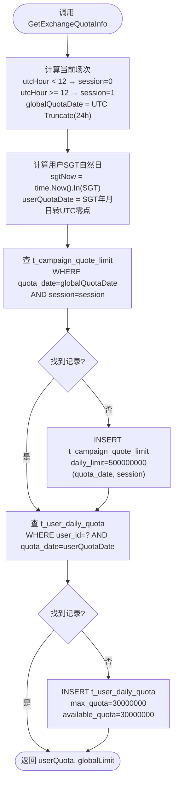
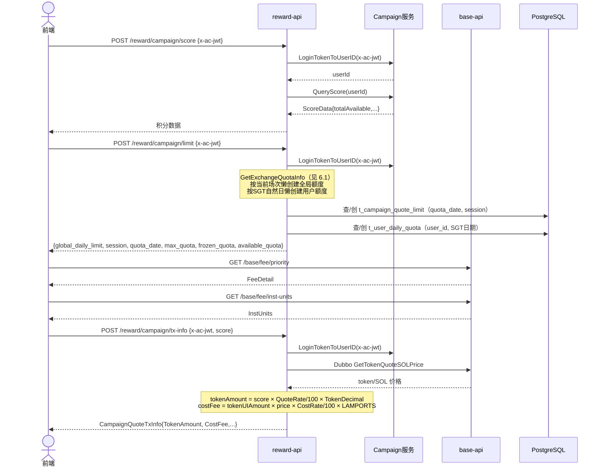
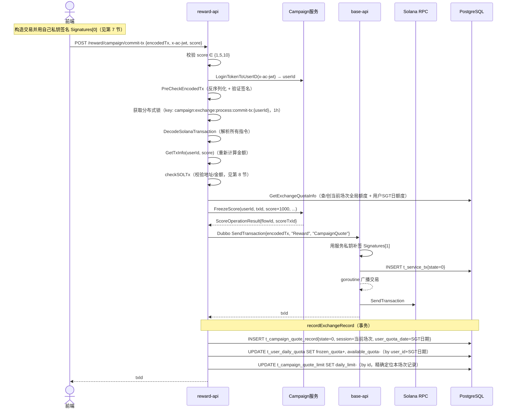
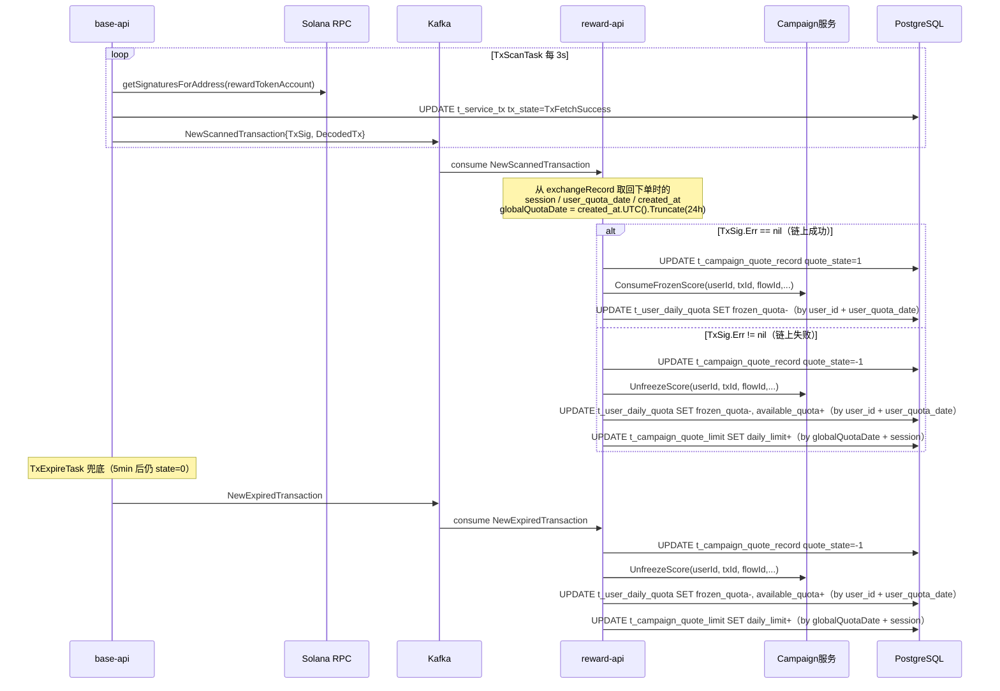
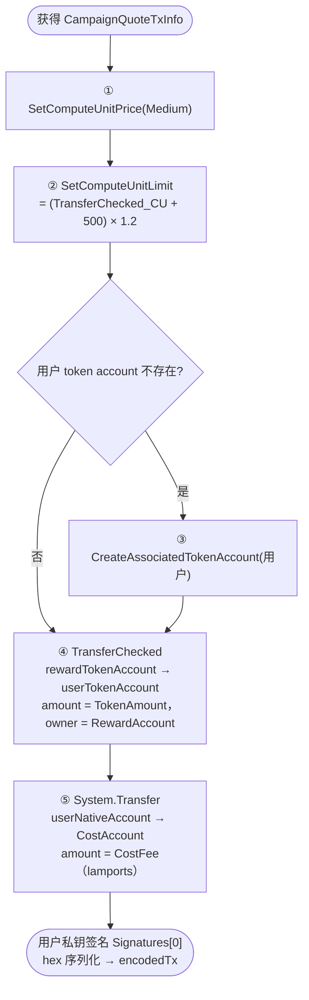
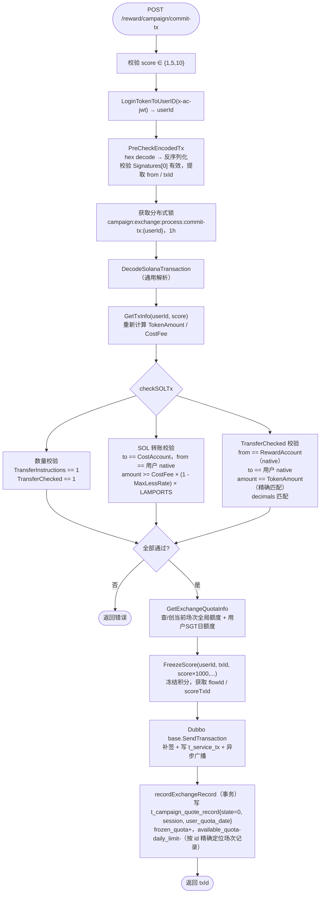
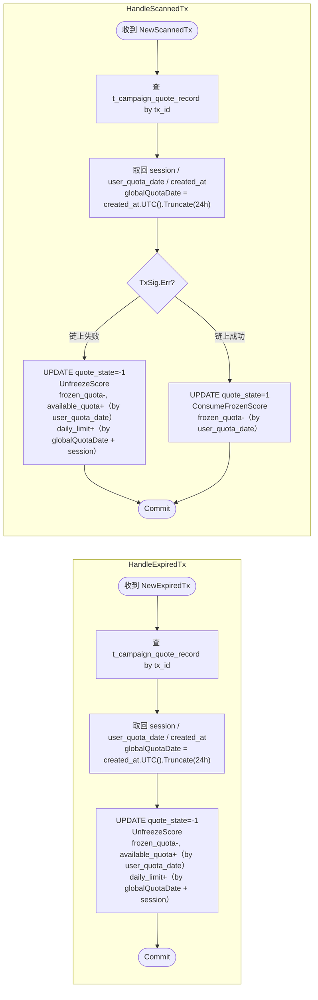

# 1. 业务概述

Campaign 是积分兑换 token 的业务。用户在 Campaign 活动平台（外部服务）中积累积分，通过本接口将积分按比例兑换为 token，同时支付 SOL 成本费。

整体分三个阶段：**GetTxInfo → 前端构造交易 → CommitTx → 链上确认（Kafka）**

> **与其他业务的核心差异**：
> - 鉴权使用 `x-ac-jwt`（Campaign 平台 token），而非 dtoken JWT
> - 积分操作通过 **Campaign HTTP 内部接口**完成（冻结 → 链上确认后消费/解冻）
> - 兑换额度分两个维度控制：**全局场次额度**（每日两次重置）和**用户每日个人限额**（按 SGT 自然日计算）
> - 积分在 CommitTx 时**先冻结**，Kafka 成功后**消费冻结**，失败/超时后**解冻**
> - `score` 只允许传入 **1 / 5 / 10**（handler 层硬校验）

---

## 2. 额度规则

### 2.1 全局场次额度（t_campaign_quote_limit）

全局奖池每天重置**两次**，以新加坡时间（SGT = UTC+8）为基准：

| session | SGT 重置时间 | 对应 UTC | 说明 |
|---|---|---|---|
| 0 | 每天 08:00 | UTC 00:00 | 早上场次，可用至 SGT 19:59 |
| 1 | 每天 20:00 | UTC 12:00 | 晚上场次，可用至次日 SGT 07:59 |

每个场次独立开放 **500,000 Token**（原始值 500,000,000），共同构成每日 1,000,000 Token 的总奖池。场次由 `(quota_date, session)` 唯一标识，其中 `quota_date` 为 UTC 自然日，`session` 取值 0 或 1。

**懒重置**：用户每次访问 `/limit` 或 CommitTx 时，系统根据当前 UTC 时间判断所在场次，若该 `(quota_date, session)` 下尚无记录则自动创建，初始额度 500,000,000 raw。

### 2.2 用户个人限额（t_user_daily_quota）

用户每日最多兑换 **30,000 Token**（原始值 30,000,000），按 **SGT 自然日**维度计算，不随场次重置而刷新。

SGT 自然日跨越两个 UTC 日期边界（UTC 16:00 = SGT 00:00），因此：
- UTC 00:00–15:59：用户 `quota_date` = 当天 UTC 日期
- UTC 16:00–23:59：用户 `quota_date` = 次日 UTC 日期（即当天 SGT 日期）

**懒重置**：系统按 SGT 自然日查询用户额度记录，不存在则自动创建，初始可用额度 30,000,000 raw。

### 2.3 额度维度对比

| 维度 | 表 | 唯一键 | 重置频率 | 初始额度 |
|---|---|---|---|---|
| 全局场次额度 | `t_campaign_quote_limit` | `(quota_date, session)` | 每日 2 次（UTC 00:00 / 12:00） | 500,000,000 raw |
| 用户每日个人限额 | `t_user_daily_quota` | `(user_id, quota_date)` | 每 SGT 自然日 1 次 | 30,000,000 raw |

---

## 3. 数据库表

### 配置表

* t_campaign_quote_config

```sql
-- campaign 兑换全局配置
DROP TABLE IF EXISTS public.t_campaign_quote_config;
CREATE TABLE public.t_campaign_quote_config
(
    record_id      ulid                        DEFAULT gen_ulid() NOT NULL,
    reward_account character varying(64)                          NOT NULL, -- 发放奖励的 solana 地址
    cost_account   character varying(64)                          NOT NULL, -- 接收 SOL 成本费的地址
    quote_rate     numeric(5, 2)                                  NOT NULL, -- 积分兑换 token 费率（score × quote_rate/100 = tokenUIAmount）
    cost_rate      numeric(5, 2)                                  NOT NULL, -- SOL 成本费率（tokenUIAmount × cost_rate/100 × price = costFee）
    created_at     timestamp without time zone DEFAULT CURRENT_TIMESTAMP,
    updated_at     timestamp without time zone DEFAULT CURRENT_TIMESTAMP
);
```

### 额度表

* t_campaign_quote_limit

```sql
-- 全局场次兑换额度表（每天分2个session，SGT 08:00/20:00 各重置一次）
DROP TABLE IF EXISTS t_campaign_quote_limit;
CREATE TABLE t_campaign_quote_limit
(
    id          BIGSERIAL PRIMARY KEY,
    daily_limit NUMERIC(78, 0) NOT NULL  DEFAULT 500000000,    -- 本场次剩余可兑换量（原始值，500000 token）
    quota_date  DATE           NOT NULL  DEFAULT CURRENT_DATE, -- UTC自然日
    session     SMALLINT       NOT NULL  DEFAULT 0,            -- 0=早上场次(UTC 00:00-11:59 / SGT 08:00-19:59)
                                                               -- 1=晚上场次(UTC 12:00-23:59 / SGT 20:00-07:59)
    created_at  TIMESTAMP WITH TIME ZONE DEFAULT NOW(),
    updated_at  TIMESTAMP WITH TIME ZONE DEFAULT NOW(),
    UNIQUE (quota_date, session)
);
```

* t_user_daily_quota

```sql
-- 用户每日兑换额度表（按SGT自然日计算，不随session重置）
DROP TABLE IF EXISTS t_user_daily_quota;
CREATE TABLE t_user_daily_quota
(
    id              BIGSERIAL PRIMARY KEY,
    user_id         VARCHAR(64)    NOT NULL,                   -- Campaign 平台用户 ID
    quota_date      DATE           NOT NULL,                   -- SGT自然日（UTC+8），UTC 16:00时翻转到次日
    max_quota       NUMERIC(78, 0) NOT NULL  DEFAULT 30000000, -- 每日最大兑换额度（30000 token，原始值）
    frozen_quota    NUMERIC(78, 0) NOT NULL  DEFAULT 0,        -- 已冻结额度（交易待确认中）
    available_quota NUMERIC(78, 0) NOT NULL  DEFAULT 30000000, -- 可用额度
    created_at      TIMESTAMP WITH TIME ZONE DEFAULT NOW(),
    updated_at      TIMESTAMP WITH TIME ZONE DEFAULT NOW(),
    UNIQUE (user_id, quota_date)
);
```

### 业务表

* t_campaign_quote_record

```sql
-- 兑换记录表
DROP TABLE IF EXISTS public.t_campaign_quote_record;
CREATE TABLE public.t_campaign_quote_record
(
    record_id       ulid           NOT NULL DEFAULT gen_ulid(),
    reward_account  VARCHAR(64)    NOT NULL, -- 发放奖励的 native account
    receipt_account VARCHAR(64)    NOT NULL, -- 接收奖励的 native account
    provider        VARCHAR(64)    NOT NULL, -- 积分来源平台（固定为 "campaign"）
    user_id         VARCHAR(64)    NOT NULL, -- Campaign 平台用户 ID
    tx_id           VARCHAR(128)   NOT NULL, -- 链上交易 id
    score_flow_id   INT            NOT NULL, -- 积分流水 ID（用于解冻/消费操作）
    score_tx_id     VARCHAR(128)   NOT NULL, -- 积分操作交易 ID
    amount          NUMERIC(78, 0) NOT NULL, -- 兑换出的 token 金额（raw）
    score           NUMERIC(78, 0) NOT NULL, -- 消耗的积分数量
    quote_state     INT,                     -- 状态：0=初始化 1=成功 -1=失败
    session         SMALLINT       NOT NULL DEFAULT 0,          -- 下单时的全局场次（0=早/1=晚），Kafka回调时精确恢复对应session额度
    user_quota_date DATE           NOT NULL DEFAULT CURRENT_DATE, -- 下单时用户所在的SGT自然日，Kafka回调时精确恢复用户额度
    created_at      TIMESTAMP WITHOUT TIME ZONE DEFAULT CURRENT_TIMESTAMP,
    updated_at      TIMESTAMP WITHOUT TIME ZONE DEFAULT CURRENT_TIMESTAMP,
    PRIMARY KEY (record_id)
);
```

> `session` 和 `user_quota_date` 在 CommitTx 时写入，解决 Kafka 回调跨日/跨场次时无法正确定位原始额度记录的问题。全局额度通过 `created_at.UTC().Truncate(24h)` + `session` 定位；用户额度通过 `user_quota_date` 定位。

---

## 4. 数据结构

```go
// GetTxInfo 请求
type CampaignQuoteTxInfoReq struct {
    Score uint64 `json:"score"` // 兑换积分数量（只允许 1 / 5 / 10）
}
```

```go
// CommitTx 请求
type CampaignQuoteReq struct {
    EncodedTx string `json:"encodedTx"` // hex 编码的已签名交易
    XAcJwt    string `json:"x-ac-jwt"`  // Campaign 平台 JWT token
    Score     uint64 `json:"score"`     // 兑换积分数量（只允许 1 / 5 / 10）
}
```

```go
// GetTxInfo 响应，前端据此打包交易
type CampaignQuoteTxInfo struct {
    RewardAccount string  `json:"rewardAccount"` // 发放 token 的 native account
    Mint          string  `json:"mint"`          // token mint 地址
    Decimals      int32   `json:"decimals"`      // token 精度
    CostAccount   string  `json:"costAccount"`   // 接收 SOL 成本费的地址
    TokenAmount   float64 `json:"tokenAmount"`   // 兑换出的 token 金额（raw）
    CostFee       float64 `json:"costFee"`       // 需支付的 SOL 成本费（lamports）
}
```

**金额计算公式**：
```
tokenUIAmount  = score × QuoteRate / 100
tokenRawAmount = tokenUIAmount × TokenDecimal
costFee        = tokenUIAmount × quoteSOLPrice × (CostRate/100) × LAMPORTS_PER_SOL
```

---

## 5. Campaign 内部 HTTP 接口（`internal/rpc/campaign_client.go`）

Campaign 服务通过内部 HTTP API 完成积分操作，地址按环境区分（见 reward_service.md §8）：

| 方法 | 路径 | 说明 |
|---|---|---|
| `LoginTokenToUserID(jwt)` | `GET /social-media/internal/user/loginTokenToUserId` | 将 `x-ac-jwt` 转换为 userId |
| `QueryScore(userId)` | `GET /score/internal/op/queryScore` | 查询用户积分 |
| `FreezeScore(...)` | `POST /score/internal/op/freeze` | CommitTx 时冻结积分（待链上确认） |
| `UnfreezeScore(...)` | `POST /score/internal/op/unfreeze` | 链上失败/超时时解冻积分 |
| `ConsumeFrozenScore(...)` | `POST /score/internal/op/consumeFrozen` | 链上成功后消费冻结积分 |

---

## 6. 业务流程

### 6.1 额度懒重置流程（GetExchangeQuotaInfo）



### 6.2 阶段一：查询信息与获取交易参数



### 6.3 阶段二：提交交易（CommitTx）



### 6.4 阶段三：链上确认与 Kafka 处理



> **跨日/跨场次回调的正确性保证**：Kafka 回调可能发生在下单场次之外（例如深夜超时兜底），此时若用 `time.Now()` 重算日期会定位到错误记录。通过在 `t_campaign_quote_record` 中记录 `session` 和 `user_quota_date`，可以始终精确恢复到下单时的那条额度记录。

---

## 7. 前端构造交易指令



---

## 8. CommitTx 服务端处理



---

## 9. Kafka 处理逻辑（`logic/campaign/kafka.go`）



> **注意**：HandleScannedTx / HandleExpiredTx 签名为 `func(...) error`，但 Campaign 实现返回 void（`func(...)`），setup.go 中调用时无返回值处理。

---

## 10. HTTP API（`handler/campaign.go`）

所有路由挂载在 `/reward/campaign` 前缀下。

### POST `/reward/campaign/config`

获取 campaign 兑换全局配置。

- 请求：无 body
- 响应：`t_campaign_quote_config` 记录

| 字段 | 类型 | 说明 |
|---|---|---|
| `rewardAccount` | string | 发放奖励的 solana 地址 |
| `costAccount` | string | 接收 SOL 成本费的地址 |
| `quoteRate` | numeric | 积分兑换 token 费率（%） |
| `costRate` | numeric | SOL 成本费率（%） |

---

### POST `/reward/campaign/score`

查询用户的 Campaign 平台积分。

- 请求头：`x-ac-jwt: <Campaign JWT>`
- 响应：`ScoreData`（积分数据，由 Campaign 服务返回）

---

### POST `/reward/campaign/limit`

查询当前场次的全局剩余额度和用户当日（SGT自然日）个人剩余额度。

- 请求头：`x-ac-jwt: <Campaign JWT>`
- 响应：

| 字段 | 类型 | 说明 |
|---|---|---|
| `global_daily_limit` | numeric | 当前场次全局剩余可兑换量（raw） |
| `global_quota_date` | date | 全局额度 UTC 日期 |
| `quota_date` | date | 用户额度日期（SGT 自然日） |
| `max_quota` | numeric | 用户最大兑换额度（raw，30,000,000） |
| `frozen_quota` | numeric | 当前冻结中的额度（raw） |
| `available_quota` | numeric | 当前可用额度（raw） |

---

### POST `/reward/campaign/tx-info`

获取打包交易所需的全部参数。

- 请求头：`x-ac-jwt: <Campaign JWT>`
- 请求体：

| 字段 | 类型 | 必填 | 说明 |
|---|---|---|---|
| `score` | uint64 | 是 | 兑换积分数量（只允许 1 / 5 / 10） |

- 响应：`CampaignQuoteTxInfo`

| 字段 | 类型 | 说明 |
|---|---|---|
| `rewardAccount` | string | 发放 token 的 native account |
| `mint` | string | token mint 地址 |
| `decimals` | int32 | token 精度 |
| `costAccount` | string | 接收 SOL 成本费的地址 |
| `tokenAmount` | float64 | 兑换出的 token 金额（raw） |
| `costFee` | float64 | 需支付的 SOL 成本费（lamports） |

---

### POST `/reward/campaign/commit-tx`

提交签名后的交易，服务端校验、冻结积分并广播到链上。

- 请求体：

| 字段 | 类型 | 必填 | 说明 |
|---|---|---|---|
| `encodedTx` | string | 是 | hex 编码的已签名 Solana 交易二进制 |
| `x-ac-jwt` | string | 是 | Campaign 平台 JWT token |
| `score` | uint64 | 是 | 兑换积分数量（只允许 1 / 5 / 10） |

- 响应：`txId`（string）

- 失败场景：

| 场景 | 说明 |
|---|---|
| score 不合法 | 只允许 1 / 5 / 10 |
| x-ac-jwt 无效 | Campaign 服务无法解析用户 ID |
| 同用户并发提交 | 分布式锁保护（key 为 userId） |
| 交易指令校验失败 | 地址/金额不符合规则（见第 8 节） |
| 积分冻结失败 | Campaign 服务返回错误 |
| base 广播失败 | Solana RPC 拒绝交易 |
