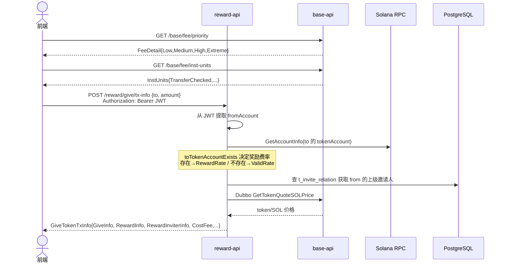
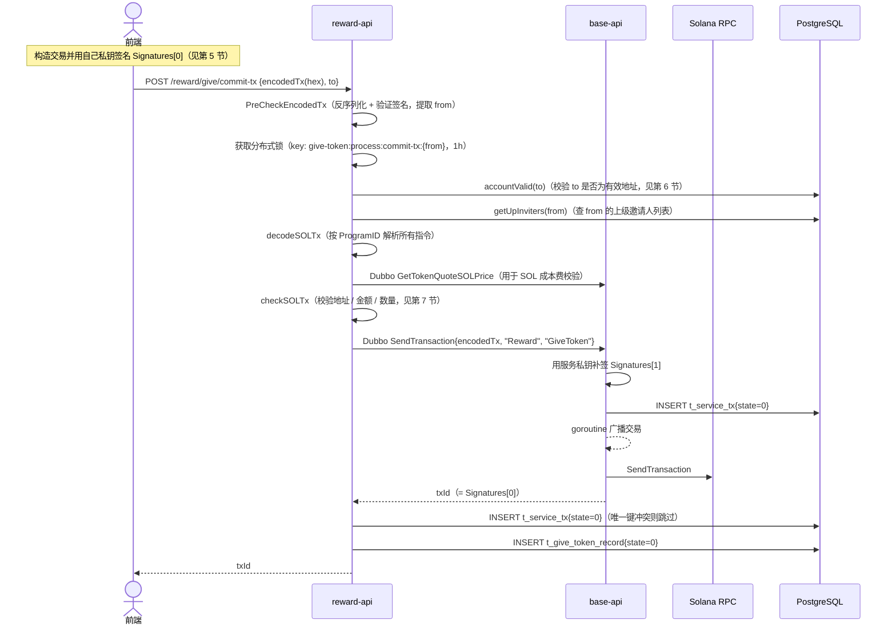
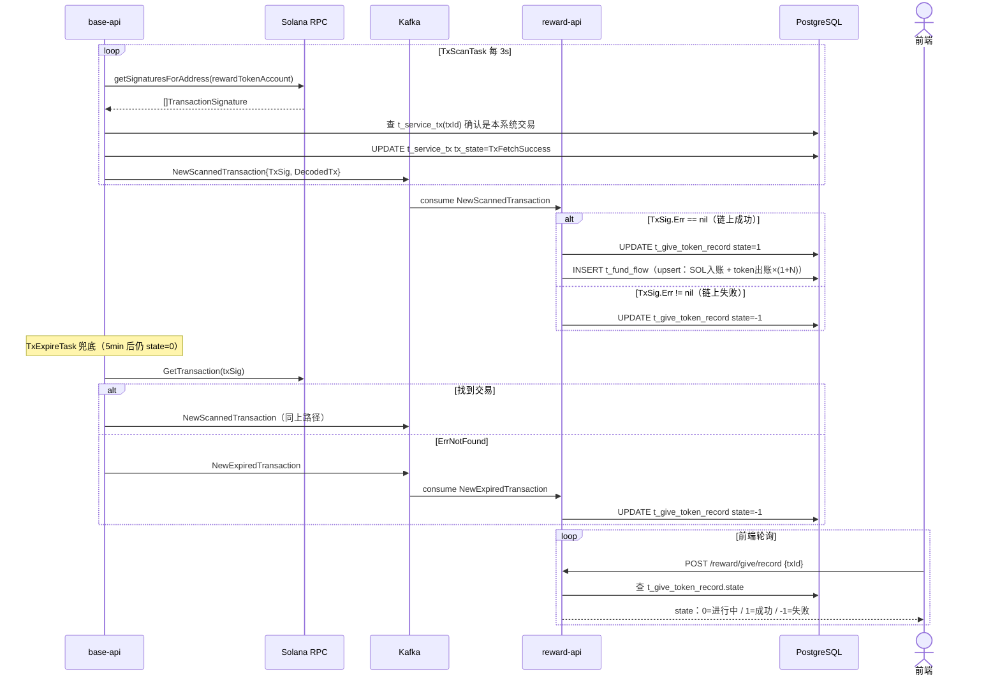
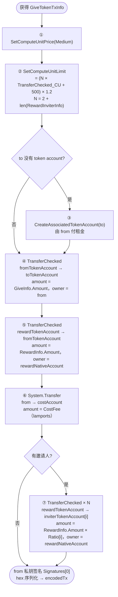
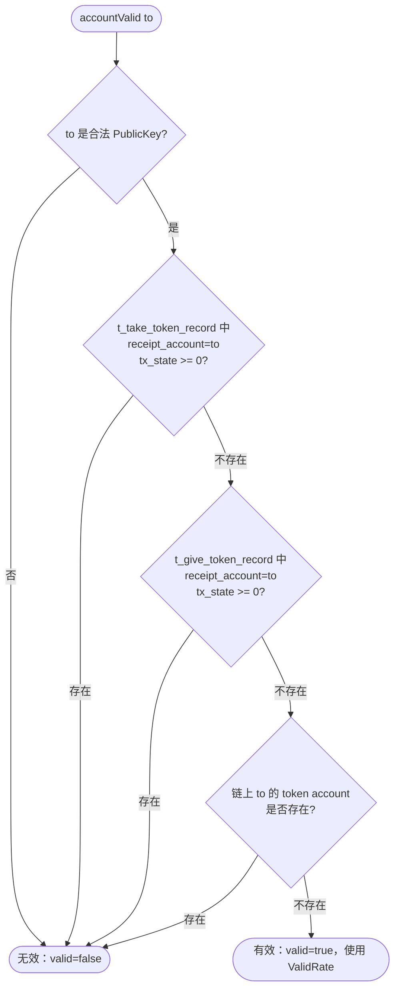
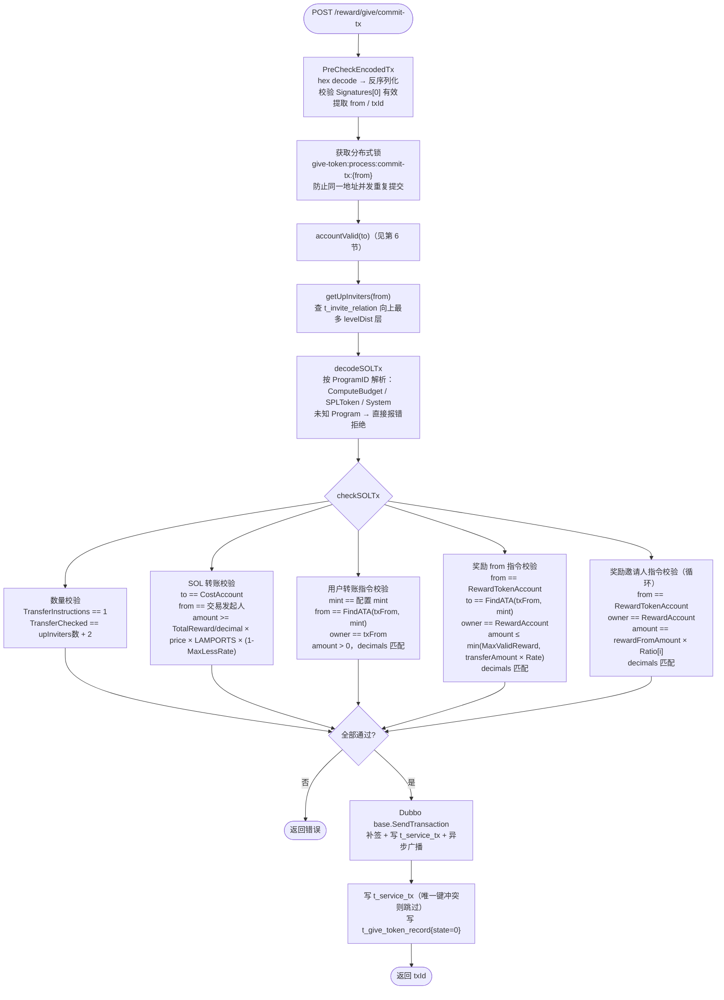
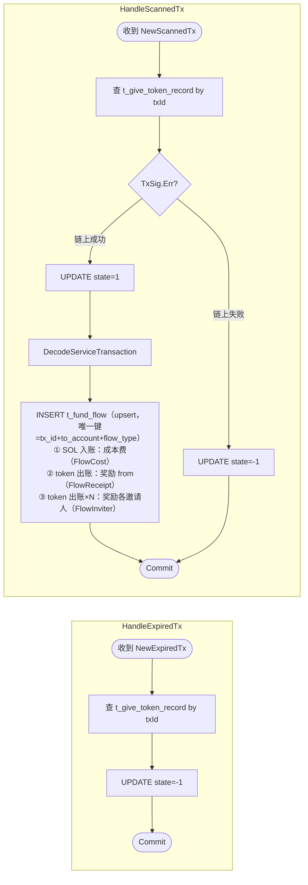

# 1. 业务概述

用户将 token 转给其他地址（to），平台根据转账金额和 to 地址是否为"有效地址"，按比例奖励转账人（from）token；若 from 存在上级邀请关系，还按层级比例向各层邀请人发 token。

整体分四个阶段：**GetTxInfo → 前端构造交易 → CommitTx → 链上确认（Kafka）**

> **与 TakeToken 的核心差异**：
> - GetTxInfo 需要 JWT，`from` 地址从 token 中提取
> - 奖励金额取决于 `to` 是否为有效地址（两档费率）
> - 无邀请码机制，不写 `t_invite_relation`

---

# 2. 数据库表

* t_give_token_config

```sql
-- give token 奖励配置
DROP TABLE IF EXISTS public.t_give_token_config;
CREATE TABLE public.t_give_token_config
(
    reward_account   character varying(64) NOT NULL, -- 发放奖励的 solana 地址
    cost_account     character varying(64) NOT NULL, -- 接收成本费的 solana 地址
    reward_rate      numeric(5, 2)         NOT NULL, -- 普通地址奖励费率（to 有 token account 时）
    max_valid_reward numeric(78, 0)        NOT NULL, -- 奖励金额上限
    valid_rate       numeric(10, 6)        NOT NULL, -- 有效地址奖励费率（to 无 token account 时）
    created_at       timestamp without time zone DEFAULT CURRENT_TIMESTAMP,
    updated_at       timestamp without time zone DEFAULT CURRENT_TIMESTAMP
);
```

* t_give_token_record

```sql
-- give token 记录表
DROP TABLE IF EXISTS public.t_give_token_record;
CREATE TABLE public.t_give_token_record
(
    record_id       public.ulid                 DEFAULT public.gen_ulid() NOT NULL,
    from_account    character varying(64)                                 NOT NULL, -- 发送 token 的 solana 地址
    receipt_account character varying(64)                                 NOT NULL, -- 接收 token 的 solana 地址
    tx_id           character varying(128)                                NOT NULL, -- 交易 id
    amount          numeric(78, 0)                                        NOT NULL, -- give token 的金额
    tx_state        integer,                                                        -- 交易状态：0=进行中 1=成功 -1=失败
    created_at      timestamp without time zone DEFAULT CURRENT_TIMESTAMP,
    updated_at      timestamp without time zone DEFAULT CURRENT_TIMESTAMP
);
```

---

## 3. 数据结构

```go
// GetTxInfo 请求（from 从 JWT 提取，不在请求体中）
type GetGiveTokenTxInfoReq struct {
    To     string  `json:"to"`     // 接收 token 的 solana 地址
    Amount float64 `json:"amount"` // 用户转出 token 数量（UI 单位）
}
```

```go
// GetTxInfo 响应，前端据此打包交易
type GiveTokenTxInfo struct {
    RewardAccount string  `json:"rewardAccount"` // 服务端下发奖励的地址
    Mint          string  `json:"mint"`          // token mint 地址
    CostAccount   string  `json:"costAccount"`   // 接收 SOL 成本费的地址
    CostFeeRate   float64 `json:"costFeeRate"`   // 成本费率（实际为 RewardRate）
    MaxCostFee    float64 `json:"maxCostFee"`    // 奖励金额上限（实际为 MaxValidReward）
    Decimals      int32   `json:"decimals"`      // token 精度
    QuoteSOLPrice float64 `json:"quoteSOLPrice"` // token/SOL 价格

    TotalReward     float64 `json:"totalReward"`     // 整笔交易下发的 token 奖励总额（raw）
    QuotedSOLAmount float64 `json:"quotedSOLAmount"` // 需支付的 SOL 成本费金额（lamports）
    CostFee         uint64  `json:"costFee"`         // 需支付的 SOL 成本费，lamports 整数

    Claims            []model.LevelRatio `json:"claims"`            // 各层邀请人奖励费率
    GiveInfo          RewardTokenItem    `json:"giveInfo"`          // from → to 的转账项
    RewardInfo        RewardTokenItem    `json:"rewardInfo"`        // 平台奖励 from 的项
    RewardInviterInfo []RewardTokenItem  `json:"rewardInviterInfo"` // 平台奖励各层邀请人的项
}
```

---

## 4. 业务流程

### 4.1 阶段一：获取交易参数（GetTxInfo）



### 4.2 阶段二：提交交易（CommitTx）



### 4.3 阶段三：链上确认与 Kafka 处理



---

## 5. 前端构造交易指令



---

## 6. 有效地址判断（`logic/give/logic.go:accountValid`）

`to` 地址满足以下全部条件才认为是**有效地址**（valid=true），使用 `ValidRate` 计算奖励；否则为普通地址，使用 `RewardRate`。



---

## 7. CommitTx 服务端处理



---

## 8. Kafka 处理逻辑（`logic/give/kafka.go`）



> GiveToken 成功后**不**写 `t_invite_relation`，邀请关系由 TakeToken 在领取时确定。

---

## 9. HTTP API（`handler/give.go`）

所有路由挂载在 `/reward/give` 前缀下。

### POST `/reward/give/config`

获取 give token 业务规则配置。

- 请求：无 body
- 响应：`t_give_token_config` 记录

| 字段 | 类型 | 说明 |
|---|---|---|
| `rewardAccount` | string | 发放奖励的 solana 地址 |
| `costAccount` | string | 接收 SOL 成本费的地址 |
| `rewardRate` | numeric | 普通地址奖励费率（to 有 token account 时） |
| `maxValidReward` | numeric | 奖励金额上限（raw） |
| `validRate` | numeric | 有效地址奖励费率（to 无 token account 时） |

---

### POST `/reward/give/tx-info` 🔒 需要 JWT

获取打包交易所需的全部参数，`from` 地址由服务端从 JWT 中提取。

- 请求头：`Authorization: Bearer <token>`
- 请求体：

| 字段 | 类型 | 必填 | 说明 |
|---|---|---|---|
| `to` | string | 是 | 接收 token 的 native account |
| `amount` | float64 | 是 | 转出 token 数量（UI 单位） |

- 响应：`GiveTokenTxInfo`

| 字段 | 类型 | 说明 |
|---|---|---|
| `rewardAccount` | string | 服务端下发奖励的地址 |
| `mint` | string | token mint 地址 |
| `costAccount` | string | 接收 SOL 成本费的地址 |
| `decimals` | int32 | token 精度 |
| `quoteSOLPrice` | float64 | token/SOL 价格 |
| `totalReward` | float64 | 整笔交易奖励的 token 总额（raw） |
| `quotedSOLAmount` | float64 | 需支付的 SOL 成本费（lamports） |
| `costFee` | uint64 | 需支付的 SOL 成本费，lamports 整数；前端构造 `System.Transfer` 时直接使用 |
| `claims` | []LevelRatio | 各层邀请人奖励费率配置 |
| `giveInfo` | RewardTokenItem | from → to 的转账项（index/receiptAccount/amount） |
| `rewardInfo` | RewardTokenItem | 平台奖励 from 的项 |
| `rewardInviterInfo` | []RewardTokenItem | 平台奖励各层邀请人的项列表 |

---

### POST `/reward/give/commit-tx`

提交签名后的交易，服务端校验并广播到链上。

- 请求体：

| 字段 | 类型 | 必填 | 说明 |
|---|---|---|---|
| `encodedTx` | string | 是 | hex 编码的已签名 Solana 交易二进制 |
| `to` | string | 是 | 接收 token 的 native account（与构造交易时一致） |

- 响应：`txId`（string，链上交易 ID = `tx.Signatures[0]`）

- 失败场景：

| 场景 | 说明 |
|---|---|
| 同地址并发提交 | 分布式锁保护，同一地址同时只处理一笔 |
| 交易指令校验失败 | 地址/金额/数量不符合规则（见第 7 节） |
| base 广播失败 | Solana RPC 拒绝交易 |

---

### POST `/reward/give/record`

根据交易 ID 查询 give token 业务记录，用于前端轮询状态。

- 请求体：

| 字段 | 类型 | 必填 | 说明 |
|---|---|---|---|
| `txId` | string | 是 | commit-tx 返回的交易 ID |

- 响应：`t_give_token_record` 记录

| 字段 | 类型 | 说明 |
|---|---|---|
| `txId` | string | 交易 ID |
| `fromAccount` | string | 转出 token 的地址 |
| `receiptAccount` | string | 接收 token 的地址 |
| `amount` | numeric | 转出 token 金额（raw） |
| `txState` | int | `0`=进行中 / `1`=成功 / `-1`=失败 |
