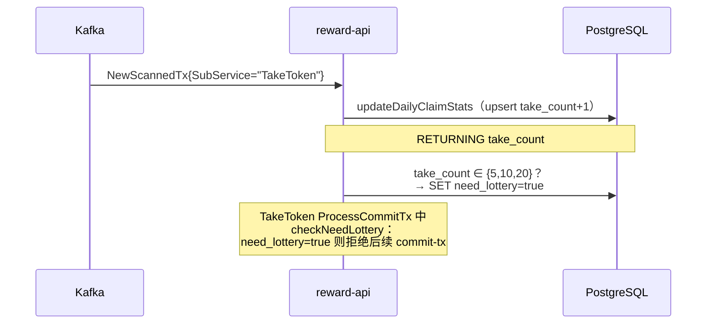
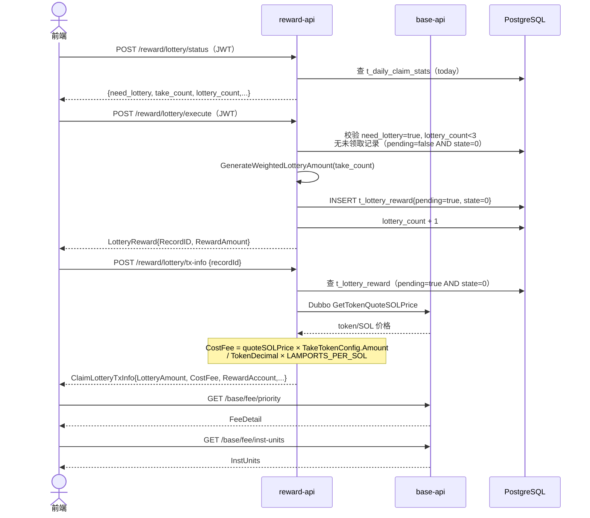
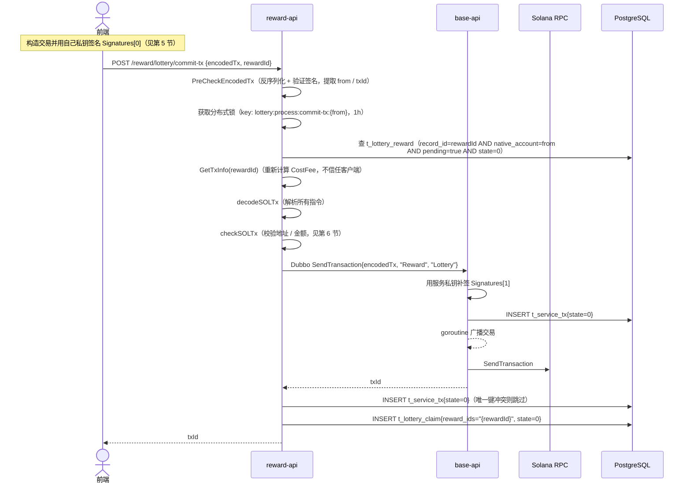
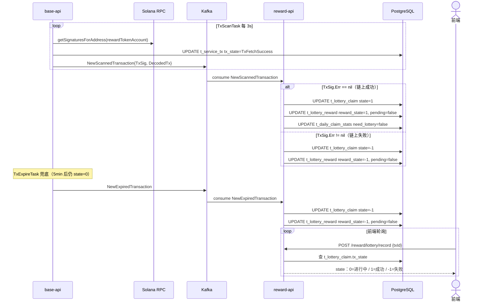
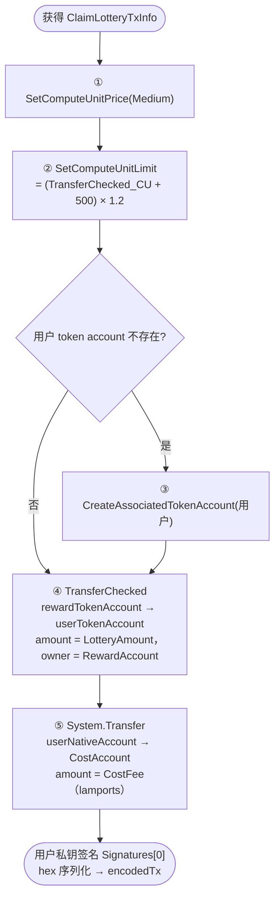
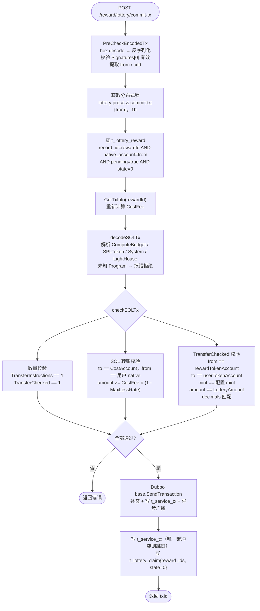
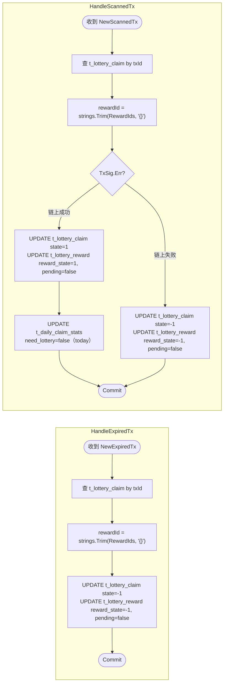

# 1. 业务概述

Lottery 是 TakeToken 的附加抽奖机制。用户每日累计 TakeToken 达到 **5 / 10 / 20 次**阈值时，系统阻止继续领取（`need_lottery=true`），要求用户先完成一次链上抽奖领取，才能解除阻断继续 take。

每日最多触发 3 次抽奖，奖励金额按次数段带权重随机生成。

> **与 TakeToken / GiveToken 的核心差异**：
> - 流程分为两步：先 **Execute**（抽奖，生成奖励记录）再 **CommitTx**（提交链上领取）
> - `execute` 和 `status` 接口需要 JWT
> - `CostFee` 基于 TakeTokenConfig 固定金额计算，与本次随机奖励金额无关

---

## 2. 数据库表

* t_lottery_reward

```sql
-- 抽奖奖励发放表
DROP TABLE IF EXISTS public.t_lottery_reward;
CREATE TABLE public.t_lottery_reward
(
    record_id      public.ulid                 DEFAULT public.gen_ulid() NOT NULL,
    native_account character varying(64)                                 NOT NULL, -- 用户地址
    reward_amount  numeric(78, 0),                                                 -- 奖励金额（raw）
    reward_type    integer,                                                        -- 奖励类型（0=默认）
    reward_state   integer                     DEFAULT 0,                          -- 奖励状态：0=待领取 1=已领取 -1=失败
    pending        boolean                     DEFAULT false,                      -- true=已创建等待提交链上交易
    reward_day     date                                                  NOT NULL, -- 抽奖日期
    created_at     timestamp without time zone DEFAULT CURRENT_TIMESTAMP,
    updated_at     timestamp without time zone DEFAULT CURRENT_TIMESTAMP
);
```

* t_lottery_claim

```sql
-- 领取抽奖奖励记录表
DROP TABLE IF EXISTS public.t_lottery_claim;
CREATE TABLE public.t_lottery_claim
(
    record_id  public.ulid                 DEFAULT public.gen_ulid() NOT NULL,
    reward_ids public.ulid[]                                         NOT NULL, -- 关联的 t_lottery_reward.record_id 数组
    tx_id      character varying(128),                                         -- 链上交易 id
    tx_state   integer                     DEFAULT 0,                          -- 交易状态：0=待确认 1=成功 -1=失败
    created_at timestamp without time zone DEFAULT CURRENT_TIMESTAMP,
    updated_at timestamp without time zone DEFAULT CURRENT_TIMESTAMP
);
```

> `t_daily_claim_stats` 表结构见 `reward_take_token.md §2`。

---

## 3. 数据结构

```go
// GetTxInfo 请求
type GetLotteryTxInfoReq struct {
    RecordId string `json:"recordId"` // t_lottery_reward.record_id
}
```

```go
// CommitTx 请求
type CommitLotteryTxReq struct {
    EncodedTx string `json:"encodedTx"` // hex 编码的已签名交易
    RewardId  string `json:"rewardId"`  // t_lottery_reward.record_id
}
```

```go
// GetTxInfo 响应，前端据此打包交易
type ClaimLotteryTxInfo struct {
    RecordId      string  `json:"recordId"`      // t_lottery_reward.record_id
    RewardAccount string  `json:"rewardAccount"` // 发放奖励的 native account
    Mint          string  `json:"mint"`          // token mint 地址
    CostAccount   string  `json:"costAccount"`   // 接收 SOL 成本费的地址
    Decimals      int32   `json:"decimals"`      // token 精度
    LotteryAmount float64 `json:"lotteryAmount"` // 奖励金额（raw）
    CostFee       float64 `json:"costFee"`       // 需支付的 SOL 成本费（lamports）
}
```

**t_lottery_reward 状态机**：

```
ExecuteLottery 创建 → pending=true,  reward_state=0（等待用户提交链上交易）
Kafka 链上成功       → pending=false, reward_state=1（RewardStateClaimed）
Kafka 链上失败/超时  → pending=false, reward_state=-1（RewardStateFailed）
```

---

## 4. 业务流程

### 4.1 TakeToken 触发抽奖



### 4.2 阶段一：执行抽奖并获取交易参数



### 4.3 阶段二：提交交易（CommitTx）



### 4.4 阶段三：链上确认与 Kafka 处理



---

## 5. 前端构造交易指令



> `rewardTokenAccount` 由前端通过 `FindAssociatedTokenAddress(RewardAccount, Mint)` 推导（`RewardAccount` 为 native account）。

---

## 6. CommitTx 服务端处理



---

## 7. 奖励金额随机算法（`logic/lottery/amount.go`）

`GenerateWeightedLotteryAmount(takeCount int)` 按今日 `take_count` 选择概率配置，在区间内均匀随机，返回**字面值**（UI 显示金额），`ExecuteLottery` 中乘以 `TokenDecimal` 转为 raw amount 存入 DB。

| take_count | 区间 | 权重（总 10000） |
|---|---|---|
| 5~9 | 1000~1500 | 9050（90.50%） |
| 5~9 | 2001~3000 | 950（9.50%） |
| 10~19 | 1000~1500 | 8000（80.00%） |
| 10~19 | 2001~3000 | 1905（19.05%） |
| 10~19 | 3001~5000 | 95（0.95%） |
| ≥20 | 1000~1500 | 7500（75.00%） |
| ≥20 | 2000~3000 | 2300（23.00%） |
| ≥20 | 3001~5000 | 185（1.85%） |
| ≥20 | 5001~10000 | 15（0.15%） |

---

## 8. Kafka 处理逻辑（`logic/lottery/kafka.go`）



---

## 9. HTTP API（`handler/lottery.go`）

所有路由挂载在 `/reward/lottery` 前缀下。

### POST `/reward/lottery/status` 🔒 需要 JWT

查询今日领取统计。

- 响应：`*model.DailyClaimStats`（今日无记录时返回 null）

| 字段 | 类型 | 说明 |
|---|---|---|
| `takeCount` | int | 今日累计 take token 次数 |
| `needLottery` | bool | 是否需要完成抽奖 |
| `lotteryCount` | int | 今日已触发抽奖次数（上限 3） |
| `totalLottery` | float64 | 今日抽奖总奖励 |
| `lastTakeTime` | timestamp | 最后一次 take 时间 |

---

### POST `/reward/lottery/execute` 🔒 需要 JWT

执行抽奖，生成奖励记录。

- 请求：无 body（`nativeAccount` 从 JWT 提取）
- 校验条件（任意不满足则拒绝）：

| 条件 | 说明 |
|---|---|
| `need_lottery == true` | 必须处于需要抽奖状态 |
| `lottery_count < 3` | 今日剩余抽奖次数 |
| 无 `pending=false AND state=0` 记录 | 无已创建但未提交的记录 |

- 响应：`model.LotteryReward`

| 字段 | 类型 | 说明 |
|---|---|---|
| `recordId` | string | 后续传给 `/tx-info` 的 ID |
| `rewardAmount` | float64 | 随机生成的奖励金额（raw） |

---

### POST `/reward/lottery/tx-info`

获取打包交易所需的全部参数。

- 请求体：

| 字段 | 类型 | 必填 | 说明 |
|---|---|---|---|
| `recordId` | string | 是 | execute 返回的 record_id |

- 响应：`ClaimLotteryTxInfo`

| 字段 | 类型 | 说明 |
|---|---|---|
| `recordId` | string | 奖励记录 ID |
| `rewardAccount` | string | 发放奖励的 native account |
| `mint` | string | token mint 地址 |
| `costAccount` | string | 接收 SOL 成本费的地址 |
| `decimals` | int32 | token 精度 |
| `lotteryAmount` | float64 | 奖励金额（raw） |
| `costFee` | float64 | 需支付的 SOL 成本费（lamports，基于 TakeTokenConfig.Amount 计算） |

---

### POST `/reward/lottery/commit-tx`

提交签名后的交易，服务端校验并广播到链上。

- 请求体：

| 字段 | 类型 | 必填 | 说明 |
|---|---|---|---|
| `encodedTx` | string | 是 | hex 编码的已签名 Solana 交易二进制 |
| `rewardId` | string | 是 | execute 返回的 record_id |

- 响应：`txId`（string）

---

### POST `/reward/lottery/unclaimed`

查询未领取的抽奖奖励列表（`pending=false AND state=0`）。

- 请求体：`{ "nativeAccount": "..." }`
- 响应：`[]*model.LotteryReward`

---

### POST `/reward/lottery/record`

根据交易 ID 查询领取记录，用于前端轮询状态。

- 请求体：`{ "txId": "..." }`
- 响应：`t_lottery_claim` 记录

| 字段 | 类型 | 说明 |
|---|---|---|
| `txId` | string | 交易 ID |
| `rewardIds` | ulid[] | 关联的 t_lottery_reward IDs |
| `txState` | int | `0`=进行中 / `1`=成功 / `-1`=失败 |

---

## 10. 注意事项

| 项目 | 说明 |
|---|---|
| `reward_ids` 类型 | PostgreSQL `ulid[]`，代码中读写需用 `strings.Trim(value, "{}")` 剥离花括号 |
| `CostFee` 计算基准 | 基于 `TakeTokenConfig.Amount`（固定配置值），与本次随机 `LotteryAmount` 无关，前端不可混用 |
| `RewardAccount` 类型 | 是 native account，前端需通过 `FindAssociatedTokenAddress(RewardAccount, Mint)` 推导 `rewardTokenAccount` |
| `need_lottery` 重置时机 | 在 Kafka `HandleScannedTx` 成功路径重置，**不是** commit-tx 时，前端需轮询 `need_lottery=false` |
| 唯一约束 | `t_daily_claim_stats(native_account, take_date)` 必须存在唯一约束，否则 `ON CONFLICT` upsert 报错 |
