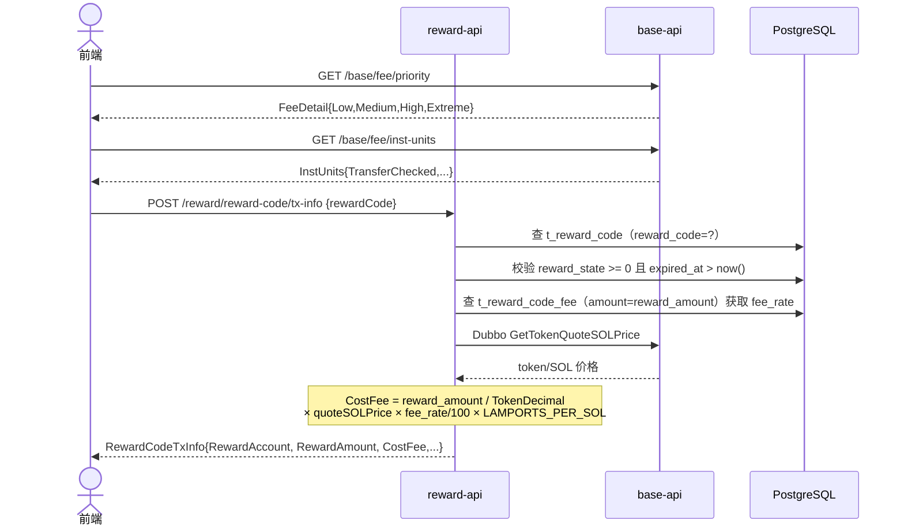
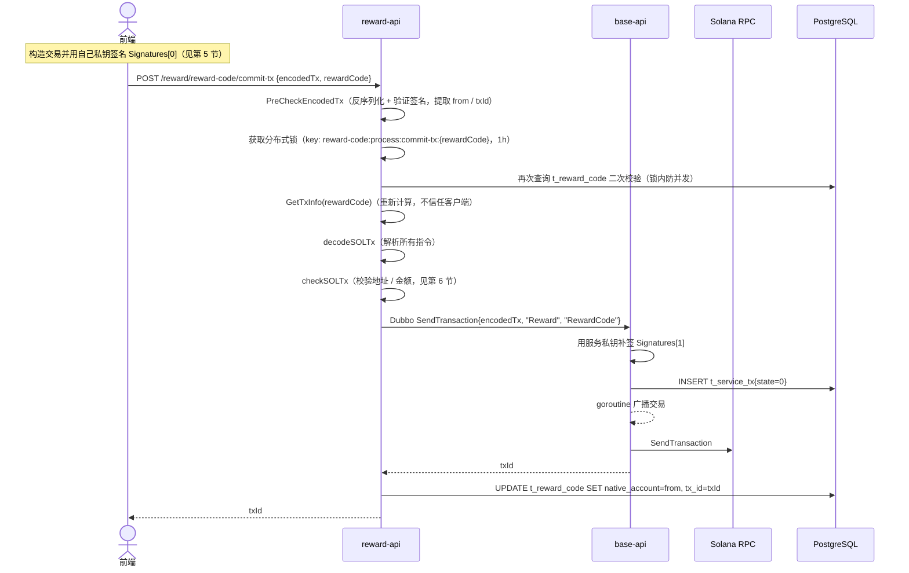
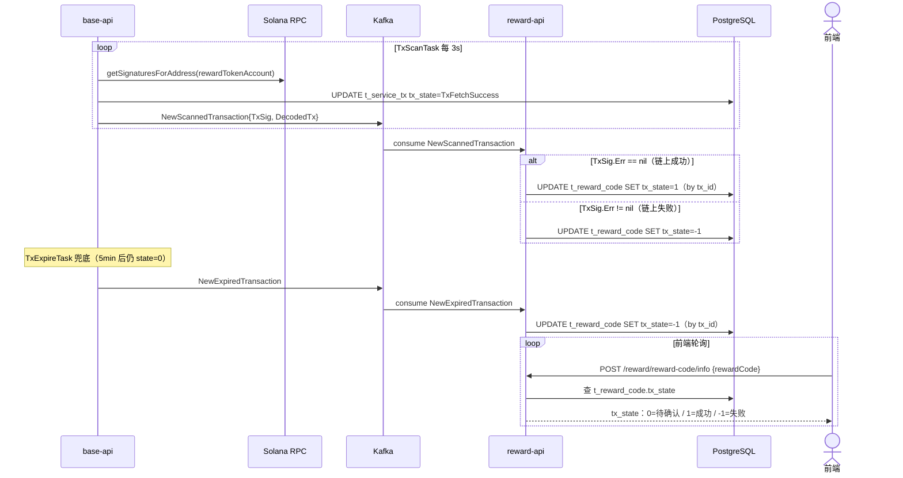
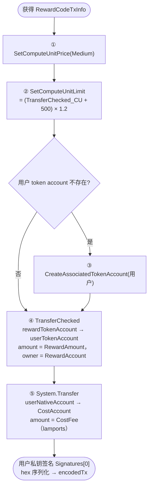
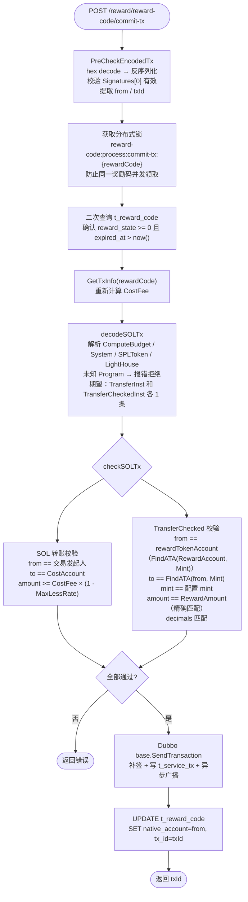
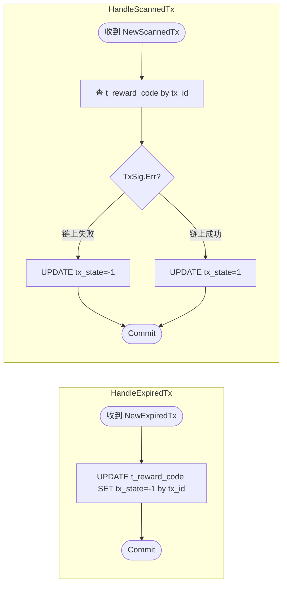

# 1. 业务概述

RewardCode 是一种兑换码领取机制。运营方预先生成奖励码（`t_reward_code`），用户凭奖励码支付 SOL 成本费，平台从奖励账户向用户发放对应金额的 token。

整体分三个阶段：**GetTxInfo → 前端构造交易 → CommitTx → 链上确认（Kafka）**

> **与其他业务的核心差异**：
> - 无邀请人奖励，交易结构最简单（1 条 SOL Transfer + 1 条 TransferChecked）
> - 奖励金额固定写在 `t_reward_code` 里，不随用户行为变化
> - 成本费率从 `t_reward_code_fee` 按金额档位查询
> - 有独立的后台任务（`RewardCodeExpireTask`）每 5 分钟将已过期未使用的奖励码标记为超时
> - 分布式锁 key 为**奖励码**（不是用户地址），防止同一奖励码被并发领取

---

## 2. 数据库表

* t_reward_code_config

```sql
-- 奖励码全局配置（reward_account / cost_account）
DROP TABLE IF EXISTS public.t_reward_code_config;
CREATE TABLE public.t_reward_code_config
(
    record_id      ulid                        DEFAULT gen_ulid() NOT NULL,
    reward_account character varying(64)                          NOT NULL, -- 下发奖励的 solana 地址
    cost_account   character varying(64)                          NOT NULL, -- 接收 SOL 成本费的地址
    created_at     timestamp without time zone DEFAULT CURRENT_TIMESTAMP,
    updated_at     timestamp without time zone DEFAULT CURRENT_TIMESTAMP,
    PRIMARY KEY (record_id)
);
```

* t_reward_code

```sql
-- 奖励码表
DROP TABLE IF EXISTS public.t_reward_code;
CREATE TABLE public.t_reward_code
(
    record_id      ulid                        DEFAULT gen_ulid()  NOT NULL,
    reward_code    character varying(6)                            NOT NULL, -- 6位奖励码
    reward_amount  numeric(78, 0)                                  NOT NULL, -- 奖励 token 金额（raw）
    reward_state   integer                     DEFAULT 0           NOT NULL, -- 奖励码状态：0=未使用 -2=已过期
    native_account character varying(64)       DEFAULT NULL,                 -- 领取奖励码的 solana 地址（提交交易后写入）
    tx_id          character varying(128)      DEFAULT NULL,                 -- 链上交易 id（提交交易后写入）
    tx_state       integer                     DEFAULT 0           NOT NULL, -- 交易状态：0=待确认 1=成功 -1=失败
    expired_at     timestamp without time zone DEFAULT (CURRENT_TIMESTAMP + '24:00:00'::interval), -- 过期时间
    created_at     timestamp without time zone DEFAULT CURRENT_TIMESTAMP,
    updated_at     timestamp without time zone DEFAULT CURRENT_TIMESTAMP
);
```

* t_reward_code_fee

```sql
-- 奖励码成本费率配置（按奖励金额档位）
DROP TABLE IF EXISTS public.t_reward_code_fee;
CREATE TABLE public.t_reward_code_fee
(
    amount     numeric(78, 0) NOT NULL, -- 奖励码金额（raw），与 t_reward_code.reward_amount 匹配
    fee_rate   numeric(78, 0) NOT NULL, -- 成本费率（%）
    created_at timestamp without time zone DEFAULT CURRENT_TIMESTAMP,
    updated_at timestamp without time zone DEFAULT CURRENT_TIMESTAMP
);
```

**t_reward_code 状态机**：

```
创建时           → reward_state=0,  tx_state=0（未使用，等待领取）
CommitTx 提交后  → reward_state=0,  tx_state=0，native_account/tx_id 写入（等待链上确认）
Kafka 链上成功   → reward_state=0,  tx_state=1
Kafka 链上失败   → reward_state=0,  tx_state=-1
过期未使用       → reward_state=-2（RewardStateExpired，由 RewardCodeExpireTask 定期更新）
```

---

## 3. 数据结构

```go
// GetInfo / GetTxInfo 请求（共用）
type GetRewardCodeTxInfoReq struct {
    RewardCode string `json:"rewardCode"` // 6 位奖励码
}
```

```go
// CommitTx 请求
type CommitRewardCodeTxReq struct {
    EncodedTx  string `json:"encodedTx"`  // hex 编码的已签名交易
    RewardCode string `json:"rewardCode"` // 6 位奖励码
}
```

```go
// GetTxInfo 响应，前端据此打包交易
type RewardCodeTxInfo struct {
    RewardAccount string  `json:"rewardAccount"` // 发放 token 的 native account
    Mint          string  `json:"mint"`          // token mint 地址
    Decimals      int32   `json:"decimals"`      // token 精度
    CostAccount   string  `json:"costAccount"`   // 接收 SOL 成本费的地址
    RewardAmount  float64 `json:"rewardAmount"`  // 奖励 token 金额（raw）
    CostFee       float64 `json:"costFee"`       // 需支付的 SOL 成本费（lamports）
}
```

---

## 4. 业务流程

### 4.1 阶段一：获取交易参数（GetTxInfo）



### 4.2 阶段二：提交交易（CommitTx）



### 4.3 阶段三：链上确认与 Kafka 处理



---

## 5. 前端构造交易指令



> `rewardTokenAccount` 由前端通过 `FindAssociatedTokenAddress(RewardAccount, Mint)` 推导。

---

## 6. CommitTx 服务端处理



---

## 7. Kafka 处理逻辑（`logic/rewardcode/kafka.go`）



> RewardCode 无资金流水记录（`t_fund_flow`），Kafka 处理仅更新奖励码状态。

---

## 8. 后台任务：RewardCodeExpireTask（`task/reward_code_expire.go`）

每 5 分钟（分布式锁 TTL 6 分钟）扫描并批量更新过期奖励码：

```sql
UPDATE t_reward_code
SET reward_state = -2  -- RewardStateExpired
WHERE reward_state = 0
  AND expired_at < NOW()
```

---

## 9. HTTP API（`handler/reward_code.go`）

所有路由挂载在 `/reward/reward-code` 前缀下。

### POST `/reward/reward-code/info`

查询奖励码基本信息。

- 请求体：

| 字段 | 类型 | 必填 | 说明 |
|---|---|---|---|
| `rewardCode` | string | 是 | 6 位奖励码 |

- 响应：`t_reward_code` 记录

| 字段 | 类型 | 说明 |
|---|---|---|
| `rewardCode` | string | 奖励码 |
| `rewardAmount` | numeric | 奖励 token 金额（raw） |
| `rewardState` | int | `0`=未使用 / `-2`=已过期 |
| `txState` | int | `0`=待确认 / `1`=成功 / `-1`=失败 |
| `expiredAt` | timestamp | 过期时间 |

---

### POST `/reward/reward-code/tx-info`

获取打包交易所需的全部参数。

- 请求体：

| 字段 | 类型 | 必填 | 说明 |
|---|---|---|---|
| `rewardCode` | string | 是 | 6 位奖励码 |

- 响应：`RewardCodeTxInfo`

| 字段 | 类型 | 说明 |
|---|---|---|
| `rewardAccount` | string | 发放 token 的 native account |
| `mint` | string | token mint 地址 |
| `decimals` | int32 | token 精度 |
| `costAccount` | string | 接收 SOL 成本费的地址 |
| `rewardAmount` | float64 | 奖励 token 金额（raw） |
| `costFee` | float64 | 需支付的 SOL 成本费（lamports） |

- 失败场景：

| 场景 | 说明 |
|---|---|
| 奖励码不存在 | `reward_code` 查不到 |
| 奖励码已过期 | `reward_state < 0` 或 `expired_at < now()` |
| 费率配置缺失 | `t_reward_code_fee` 中无匹配 `amount` 的记录 |

---

### POST `/reward/reward-code/commit-tx`

提交签名后的交易，服务端校验并广播到链上。

- 请求体：

| 字段 | 类型 | 必填 | 说明 |
|---|---|---|---|
| `encodedTx` | string | 是 | hex 编码的已签名 Solana 交易二进制 |
| `rewardCode` | string | 是 | 6 位奖励码 |

- 响应：`txId`（string）

- 失败场景：

| 场景 | 说明 |
|---|---|
| 奖励码并发领取 | 分布式锁保护，同一奖励码同时只处理一次 |
| 奖励码已过期/不存在 | 锁内二次校验 |
| 交易指令校验失败 | 地址/金额不符合规则（见第 6 节） |
| base 广播失败 | Solana RPC 拒绝交易 |
