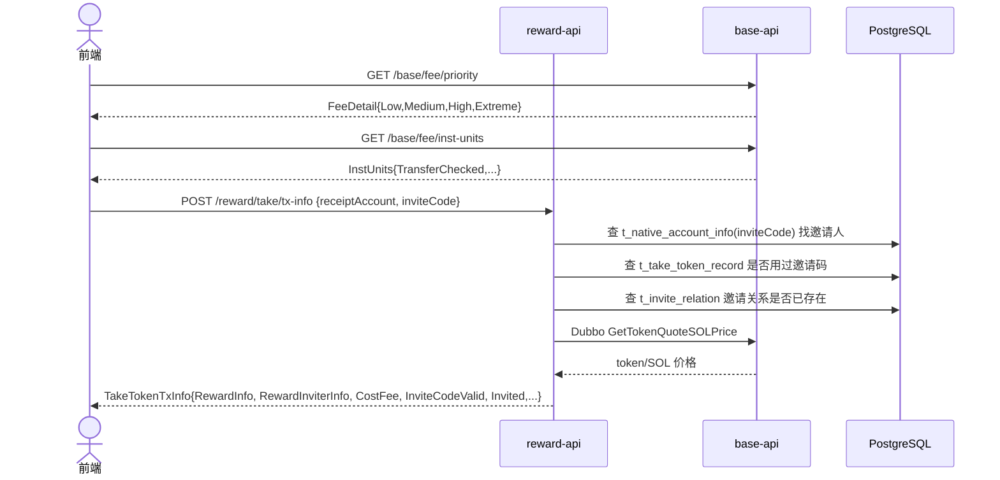
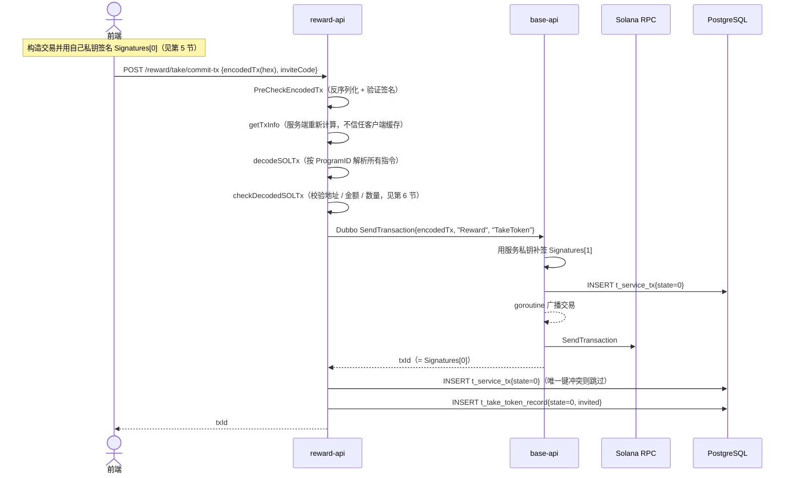
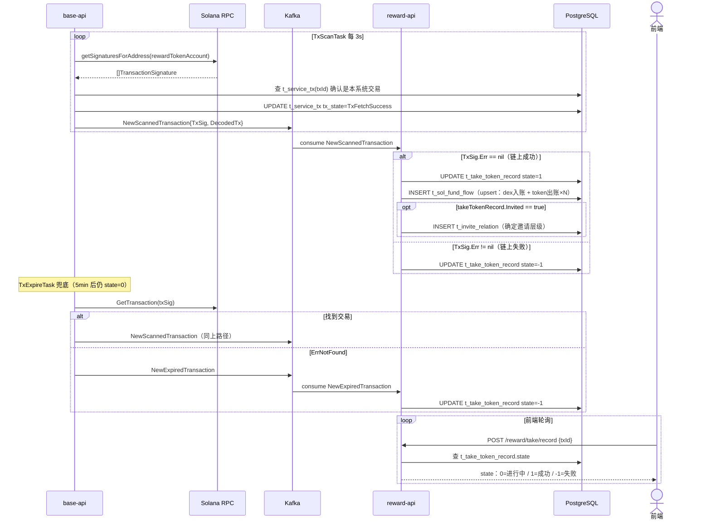
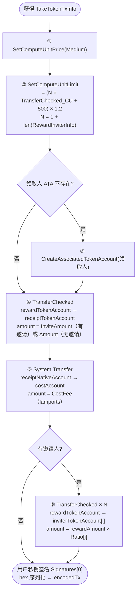
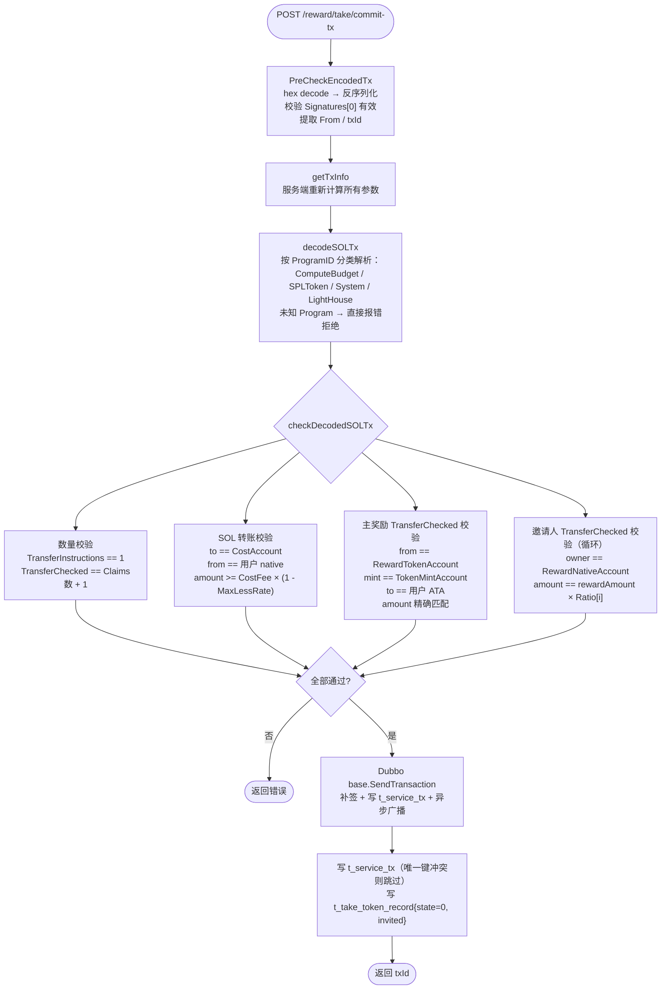
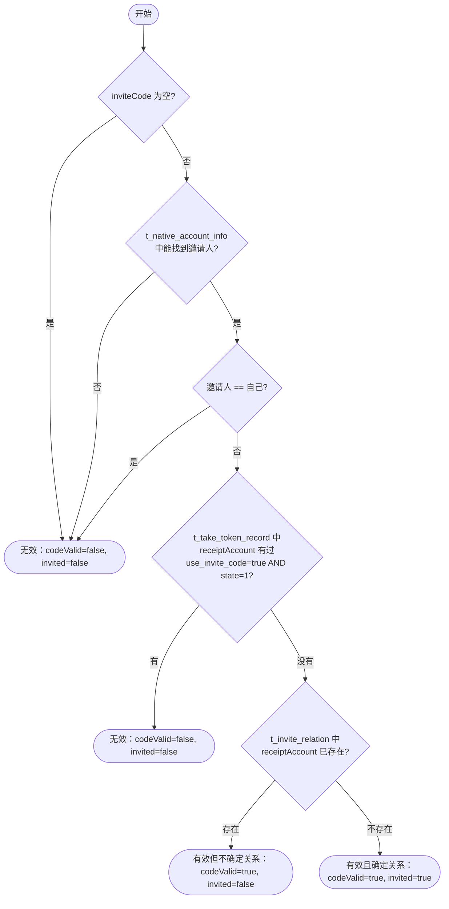
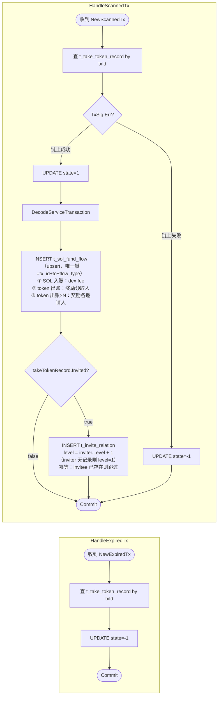

# 1. 业务概述

用户支付 SOL 成本费（打给 dex 账户），平台从奖励账户向用户发 token；若存在有效邀请关系，还按层级比例向各层邀请人发 token。

整体分四个阶段：**GetTxInfo → 前端构造交易 → CommitTx → 链上确认（Kafka）**

---

# 2. 数据库表

* t_take_token_config
```sql
-- take token 奖励配置表
DROP TABLE IF EXISTS public.t_take_token_config;
CREATE TABLE public.t_take_token_config
(
    record_id      public.ulid                 DEFAULT public.gen_ulid() NOT NULL,
    invite_code    character varying(16)       DEFAULT NULL::character varying,    -- 邀请码，默认规则为空
    reward_account character varying(64)                                 NOT NULL, -- 下发奖励的 solana 地址
    cost_account   character varying(64)                                 NOT NULL, -- 接收成本费的 solana 地址
    amount         numeric(78, 0)                                        NOT NULL, -- 奖励金额
    invite_amount  numeric(78, 0)                                        NOT NULL, -- 确定邀请关系时的奖励金额
    cost_fee_rate  numeric(78, 0)                                        NOT NULL, -- 成本费费率
    max_cost_fee   numeric(78, 0)                                        NOT NULL, -- 最大成本费
    is_default     boolean                     DEFAULT false,                      -- 是否是默认规则
    reward_inviter boolean                     DEFAULT true,                       -- 是否奖励邀请人
    invited        boolean                     DEFAULT true,                       -- 是否确定邀请关系
    created_at     timestamp without time zone DEFAULT CURRENT_TIMESTAMP,
    updated_at     timestamp without time zone DEFAULT CURRENT_TIMESTAMP
);
```

* t_take_token_record
```sql
-- take token 记录表
DROP TABLE IF EXISTS public.t_take_token_record;
CREATE TABLE public.t_take_token_record
(
    record_id       public.ulid                 DEFAULT public.gen_ulid() NOT NULL,
    reward_account  character varying(64)                                 NOT NULL, -- 下发奖励的 solana 地址
    receipt_account character varying(64)                                 NOT NULL, -- 接收奖励的地址
    cost_account    character varying(64)                                 NOT NULL, -- 接收成本费的地址
    tx_id           character varying(128)                                NOT NULL, -- 交易 id
    amount          numeric(78, 0)                                        NOT NULL, -- 奖励金额
    cost_fee        numeric(78, 0)                                        NOT NULL, -- 成本费
    use_invite_code boolean                                               NOT NULL, -- 是否使用邀请码
    invite_code     character varying(16),                                          -- 邀请码
    tx_state        integer,                                                        -- 交易状态：0=进行中 1=成功 -1=失败
    invited         boolean,                                                        -- 是否确定邀请关系
    created_at      timestamp without time zone DEFAULT CURRENT_TIMESTAMP,
    updated_at      timestamp without time zone DEFAULT CURRENT_TIMESTAMP
);
```

* t_daily_claim_stats

```sql
-- 当日 take token 和 lottery 统计表
DROP TABLE IF EXISTS public.t_daily_claim_stats;
CREATE TABLE public.t_daily_claim_stats
(
    record_id      public.ulid                 DEFAULT public.gen_ulid() NOT NULL,
    native_account character varying(64)                                 NOT NULL, -- 地址
    take_date      date                                                  NOT NULL, -- 日期
    take_count     integer                     DEFAULT 0                 NOT NULL, -- take token 次数
    need_lottery   boolean                     DEFAULT false             NOT NULL, -- 是否需要抽奖
    last_take_time timestamp without time zone,                                    -- 上次 take token 时间
    total_lottery  numeric(78, 0)              DEFAULT 0                 NOT NULL, -- 总计 lottery 金额
    total_take     numeric(78, 0)              DEFAULT 0                 NOT NULL, -- 总计 take token 金额
    lottery_count  integer                     DEFAULT 0                 NOT NULL, -- 抽奖次数
    created_at     timestamp without time zone DEFAULT CURRENT_TIMESTAMP,
    updated_at     timestamp without time zone DEFAULT CURRENT_TIMESTAMP
);
ALTER TABLE t_daily_claim_stats
    ADD CONSTRAINT uq_daily_claim_stats_account_date UNIQUE (native_account, take_date);
```

---

## 3. 数据结构

```go
// 奖励发放项
type RewardTokenItem struct {
    Index          int    `json:"index"`          // 排序索引
    ReceiptAccount string `json:"receiptAccount"` // 接收奖励的 solana 地址
    Amount         uint64 `json:"amount"`         // 奖励 token 金额（raw）
}
```

```go
// GetTxInfo 请求
type GetTakeTokenTxInfoReq struct {
    InviteCode     string  `json:"inviteCode"`     // 可选，邀请码
    Custom         bool    `json:"custom"`         // 是否自定义金额（暂未使用）
    CustomAmount   float64 `json:"customAmount"`   // 自定义金额（暂未使用）
    ReceiptAccount string  `json:"receiptAccount"` // 领取奖励的 native account
}
```

```go
// GetTxInfo 响应，前端据此打包交易
type TakeTokenTxInfo struct {
    RewardAccount   string  `json:"rewardAccount"`   // 下发奖励的 solana 地址
    Mint            string  `json:"mint"`            // token mint 地址
    CostAccount     string  `json:"costAccount"`     // 接收 SOL 成本费的地址
    CostFeeRate     float64 `json:"costFeeRate"`     // 成本费率
    MaxCostFee      float64 `json:"maxCostFee"`      // 最大成本费
    Decimals        int32   `json:"decimals"`        // token 精度
    InviteCode      string  `json:"inviteCode"`      // 邀请码
    InviteCodeValid bool    `json:"inviteCodeValid"` // 邀请码是否有效
    Invited         bool    `json:"invited"`         // 本次是否将确定邀请关系
    QuoteSOLPrice   float64 `json:"quoteSOLPrice"`   // token/SOL 价格
    TotalReward     float64 `json:"totalReward"`     // 整笔交易奖励的 token 总额
    QuotedSOLAmount float64 `json:"quotedSOLAmount"` // 成本费 SOL 金额
    CostFee         uint64  `json:"costFee"`         // SOL 成本费，单位 lamports
    Claims          []model.LevelRatio `json:"claims"`            // 各层邀请人奖励费率
    RewardInfo      RewardTokenItem    `json:"rewardInfo"`        // 领取人奖励项
    RewardInviterInfo []RewardTokenItem `json:"rewardInviterInfo"` // 各邀请人奖励项
}
```

---

## 4. 业务流程

### 4.1 阶段一：获取交易参数（GetTxInfo）



### 4.2 阶段二：提交交易（CommitTx）



### 4.3 阶段三：链上确认与 Kafka 处理



---

## 5. 前端构造交易指令



---

## 6. CommitTx 服务端处理



---

## 7. 邀请码有效性判断（`logic/take/logic.go`）

返回值：`(directInviter, codeValid, invited, err)`
- `codeValid=true, invited=true` → 邀请码有效，本次将确定邀请关系，奖励金额用 `InviteAmount`
- `codeValid=true, invited=false` → 邀请码有效但邀请关系已存在，奖励金额用 `Amount`
- `codeValid=false` → 邀请码无效



---

## 8. Kafka 处理逻辑（`logic/take/kafka.go`）



---

## 9. 邀请关系管理（`logic/invite.go`）

| 方法 | 说明 |
|---|---|
| `GetAccountByInviteCode(code)` | 查 `t_native_account_info` by invite_code |
| `CheckInviteRecord(account)` | 查 `t_invite_relation`，account 是否作为 invitee 存在 |
| `GetUpInviterRecords(account, depth)` | `WITH RECURSIVE` 向上递归查（最大 depth=20） |
| `GetDownInviteeRecords(account, depth)` | `WITH RECURSIVE` 向下递归查 |
| `InviteRelationExist(account)` | 查是否作为 inviter 或 invitee 存在（用于前置检查） |
| `RecordDetermineInvitationHierarchy(...)` | 写 `t_invite_relation`（幂等：invitee 已存在则跳过） |
| `BuildSortedInviterItems(...)` | 构建排序好的邀请人奖励列表（供 getTxInfo 使用） |

---

## 10. HTTP API（`handler/take.go`）

所有路由挂载在 `/reward/take` 前缀下。

### POST `/reward/take/config`

获取 take token 业务规则配置。

- 请求：无 body
- 响应：`t_take_token_config` 记录

| 字段 | 类型 | 说明 |
|---|---|---|
| `rewardAccount` | string | 下发奖励的 solana 地址 |
| `costAccount` | string | 接收 SOL 成本费的地址 |
| `amount` | numeric | 无邀请码时的奖励金额（raw） |
| `inviteAmount` | numeric | 有邀请码且确定邀请关系时的奖励金额（raw） |
| `costFeeRate` | numeric | 成本费费率 |
| `maxCostFee` | numeric | 最大成本费 |
| `rewardInviter` | boolean | 是否奖励邀请人 |
| `invited` | boolean | 是否确定邀请关系 |

---

### POST `/reward/take/tx-info`

获取打包交易所需的全部参数，前端据此构造 Solana 交易。

- 请求体：

| 字段 | 类型 | 必填 | 说明 |
|---|---|---|---|
| `receiptAccount` | string | 是 | 领取奖励的 native account |
| `inviteCode` | string | 否 | 邀请码 |

- 响应：`TakeTokenTxInfo`

| 字段 | 类型 | 说明 |
|---|---|---|
| `rewardAccount` | string | 下发奖励的 solana 地址 |
| `mint` | string | token mint 地址 |
| `costAccount` | string | 接收 SOL 成本费的地址 |
| `costFeeRate` | float64 | 成本费率 |
| `maxCostFee` | float64 | 最大成本费 |
| `decimals` | int32 | token 精度 |
| `inviteCode` | string | 邀请码（原样返回） |
| `inviteCodeValid` | boolean | 邀请码是否有效 |
| `invited` | boolean | 本次是否将确定邀请关系 |
| `quoteSOLPrice` | float64 | token/SOL 价格 |
| `totalReward` | float64 | 整笔交易奖励的 token 总额（raw） |
| `quotedSOLAmount` | float64 | 需支付的 SOL 成本费金额（lamports） |
| `costFee` | uint64 | 后端计算后的 SOL 成本费，单位 lamports；前端直接用于 System.Transfer |
| `claims` | []LevelRatio | 各层邀请人奖励费率配置 |
| `rewardInfo` | RewardTokenItem | 领取人奖励项（index/receiptAccount/amount） |
| `rewardInviterInfo` | []RewardTokenItem | 各层邀请人奖励项列表（按层级排序） |

---

### POST `/reward/take/commit-tx`

提交签名后的交易，服务端校验并广播到链上。

- 请求体：

| 字段 | 类型 | 必填 | 说明 |
|---|---|---|---|
| `encodedTx` | string | 是 | hex 编码的已签名 Solana 交易二进制 |
| `inviteCode` | string | 否 | 邀请码（需与 tx-info 时一致） |

- 响应：`txId`（string，链上交易 ID = `tx.Signatures[0]`）

- 失败场景：

| 场景 | 说明 |
|---|---|
| 未完成抽奖 | 当日需先完成 lottery 才能继续领取 |
| 同地址并发提交 | 分布式锁保护，同一地址同时只处理一笔 |
| 交易指令校验失败 | 地址/金额/数量不符合规则（见第 6 节） |
| base 广播失败 | Solana RPC 拒绝交易 |

---

### POST `/reward/take/record`

根据交易 ID 查询 take token 业务记录，用于前端轮询状态。

- 请求体：

| 字段 | 类型 | 必填 | 说明 |
|---|---|---|---|
| `txId` | string | 是 | commit-tx 返回的交易 ID |

- 响应：`t_take_token_record` 记录

| 字段 | 类型 | 说明 |
|---|---|---|
| `txId` | string | 交易 ID |
| `receiptAccount` | string | 领取奖励的地址 |
| `rewardAccount` | string | 下发奖励的地址 |
| `amount` | numeric | 奖励金额（raw） |
| `costFee` | numeric | 实际支付的成本费（raw） |
| `useInviteCode` | boolean | 是否使用了邀请码 |
| `inviteCode` | string | 邀请码 |
| `txState` | int | `0`=进行中 / `1`=成功 / `-1`=失败 |
| `invited` | boolean | 是否确定了邀请关系 |
